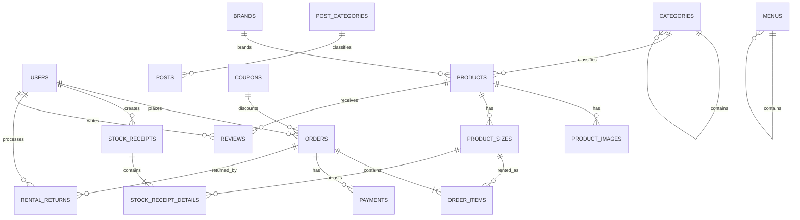

# ĐẶC TẢ CƠ SỞ DỮ LIỆU HỆ THỐNG THUÊ SẢN PHẨM

## 1. Tổng quan

Tài liệu này đặc tả cơ sở dữ liệu `thltweb_huy_tuyet` từ file SQL do nhóm cung cấp. Hệ thống phục vụ website cho thuê sản phẩm, gồm các phân hệ:

- Người dùng và phân quyền.
- Danh mục, thương hiệu, sản phẩm, kích thước và tồn kho.
- Đơn thuê, mã giảm giá, thanh toán, trả hàng và hoàn cọc.
- Nhập/xuất kho.
- Bài viết, trang nội dung, banner và menu.
- Liên hệ và đánh giá sản phẩm.

Cơ sở dữ liệu sử dụng MySQL, bộ mã `utf8mb4`, khóa chính tự tăng, khóa ngoại để bảo đảm liên kết, `ENUM` cho trạng thái và `DECIMAL(12,2)` cho tiền tệ.

## 2. Sơ đồ quan hệ tổng quát



## 3. Đặc tả các bảng

### 3.1. `users` — Người dùng

**Chức năng:** Lưu tài khoản, thông tin liên hệ, vai trò và trạng thái của khách hàng/quản trị viên.

| Trường | Ý nghĩa |
|---|---|
| `id` | Khóa chính người dùng. |
| `role` | `admin` hoặc `member`; mặc định là thành viên. |
| `fullname`, `email`, `phone`, `address` | Thông tin cá nhân và liên hệ. Email là duy nhất. |
| `password` | Mật khẩu đã băm, không lưu mật khẩu rõ. |
| `avatar` | Đường dẫn ảnh đại diện. |
| `status` | `active` hoặc `locked`. |
| `remember_token` | Token duy trì đăng nhập. |
| `created_at`, `updated_at` | Thời gian tạo và cập nhật. |

**Quan hệ:** Một người dùng có thể có nhiều đơn thuê, phiếu kho, đánh giá; quản trị viên có thể xử lý nhiều lần trả hàng. Tài khoản bị khóa không được đăng nhập hoặc tạo giao dịch mới.

### 3.2. `password_reset_tokens` — Token đặt lại mật khẩu

**Chức năng:** Lưu token phục vụ luồng quên mật khẩu.

| Trường | Ý nghĩa |
|---|---|
| `email` | Khóa chính, email yêu cầu đặt lại mật khẩu. |
| `token` | Token xác thực. |
| `created_at` | Thời điểm phát hành token. |

Schema không có khóa ngoại đến `users`; ứng dụng phải kiểm tra email tồn tại và thời hạn token.

### 3.3. `categories` — Danh mục sản phẩm

**Chức năng:** Phân nhóm sản phẩm và tạo cây danh mục nhiều cấp.

Các trường chính gồm `name`, `slug` duy nhất, `parent_id`, mô tả, ảnh và trạng thái `active/hidden`. `parent_id` tự tham chiếu đến `categories.id`. 
Khi xóa danh mục cha, danh mục con được đưa về cấp gốc; (quản 
(quan hệ danh mục với danh mục)


không thể xóa danh mục đang có sản phẩm.
(quan hệ sản phẩm với danh mục)
### 3.4. `brands` — Thương hiệu

**Chức năng:** Lưu tên, slug, logo, mô tả và trạng thái thương hiệu. Một thương hiệu có nhiều sản phẩm. Khi thương hiệu bị xóa, sản phẩm được giữ lại và `brand_id` được đặt `NULL`.

### 3.5. `products` — Sản phẩm

**Chức năng:** Lưu thông tin chung và chính sách giá/cọc của sản phẩm cho thuê.

| Nhóm trường | Ý nghĩa |
|---|---|
| `category_id`, `brand_id` | Danh mục bắt buộc và thương hiệu tùy chọn. |
| `name`, `slug` | Tên và định danh URL duy nhất. |
| `thumbnail`, `short_description`, `description` | Hình ảnh và nội dung giới thiệu. |
| `rental_price_per_day` | Giá thuê mỗi ngày. |
| `deposit_rate_percent`, `original_value` | Tỷ lệ cọc và giá trị gốc để tính cọc. |
| `is_featured`, `view_count` | Sản phẩm nổi bật và lượt xem. |
| `status` | `active` hoặc `hidden`. |

Công thức tham khảo:

```text
deposit_per_item = original_value × deposit_rate_percent / 100
```

Một sản phẩm có nhiều ảnh, kích thước và đánh giá.

### 3.6. `product_images` — Ảnh sản phẩm

**Chức năng:** Lưu bộ ảnh của sản phẩm. `image_url` là đường dẫn ảnh, `sort_order` là thứ tự hiển thị. Xóa sản phẩm sẽ xóa toàn bộ ảnh liên quan.

### 3.7. `product_sizes` — Kích thước và tồn kho

**Chức năng:** Quản lý biến thể kích thước và số lượng tồn.

- Kích thước: `XS`, `S`, `M`, `L`, `XL`, `2XL`, `FreeSize`.
- Cặp `product_id + size` là duy nhất.
- `stock_quantity` là số lượng tồn hiện tại.
- Xóa sản phẩm sẽ xóa các biến thể.

Ứng dụng không được để tồn âm. Vì schema chưa có bảng lịch giữ hàng theo ngày, số lượng khả dụng phải được tính thêm từ các đơn thuê chưa hoàn tất có khoảng ngày giao nhau.

### 3.8. `coupons` — Mã giảm giá

**Chức năng:** Lưu mã ưu đãi giảm một số tiền cố định.

Các điều kiện áp dụng: mã `active`, hiện tại nằm giữa `start_date` và `end_date`, giá trị đơn đạt `min_order_value`, đồng thời `used_count < usage_limit`. `code` là duy nhất.

### 3.9. `orders` — Đơn thuê

**Chức năng:** Bảng đầu đơn, lưu người thuê, thông tin nhận hàng, tổng tiền và trạng thái.

| Nhóm | Các trường và ý nghĩa |
|---|---|
| Định danh | `id`, `order_code` duy nhất. |
| Khách hàng | `user_id` và bản chụp `customer_name/phone/email` tại lúc đặt. |
| Giao nhận | `delivery_type` là `store_pickup/delivery`, địa chỉ, ghi chú và phí giao. |
| Tài chính | Tổng tiền thuê, tổng cọc, giảm giá, phí giao, tổng thanh toán và cọc đã hoàn. |
| Thanh toán | `cash/vnpay`; trạng thái `unpaid/partially_paid/paid/refunded`. |
| Vận hành | `pending/confirmed/delivering/renting/returning/completed/cancelled`. |

Công thức tổng quát:

```text
grand_total = total_rental_fee
            + total_deposit_fee
            + shipping_fee
            - discount_amount
```

Các tổng tiền phải là bản chụp tại thời điểm đặt, không tính lại lịch sử theo giá sản phẩm hiện tại.

### 3.10. `order_items` — Chi tiết đơn thuê

**Chức năng:** Lưu từng kích thước sản phẩm, số lượng, thời gian thuê và giá đã chốt.

| Trường | Ý nghĩa |
|---|---|
| `order_id` | Đơn thuê. |
| `product_size_id` | Sản phẩm và kích thước được thuê. |
| `quantity` | Số lượng thuê. |
| `rent_start_date`, `rent_end_date`, `rental_days` | Khoảng thuê và số ngày tính phí. |
| `price_per_day`, `deposit_per_item` | Đơn giá và cọc mỗi sản phẩm đã chốt. |
| `total_item_rental`, `total_item_deposit` | Tổng tiền thuê và cọc của dòng. |

```text
total_item_rental  = quantity × rental_days × price_per_day
total_item_deposit = quantity × deposit_per_item
total_rental_fee   = tổng total_item_rental của đơn
total_deposit_fee  = tổng total_item_deposit của đơn
```

Xóa đơn sẽ xóa chi tiết; không thể xóa biến thể đã xuất hiện trong lịch sử đơn.

### 3.11. `rental_returns` — Trả hàng

**Chức năng:** Ghi nhận ngày trả thực tế, nhân viên xử lý, phí phạt, lý do, tiền cọc hoàn và ghi chú tình trạng.

Công thức tham khảo:

```text
deposit_refund_amount = total_deposit_fee - penalty_fee
```

Tiền hoàn phải nằm từ 0 đến số cọc còn phải hoàn. Schema cho phép nhiều bản ghi trả cho một đơn. Nếu chỉ trả toàn bộ một lần, nên đặt UNIQUE cho `order_id`; nếu cho trả nhiều đợt, cần thêm bảng chi tiết sản phẩm của từng lần trả.

### 3.12. `payments` — Giao dịch thanh toán

**Chức năng:** Lưu lịch sử thu tiền và hoàn tiền cọc.

- Cổng: `cash` hoặc `vnpay`.
- Loại: `payment` hoặc `deposit_refund`.
- Trạng thái: `pending`, `success`, `failed`.
- Chỉ giao dịch thành công được dùng để tính số đã thu/hoàn.
- Callback VNPay phải idempotent; nên đặt UNIQUE cho `transaction_id`.

### 3.13. `stock_receipts` — Phiếu nhập/xuất kho

**Chức năng:** Lưu đầu phiếu điều chỉnh kho, gồm mã phiếu duy nhất, người lập, loại `import/export`, lý do, tổng giá trị và thời gian tạo.

### 3.14. `stock_receipt_details` — Chi tiết phiếu kho

**Chức năng:** Lưu kích thước sản phẩm, số lượng và đơn giá của từng dòng phiếu.

```text
total_amount = tổng(quantity × unit_price)
```

Phiếu nhập làm tăng tồn; phiếu xuất làm giảm tồn và không được làm tồn âm. Tạo phiếu, tạo chi tiết và cập nhật tồn phải thực hiện trong một transaction.

### 3.15. `post_categories` — Danh mục bài viết

**Chức năng:** Phân nhóm bài viết bằng tên, slug duy nhất và trạng thái `active/hidden`.

### 3.16. `posts` — Bài viết

**Chức năng:** Lưu tiêu đề, slug, ảnh đại diện, tóm tắt, nội dung, danh mục và trạng thái `published/draft/hidden`. Không thể xóa danh mục đang chứa bài viết.

### 3.17. `pages` — Trang nội dung tĩnh

**Chức năng:** Quản lý các trang như Giới thiệu, Chính sách thuê, Điều khoản, Hướng dẫn. Mỗi trang có tiêu đề, slug duy nhất, nội dung và trạng thái `active/hidden`.

### 3.18. `banners` — Banner

**Chức năng:** Quản lý ảnh quảng bá, liên kết, vị trí, thứ tự và trạng thái hiển thị. Vị trí mặc định là `home_main_slider`.

### 3.19. `menus` — Menu điều hướng

**Chức năng:** Quản lý menu header/footer và cấu trúc nhiều cấp bằng `parent_id`. Khi xóa menu cha, menu con bị xóa theo. Ứng dụng cần ngăn menu tự trỏ tới chính nó hoặc tạo chu trình.

### 3.20. `contacts` — Liên hệ khách hàng

**Chức năng:** Lưu người gửi, tiêu đề, nội dung, phản hồi quản trị viên và trạng thái `pending/replied`.

### 3.21. `reviews` — Đánh giá sản phẩm

**Chức năng:** Lưu người đánh giá, sản phẩm, điểm 1–5 và nhận xét. Nên chỉ cho người đã hoàn tất đơn chứa sản phẩm được đánh giá. Nếu mỗi người chỉ đánh giá một sản phẩm một lần, cần UNIQUE (`product_id`, `user_id`).

## 4. Luồng nghiệp vụ chính

### 4.1. Đăng ký, đăng nhập và quên mật khẩu

1. Khách đăng ký; hệ thống kiểm tra email duy nhất, băm mật khẩu và tạo tài khoản `member/active`.
2. Khi đăng nhập, hệ thống xác thực mật khẩu và từ chối tài khoản `locked`.
3. Khi quên mật khẩu, tạo token có thời hạn, gửi liên kết, xác minh token, cập nhật mật khẩu rồi xóa token.

### 4.2. Quản trị sản phẩm

1. Quản trị viên tạo danh mục và thương hiệu.
2. Tạo sản phẩm, khai báo giá thuê, giá trị gốc và tỷ lệ cọc.
3. Thêm bộ ảnh và các kích thước.
4. Nhập kho ban đầu qua phiếu nhập.
5. Chỉ dữ liệu `active` được hiển thị cho khách.

### 4.3. Nhập/xuất kho

1. Quản trị viên lập phiếu `import` hoặc `export`.
2. Thêm các dòng chi tiết.
3. Hệ thống tính tổng giá trị.
4. Trong cùng transaction, tăng hoặc giảm `stock_quantity`.
5. Nếu xuất vượt tồn, rollback toàn bộ giao dịch.

### 4.4. Chọn sản phẩm và tạo đơn

1. Khách xem sản phẩm, chọn kích thước, số lượng và khoảng ngày thuê.
2. Hệ thống kiểm tra ngày hợp lệ, trạng thái sản phẩm và khả dụng trong toàn bộ khoảng thuê.
3. Hệ thống chốt giá, tiền cọc và số ngày vào `order_items`.
4. Kiểm tra coupon, tính tổng tiền.
5. Tạo `orders`, `order_items` và tăng lượt dùng coupon trong cùng transaction.
6. Đơn mới có trạng thái `pending`.

### 4.5. Xử lý và bàn giao đơn

```text
pending → confirmed → delivering → renting
```

- Quản trị viên kiểm tra lịch và xác nhận đơn.
- Đơn giao tận nơi chuyển qua `delivering`; nhận tại cửa hàng có thể chuyển thẳng từ `confirmed` sang `renting` khi bàn giao.
- Khi khách nhận sản phẩm, đơn chuyển sang `renting`.
- Mỗi khoản thu được ghi trong `payments`; tổng giao dịch thành công quyết định trạng thái thanh toán.

### 4.6. Thanh toán

**Tiền mặt:** Tạo giao dịch `cash`, nhân viên xác nhận `success`.

**VNPay:** Tạo giao dịch `pending`, chuyển khách sang cổng thanh toán, xác minh callback và số tiền, sau đó cập nhật `success/failed`. Callback lặp lại không được tạo giao dịch trùng.

### 4.7. Trả hàng và hoàn cọc

```text
renting → returning → completed
```

1. Nhân viên tiếp nhận và kiểm tra ngày trả, số lượng, tình trạng.
2. Nếu trễ/hư hỏng/thiếu, ghi phí và lý do phạt.
3. Tạo `rental_returns`, xác định tiền cọc hoàn.
4. Ghi giao dịch `deposit_refund`, cập nhật `refunded_deposit`.
5. Hoàn tất đối soát thì chuyển đơn sang `completed`.
6. Hàng đạt yêu cầu trở lại khả dụng; hàng hỏng cần phiếu kho phù hợp.

### 4.8. Hủy đơn

1. Thông thường chỉ cho hủy khi `pending` hoặc `confirmed`.
2. Chuyển sang `cancelled`, giải phóng lượng giữ theo lịch.
3. Hoàn lượt coupon theo chính sách.
4. Nếu đã thu tiền, thực hiện giao dịch hoàn và cập nhật thanh toán.

### 4.9. Nội dung và chăm sóc khách hàng

- Quản trị bài viết, trang tĩnh, banner và menu.
- Nội dung nháp/ẩn không hiển thị công khai.
- Khách gửi liên hệ ở trạng thái `pending`; khi trả lời, lưu `admin_reply` và chuyển `replied`.
- Khách đã hoàn tất thuê có thể đánh giá sản phẩm.

## 5. Quy tắc cần kiểm tra ở tầng ứng dụng

- Tiền, số lượng, số ngày thuê và tỷ lệ cọc không âm.
- `rent_end_date >= rent_start_date`; `rental_days` đúng chính sách tính ngày.
- Coupon còn hạn, còn lượt, đủ giá trị tối thiểu và tiền giảm không vượt giới hạn.
- Bắt buộc địa chỉ khi giao tận nơi.
- Không cho xuất kho hoặc xác nhận thuê vượt số lượng khả dụng.
- Không cho chuyển trạng thái đơn sai thứ tự.
- Tiền hoàn cọc không vượt số cọc còn lại.
- Chỉ quản trị viên được xử lý kho, đơn, hoàn trả và nội dung.
- Các luồng tạo đơn, coupon, kho và thanh toán phải dùng transaction và khóa phù hợp để tránh tranh chấp đồng thời.

## 6. Quan hệ và hành vi khi xóa

| Bảng cha → bảng con | Hành vi |
|---|---|
| `categories → categories` | Đặt `parent_id = NULL`. |
| `categories → products` | Từ chối xóa. |
| `brands → products` | Đặt `brand_id = NULL`. |
| `products → product_images/product_sizes/reviews` | Xóa theo. |
| `users → orders/stock_receipts` | Từ chối xóa. |
| `users → rental_returns` | Đặt `staff_id = NULL`. |
| `users → reviews` | Xóa theo. |
| `coupons → orders` | Đặt `coupon_id = NULL`. |
| `orders → order_items/payments/rental_returns` | Xóa theo. |
| `product_sizes → order_items/stock_receipt_details` | Từ chối xóa. |
| `stock_receipts → stock_receipt_details` | Xóa theo. |
| `post_categories → posts` | Từ chối xóa. |
| `menus → menus` | Xóa menu con theo. |

## 7. Đề xuất hoàn thiện

1. Thêm chỉ mục cho khóa ngoại, trạng thái đơn, ngày thuê, trạng thái sản phẩm và thời gian tạo.
2. Thêm UNIQUE cho `payments.transaction_id`.
3. Bổ sung bảng lịch giữ hàng theo khoảng ngày để kiểm soát đơn thuê trùng lịch.
4. Bổ sung chi tiết trả hàng nếu hỗ trợ trả nhiều đợt.
5. Thêm lịch sử chuyển trạng thái đơn để kiểm toán.
6. Cân nhắc soft delete cho người dùng, sản phẩm và nội dung.
7. Thêm CHECK cho tiền và số lượng không âm.
8. Quy định rõ cách tính `rental_days`.
9. Bổ sung thời điểm cập nhật cho các bảng cần truy vết chỉnh sửa.
10. Luôn sử dụng cơ chế băm mật khẩu an toàn của framework.

## 8. Kết luận

Schema đã bao quát các chức năng cốt lõi của hệ thống cho thuê: danh mục và biến thể, tồn kho, đơn thuê, coupon, thanh toán, hoàn cọc, nội dung và chăm sóc khách hàng. Khi triển khai cần ưu tiên tính nhất quán của lịch thuê, kho và tài chính bằng transaction, kiểm tra nghiệp vụ và lịch sử trạng thái.

