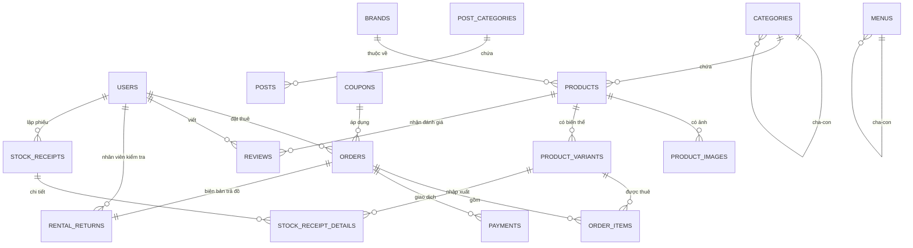

# ĐẶC TẢ HỆ THỐNG CHO THUÊ TRANG PHỤC

**Tên hệ thống:** Clothes Rental System (CRS)
**Mô hình:** 1 cửa hàng duy nhất (single-tenant)
**Stack:** Next.js 16 (App Router) + Laravel 12 REST API + MariaDB 10.4 (XAMPP)
**Cơ sở dữ liệu:** `clothes_rental_db`
**Phiên bản tài liệu:** 2.1 — 15/09/2026
**Căn cứ:** `thltweb_huy_tuyet.sql` (CSDL 22 bảng — nguồn sự thật) + `GiaiThich_ChiTiet_Database_Clothes_Rental_v2.docx` + `TomTat_ChucNang_Ecommerce_THLTW.docx` (yêu cầu môn học)

> **Bản 2.1** đồng bộ tài liệu với phần đã code xong (Lô 0 và Lô 1) — xem [§11 Tình trạng triển khai](#11-tình-trạng-triển-khai). Tên bảng, tên cột và ràng buộc trong §6 đã được đối chiếu tự động với schema thật trong `clothes_rental_db`.

> **Ghi chú phiên bản.** Bản 2.0 viết lại toàn bộ theo CSDL 22 bảng đã chốt. So với bản 1.0:
> - Bỏ mô hình cá thể (`rental_units`) và khoá lịch (`bookings`) → tồn kho quản lý bằng `product_variants.stock_quantity`.
> - Bỏ `inspections` / `inspection_items` / `maintenance_tasks` / `shipments` / `order_fees` / `refunds` → gộp vào **`rental_returns`** (biên bản trả đồ + phí phạt + hoàn cọc) và **`payments`**.
> - Bỏ `wishlists`, `addresses`, `pricing_tiers`; `promotions` nhiều loại → thay bằng **`coupons`** giảm số tiền cố định.
> - Phân quyền rút gọn còn **`admin` / `member`** ngay trên cột `users.role`, không dùng bảng role trung gian.
> - Bổ sung khối nội dung (`post_categories`, `posts`, `pages`, `banners`, `menus`, `contacts`, `system_configs`) và khối kho (`stock_receipts`, `stock_receipt_details`).

---

## MỤC LỤC

1. [Tổng quan & phạm vi](#1-tổng-quan--phạm-vi)
2. [Actor & phân quyền](#2-actor--phân-quyền)
3. [Nghiệp vụ cốt lõi](#3-nghiệp-vụ-cốt-lõi)
4. [State machine](#4-state-machine)
5. [Business rules](#5-business-rules)
6. [Mô hình dữ liệu — 22 bảng](#6-mô-hình-dữ-liệu--22-bảng)
7. [Danh sách API](#7-danh-sách-api)
8. [Danh sách màn hình & wireframe](#8-danh-sách-màn-hình--wireframe)
9. [Kiến trúc thư mục](#9-kiến-trúc-thư-mục)
10. [Lộ trình triển khai](#10-lộ-trình-triển-khai)
11. [Tình trạng triển khai](#11-tình-trạng-triển-khai)

---

## 1. TỔNG QUAN & PHẠM VI

### 1.1. Bài toán

Website cho thuê trang phục (váy dạ hội, áo dài, vest & suit, đồ cosplay, đồ biểu diễn…). Khách xem catalog, chọn **khoảng ngày thuê**, đặt đơn, trả tiền thuê **kèm tiền cọc**; đến hạn mang trả, cửa hàng kiểm tra tình trạng, tính phí phạt nếu có và hoàn lại phần cọc còn lại.

Khác biệt so với một website thương mại điện tử bán hàng thông thường — cũng là phần "ăn điểm" khi bảo vệ:

| Điểm khác biệt | Hệ quả trong CSDL 22 bảng |
|---|---|
| Đơn hàng gắn với **khoảng thời gian**, không chỉ số lượng | `order_items.rent_start_date`, `rent_end_date`, `rental_days` |
| Có **tiền cọc** phải giữ rồi hoàn lại | `products.deposit_rate_percent`, `products.original_value`, `orders.total_deposit_fee`, `orders.refunded_deposit` |
| Đồ **quay vòng**: thuê xong lại cho thuê tiếp | `stock_quantity` trừ khi giao, cộng lại khi nhận đồ đạt yêu cầu (BR-03) |
| Có **kiểm tra tình trạng khi trả**, phạt và bồi thường | `rental_returns` (phí phạt, lý do, số cọc hoàn thực tế) |
| Dòng tiền **hai chiều** (thu tiền → hoàn cọc) | `payments.type = payment / deposit_refund` |
| Đồ hỏng phải **loại khỏi kho có chứng từ** | `stock_receipts` loại `export` + `stock_receipt_details` |

### 1.2. Phạm vi (In scope)

- Catalog: danh mục đa cấp, thương hiệu, sản phẩm, biến thể size–màu, bộ sưu tập ảnh
- Tìm kiếm, lọc, sắp xếp, chi tiết sản phẩm, sản phẩm nổi bật, đếm lượt xem
- Đăng ký / đăng nhập / quên mật khẩu qua email / hồ sơ cá nhân
- Giỏ thuê (lưu phía client), chọn ngày thuê, áp mã giảm giá, đặt đơn
- Hai hình thức nhận đồ: **đến shop lấy** (`store_pickup`) hoặc **giao tận nơi** (`delivery`)
- Hai phương thức thanh toán: **tiền mặt** (`cash`) và **VNPay** (`vnpay`)
- Quản trị đơn thuê theo vòng đời 7 trạng thái, biên bản trả đồ, phí phạt, hoàn cọc
- Quản lý kho: phiếu nhập (`import`), phiếu xuất huỷ (`export`)
- Khuyến mãi bằng mã giảm số tiền cố định
- Đánh giá sản phẩm 1–5 sao sau khi thuê
- Quản trị nội dung: bài viết/blog, trang tĩnh, banner, menu, liên hệ
- Cấu hình website động (tên shop, hotline, địa chỉ, logo…)
- Báo cáo doanh thu, top sản phẩm, tồn kho

### 1.3. Ngoài phạm vi (Out of scope)

- Nhiều cửa hàng / marketplace nhiều chủ shop
- Tích hợp API hãng vận chuyển thật (GHN/GHTK) — phí ship nhập tay theo bảng cấu hình
- Kế toán thuế, hoá đơn điện tử
- App mobile native
- Quản lý tới từng cá thể vật lý có mã QR riêng (đã lược bỏ ở bản 2.0)

### 1.4. Kiến trúc tổng thể

```
┌────────────────────┐        ┌─────────────────────┐
│   Next.js (Shop)   │        │   Next.js Admin     │
│   - SSR/ISR catalog│        │   - CSR dashboard   │
│   - Giỏ thuê client│        │                     │
└─────────┬──────────┘        └──────────┬──────────┘
          │  REST /api/v1  (JSON)        │
          └──────────────┬───────────────┘
                         ▼
            ┌────────────────────────┐
            │   Laravel 12 API       │
            │  Controller → Service  │
            │  → Model (Eloquent)    │
            │  Sanctum + middleware  │
            │       role:admin       │
            └───┬───────────┬────────┘
                │           │
         ┌──────▼───┐   ┌───▼──────────┐
         │ MariaDB  │   │ Storage      │
         │ 22 bảng  │   │ ảnh sản phẩm │
         └──────────┘   └──────────────┘
                │
        ┌───────▼────────┬──────────────┐
        │ VNPay sandbox  │ Mail / SMTP  │
        └────────────────┴──────────────┘
```

**Vì sao tách rời (headless):** Next.js lo SEO trang catalog (SSR/ISR) và trải nghiệm chọn ngày; Laravel lo nghiệp vụ, transaction, tính tiền và trừ kho. Ranh giới rõ ràng, mỗi bên test độc lập, dễ trình bày khi bảo vệ.

**Vì sao không dùng bảng role trung gian:** quy mô 1 shop chỉ có 2 vai trò. Kiểm tra `$request->user()->role === 'admin'` ngay tại middleware nhanh hơn và ít bảng hơn — đúng định hướng đã chốt trong tài liệu CSDL.

---

## 2. ACTOR & PHÂN QUYỀN

### 2.1. Danh sách actor

| Actor | `users.role` | Mô tả | Kênh sử dụng |
|---|---|---|---|
| **Khách vãng lai** (Guest) | — (chưa đăng nhập) | Xem catalog, đọc bài viết, gửi liên hệ. **Không đặt thuê được** | Web public |
| **Khách hàng** (Member) | `member` | Đặt thuê, thanh toán, theo dõi đơn, đánh giá | Web public (đã đăng nhập) |
| **Quản trị viên** (Admin) | `admin` | Toàn quyền: catalog, đơn thuê, trả đồ, kho, khuyến mãi, nội dung, cấu hình, báo cáo | Admin panel |
| **Hệ thống** (Cron) | — | Job tự động: huỷ đơn quá hạn thanh toán, nhắc trả đồ, cảnh báo trễ hạn | Nền |

> Trong CSDL, cột `rental_returns.staff_id` trỏ tới `users.id` — đó là **tài khoản `admin`** đã thực hiện kiểm tra và nhận lại đồ. Hệ thống không có vai trò "nhân viên" tách riêng; nếu shop cần nhiều người làm, cấp thêm tài khoản `admin`.

### 2.2. Ma trận phân quyền

Kiểm tra quyền bằng middleware `role:admin` (không dùng `spatie/laravel-permission`).

| Chức năng | Guest | Member | Admin |
|---|:-:|:-:|:-:|
| Xem catalog, chi tiết sản phẩm, bài viết, trang tĩnh | ✓ | ✓ | ✓ |
| Gửi form liên hệ (`contacts`) | ✓ | ✓ | ✓ |
| Đăng ký / đăng nhập / quên mật khẩu | ✓ | — | — |
| Sửa hồ sơ, đổi mật khẩu, đổi avatar | | ✓ | ✓ |
| Đặt đơn thuê (`orders`) | | ✓ | ✓ |
| Xem đơn **của mình**, huỷ đơn khi còn `pending` | | ✓ | |
| Đánh giá sản phẩm đã thuê xong | | ✓ | |
| Xem / xử lý **mọi** đơn thuê | | | ✓ |
| Đổi trạng thái đơn, ghi nhận thanh toán | | | ✓ |
| Lập biên bản trả đồ, áp phí phạt, hoàn cọc | | | ✓ |
| CRUD danh mục / thương hiệu / sản phẩm / biến thể / ảnh | | | ✓ |
| Lập phiếu nhập – xuất kho | | | ✓ |
| CRUD mã giảm giá | | | ✓ |
| Duyệt / ẩn đánh giá, trả lời liên hệ | | | ✓ |
| CRUD bài viết, trang tĩnh, banner, menu | | | ✓ |
| Sửa cấu hình hệ thống, quản lý & khoá tài khoản | | | ✓ |
| Xem báo cáo doanh thu / tồn kho | | | ✓ |

> **Nguyên tắc bắt buộc đăng nhập để thuê.** `orders.user_id` là `NOT NULL`. Khách vãng lai xem thoải mái, nhưng muốn đặt phải có tài khoản — vì đơn thuê là một hợp đồng giao tài sản, cần danh tính để đòi đồ và xử lý tranh chấp.

---

## 3. NGHIỆP VỤ CỐT LÕI

### 3.1. Bản đồ chức năng

```
CRS
├── A. Catalog & Kho
│   ├── A1. Danh mục trang phục đa cấp (categories, parent_id)
│   ├── A2. Thương hiệu / nhà thiết kế (brands)
│   ├── A3. Sản phẩm: mô tả, giá thuê/ngày, % cọc, giá trị gốc (products)
│   ├── A4. Bộ sưu tập ảnh nhiều góc chụp (product_images)
│   ├── A5. Biến thể Size × Màu + SKU + tồn kho (product_variants)
│   └── A6. Phiếu nhập / xuất huỷ kho (stock_receipts + stock_receipt_details)
│
├── B. Tìm kiếm & Đặt thuê
│   ├── B1. Duyệt / lọc catalog (danh mục, thương hiệu, size, màu, giá)
│   ├── B2. Chi tiết sản phẩm + chọn biến thể + chọn khoảng ngày thuê
│   ├── B3. Giỏ thuê (lưu localStorage, nhiều món, mỗi món một khoảng ngày)
│   ├── B4. Áp mã giảm giá (coupons)
│   └── B5. Checkout: chọn hình thức nhận đồ, phương thức thanh toán
│
├── C. Thanh toán & Cọc
│   ├── C1. Tính tiền: tiền thuê + tiền cọc + phí ship − giảm giá
│   ├── C2. Thanh toán VNPay (online) — xác nhận qua IPN
│   ├── C3. Thanh toán tiền mặt khi nhận đồ / tại shop
│   ├── C4. Quyết toán khi trả: cọc − phí phạt
│   └── C5. Hoàn cọc (payments.type = deposit_refund)
│
├── D. Vận hành đơn
│   ├── D1. Xác nhận / huỷ đơn
│   ├── D2. Soạn đồ, trừ tồn kho, giao đi hoặc chờ khách tới lấy
│   ├── D3. Đang thuê — nhắc hạn trả
│   ├── D4. Khách gửi trả — lập biên bản kiểm tra (rental_returns)
│   ├── D5. Tính phí phạt (trễ hạn / hư hỏng / mất)
│   └── D6. Hoàn cọc & hoàn tất đơn, trả đồ về kho
│
├── E. Khuyến mãi & Tương tác
│   ├── E1. Mã giảm giá theo số tiền cố định (coupons)
│   ├── E2. Đánh giá 1–5 sao sau khi thuê (reviews)
│   └── E3. Liên hệ & góp ý, admin phản hồi (contacts)
│
├── F. Nội dung website
│   ├── F1. Chủ đề bài viết & bài viết blog (post_categories, posts)
│   ├── F2. Trang tĩnh: giới thiệu, chính sách thuê, bảng giá cọc (pages)
│   ├── F3. Banner / slider quảng cáo (banners)
│   └── F4. Menu header & footer đa cấp (menus)
│
└── G. Quản trị hệ thống
    ├── G1. Quản lý tài khoản, khoá / mở khoá (users.status)
    ├── G2. Cấu hình website động (system_configs)
    └── G3. Báo cáo: doanh thu, top sản phẩm, tồn kho, đơn trễ hạn
```

### 3.2. Use case chính

| Mã | Use case | Actor | Mức ưu tiên |
|---|---|---|---|
| UC-01 | Duyệt & lọc catalog trang phục | Guest, Member | Bắt buộc |
| UC-02 | Xem chi tiết sản phẩm, chọn size/màu | Guest, Member | Bắt buộc |
| UC-03 | Đăng ký / đăng nhập / quên mật khẩu | Guest | Bắt buộc |
| UC-04 | Thêm vào giỏ thuê kèm khoảng ngày | Member | Bắt buộc |
| UC-05 | Áp mã giảm giá | Member | Bắt buộc |
| UC-06 | Đặt đơn & thanh toán (VNPay hoặc tiền mặt) | Member | Bắt buộc |
| UC-07 | Theo dõi đơn / lịch sử thuê | Member | Bắt buộc |
| UC-08 | Huỷ đơn khi còn `pending` | Member | Bắt buộc |
| UC-09 | Đánh giá sản phẩm sau khi hoàn tất | Member | Nên có |
| UC-10 | Gửi liên hệ / góp ý | Guest, Member | Nên có |
| UC-11 | Xác nhận đơn & ghi nhận thanh toán | Admin | Bắt buộc |
| UC-12 | Giao đồ / bàn giao tại shop, trừ tồn kho | Admin | Bắt buộc |
| UC-13 | Nhận lại đồ, lập biên bản, tính phạt, hoàn cọc | Admin | Bắt buộc |
| UC-14 | Quản lý sản phẩm, biến thể, ảnh | Admin | Bắt buộc |
| UC-15 | Lập phiếu nhập / xuất huỷ kho | Admin | Bắt buộc |
| UC-16 | Quản lý mã giảm giá | Admin | Bắt buộc |
| UC-17 | Quản lý bài viết, trang tĩnh, banner, menu | Admin | Bắt buộc |
| UC-18 | Trả lời liên hệ khách hàng | Admin | Nên có |
| UC-19 | Xem báo cáo doanh thu & tồn kho | Admin | Nên có |
| UC-20 | Cấu hình website (tên shop, hotline, logo…) | Admin | Bắt buộc |
| UC-21 | Tự động huỷ đơn quá hạn thanh toán | System | Bắt buộc |
| UC-22 | Tự động nhắc trả đồ & cảnh báo trễ hạn | System | Bắt buộc |

### 3.3. Luồng nghiệp vụ chính (happy path)

```
KHÁCH                        HỆ THỐNG                      CỬA HÀNG (ADMIN)
  │
  ├─ Chọn sản phẩm ─────────► Kiểm tra stock_quantity > 0
  │                            của biến thể size/màu
  │◄── Hiện "Còn N bộ" ───────┘
  │
  ├─ Chọn ngày nhận / trả ──► Tính rental_days, tiền thuê, tiền cọc
  ├─ Thêm vào giỏ ──────────► Lưu localStorage (chưa chạm DB)
  ├─ Nhập mã giảm giá ──────► Kiểm tra hạn dùng, lượt dùng, đơn tối thiểu
  ├─ Checkout ──────────────► Tạo Order (pending, unpaid)
  │                            + order_items kèm ngày thuê
  │
  ├─ Thanh toán VNPay ──────► IPN xác thực chữ ký
  │   (hoặc chọn cash)         → payments (success)
  │                            → payment_status = paid
  │                                                   │
  │                            Thông báo cho shop ───►├─ Xác nhận đơn
  │                            order_status=confirmed │
  │                                                   │
  │                            Trừ stock_quantity ◄───┤─ Soạn đồ & giao
  │                            order_status=delivering│  (hoặc khách tới lấy)
  │                                                   │
  ├─ Nhận đồ ◄───────────────  order_status=renting   │
  │                            Bắt đầu đếm hạn trả
  │
  │  ... đang thuê ...
  │  (T-1 ngày) ◄───────────  Job nhắc trả đồ qua email
  │
  ├─ Gửi trả đồ ────────────────────────────────────►├─ Nhận lại & kiểm tra
  │                            order_status=returning │
  │                            Tạo rental_returns ◄───┤─ Nhập tình trạng,
  │                            penalty_fee            │  lý do phạt
  │                            deposit_refund_amount  │
  │◄── Thông báo số cọc hoàn ──┤                      │
  │                            payments(deposit_refund)
  │                            order_status=completed │
  │                            Cộng lại stock_quantity│
  ├─ Đánh giá ───────────────► Lưu reviews
```

### 3.4. Đặc tả chi tiết các use case then chốt

#### UC-06: Đặt đơn & thanh toán

| Mục | Nội dung |
|---|---|
| **Tiền điều kiện** | Khách đã đăng nhập (`users.status = 'active'`); giỏ thuê có ≥ 1 dòng; mọi biến thể còn `stock_quantity` ≥ số lượng thuê |
| **Luồng chính** | 1. Khách vào trang checkout<br>2. Hệ thống **kiểm tra lại tồn kho** của từng biến thể (chống đặt vượt kho)<br>3. Khách chọn `delivery_type`: `store_pickup` (miễn phí) hoặc `delivery` (có phí ship)<br>4. Khách nhập `customer_name`, `customer_phone`, `customer_email`; nếu `delivery` thì bắt buộc `shipping_address`<br>5. Khách nhập mã giảm giá (tuỳ chọn) → hệ thống kiểm tra BR-20<br>6. Hệ thống tính `total_rental_fee`, `total_deposit_fee`, `shipping_fee`, `discount_amount`, `grand_total` (BR-10 → BR-13)<br>7. Khách chọn `payment_method`: `cash` hoặc `vnpay`<br>8. Khách xác nhận điều khoản → tạo `orders` (`order_status = pending`, `payment_status = unpaid`) + `order_items` trong **một transaction**<br>9. Nếu `vnpay`: redirect sang cổng thanh toán → IPN trả `success` → tạo `payments` (`type = payment`) → `payment_status = paid`<br>10. Nếu `cash`: đơn giữ `unpaid`, thu tiền khi giao đồ<br>11. Gửi email xác nhận kèm `order_code` |
| **Luồng phụ 3a** | Chọn `store_pickup` → `shipping_fee = 0`, `shipping_address` để `NULL` |
| **Luồng phụ 5a** | Mã hết hạn / hết lượt / chưa đủ `min_order_value` → báo lỗi, giữ nguyên giỏ, không tạo đơn |
| **Ngoại lệ 2a** | Biến thể vừa hết kho → trả HTTP 409 kèm tên món, gợi ý size/màu khác, loại dòng đó khỏi giỏ |
| **Ngoại lệ 9a** | VNPay thất bại / khách bỏ giữa chừng → đơn giữ `pending` + `unpaid`; job `ExpireUnpaidOrders` huỷ sau 30 phút |
| **Hậu điều kiện** | Đơn tồn tại với `order_code` duy nhất; `coupons.used_count` tăng 1 nếu có áp mã; tồn kho **chưa** bị trừ (chỉ trừ khi giao đồ — BR-03) |

#### UC-13: Nhận lại đồ, kiểm tra và hoàn cọc

| Mục | Nội dung |
|---|---|
| **Tiền điều kiện** | Đơn ở trạng thái `renting` hoặc `returning` |
| **Luồng chính** | 1. Admin mở đơn tại màn hình Trả đồ, tìm theo `order_code` / SĐT<br>2. Admin nhập `actual_return_date` (mặc định hôm nay)<br>3. Hệ thống tự tính **số ngày trễ** = `actual_return_date − max(rent_end_date)` và gợi ý phí trễ (BR-30)<br>4. Admin kiểm tra từng món, nhập thêm phí hư hỏng nếu có và ghi `penalty_reason`<br>5. Hệ thống chốt `penalty_fee` và tính `deposit_refund_amount = total_deposit_fee − penalty_fee` (không âm — BR-32)<br>6. Admin lưu → tạo `rental_returns` với `staff_id` = admin đang đăng nhập<br>7. Hệ thống tạo `payments` (`type = deposit_refund`) nếu `deposit_refund_amount > 0`<br>8. Cập nhật `orders.refunded_deposit`, `payment_status = refunded`<br>9. `order_status = completed`<br>10. **Cộng lại `stock_quantity`** cho các biến thể trả về nguyên vẹn |
| **Luồng phụ 4a** | Món hư hỏng nặng / mất → **không** cộng lại tồn kho; admin lập `stock_receipts` loại `export` với lý do "huỷ do hư hỏng" (BR-33) |
| **Ngoại lệ 5a** | `penalty_fee > total_deposit_fee` → `deposit_refund_amount = 0`; phần chênh ghi vào `return_note` là công nợ khách phải trả thêm, thu bằng `payments` (`type = payment`) |
| **Ngoại lệ 2a** | Khách trả thiếu món → ghi rõ trong `return_note`, đơn giữ `returning` cho tới khi trả đủ hoặc chốt phí mất đồ |
| **Hậu điều kiện** | Có biên bản `rental_returns`; cọc đã quyết toán; tồn kho cập nhật đúng; đơn `completed` và khách được phép đánh giá |

#### UC-15: Lập phiếu nhập / xuất kho

| Mục | Nội dung |
|---|---|
| **Tiền điều kiện** | Người dùng là `admin` |
| **Luồng chính** | 1. Admin chọn loại phiếu: `import` (nhập đồ mới) hoặc `export` (xuất huỷ đồ lỗi)<br>2. Hệ thống sinh `receipt_code` (`PNK-2026-001` / `PXK-2026-001`)<br>3. Admin nhập `reason` và thêm từng dòng: `product_variant_id`, `quantity`, `unit_price`<br>4. Hệ thống tính `total_amount = Σ(quantity × unit_price)`<br>5. Lưu trong transaction: `stock_receipts` + `stock_receipt_details`<br>6. Cộng (`import`) hoặc trừ (`export`) `product_variants.stock_quantity` tương ứng |
| **Ngoại lệ 6a** | Phiếu `export` làm `stock_quantity` âm → từ chối, báo số lượng tồn hiện tại |
| **Hậu điều kiện** | Mọi biến động tồn kho ngoài luồng thuê đều có chứng từ truy vết được |

---

## 4. STATE MACHINE

### 4.1. Trạng thái đơn thuê (`orders.order_status`)

```
                    ┌──────────┐
                    │ pending  │  Khách vừa đặt, chờ shop xác nhận
                    └────┬─────┘
          huỷ ◄──────────┤──────── quá 30' chưa thanh toán (vnpay) ──► cancelled
                         │ admin xác nhận
                    ┌────▼──────┐
          huỷ ◄─────│ confirmed │  Đã chốt đơn, đang soạn đồ
                    └────┬──────┘
                         │ giao đi / khách tới lấy → TRỪ TỒN KHO
                    ┌────▼───────┐
                    │ delivering │  Đang giao (hoặc chờ khách tới nhận)
                    └────┬───────┘
                         │ khách đã nhận đồ
                    ┌────▼──────┐
                    │  renting  │  Đang trong thời gian thuê
                    └────┬──────┘
                         │ khách gửi trả / mang tới shop
                    ┌────▼───────┐
                    │ returning  │  Đang kiểm tra tình trạng đồ
                    └────┬───────┘
                         │ lập rental_returns, quyết toán cọc
                    ┌────▼──────┐
                    │ completed │  Hoàn tất → CỘNG LẠI TỒN KHO
                    └───────────┘

Trạng thái kết thúc: completed | cancelled
```

**Bảng chuyển trạng thái hợp lệ:**

| Từ | Sang | Ai thực hiện | Điều kiện / hệ quả |
|---|---|---|---|
| `pending` | `confirmed` | Admin | Còn đủ tồn kho; nếu `vnpay` thì phải `payment_status = paid` |
| `pending` | `cancelled` | Member / Admin / Cron | Khách tự huỷ, admin từ chối, hoặc job huỷ đơn `vnpay` quá 30 phút chưa trả tiền. Trả lại lượt dùng coupon (BR-22) |
| `confirmed` | `delivering` | Admin | **Trừ `stock_quantity`** của từng biến thể trong `order_items` (BR-03) |
| `confirmed` | `cancelled` | Admin | Hoàn 100% nếu đã thu tiền; tồn kho chưa trừ nên không phải hoàn kho |
| `delivering` | `renting` | Admin | Khách đã nhận đồ; nếu `cash` thì ghi nhận `payments` tại bước này → `payment_status = paid` |
| `delivering` | `cancelled` | Admin | Giao không thành công / khách từ chối nhận → **cộng lại `stock_quantity`**, hoàn tiền đã thu |
| `renting` | `returning` | Admin | Khách gửi trả, bắt đầu kiểm tra |
| `returning` | `completed` | Admin | Đã lập `rental_returns`, đã quyết toán cọc, **cộng lại `stock_quantity`** phần đồ còn dùng được |

> **Chốt kỹ thuật.** Đưa toàn bộ bảng này vào một class `OrderStatusService::transitionTo()` phía Laravel. Không cho controller gán `$order->order_status = 'x'` tuỳ tiện — mọi chuyển trạng thái đều đi qua đúng một cửa, kiểm tra tính hợp lệ và xử lý tồn kho kèm theo trong cùng transaction.

**Điểm dễ sai cần nhớ:** tồn kho **trừ ở bước `confirmed → delivering`** chứ không trừ lúc đặt đơn. Lý do: đơn `pending` có thể bị huỷ hàng loạt, trừ sớm sẽ khoá kho oan. Bù lại, phải kiểm tra tồn kho **lần nữa** ngay trước khi trừ, vì giữa lúc đặt và lúc xác nhận có thể đã có đơn khác lấy mất đồ.

### 4.2. Trạng thái thanh toán (`orders.payment_status`)

```
  unpaid ──► partially_paid ──► paid ──► refunded
     │                            ▲
     └────────────────────────────┘
```

| Trạng thái | Ý nghĩa | Khi nào xuất hiện |
|---|---|---|
| `unpaid` | Chưa thu đồng nào | Đơn `cash` mới tạo, hoặc `vnpay` chưa thanh toán xong |
| `partially_paid` | Đã thu một phần | Khách trả trước tiền thuê tại shop, còn cọc thu sau (hoặc ngược lại) |
| `paid` | Đã thu đủ `grand_total` | Sau IPN VNPay thành công, hoặc admin ghi nhận đủ tiền mặt |
| `refunded` | Đã hoàn cọc sau khi quyết toán | Sau khi lập `rental_returns` và tạo `payments` loại `deposit_refund` |

### 4.3. Trạng thái giao dịch (`payments.status`)

`pending` → `success` | `failed`

- `pending`: đã tạo phiên thanh toán VNPay, chưa có phản hồi IPN.
- `success`: IPN xác thực chữ ký hợp lệ và mã phản hồi thành công; hoặc admin xác nhận đã nhận tiền mặt.
- `failed`: IPN báo thất bại, hoặc khách huỷ giữa chừng.

> Giao dịch **hoàn cọc** (`type = deposit_refund`) ở shop nhỏ thường chi bằng tiền mặt → tạo thẳng bản ghi `success` kèm số phiếu chi trong `transaction_id`.

### 4.4. Các trạng thái hiển thị khác

| Bảng | Cột | Giá trị | Ý nghĩa |
|---|---|---|---|
| `users` | `status` | `active` / `locked` | Tài khoản bị `locked` không đăng nhập và không đặt đơn được |
| `categories`, `brands`, `products`, `pages`, `banners`, `menus`, `post_categories` | `status` | `active` / `hidden` | `hidden` thì không trả về ở API public |
| `posts` | `status` | `published` / `draft` / `hidden` | Chỉ `published` hiển thị ra ngoài |
| `coupons` | `status` | `active` / `inactive` | `inactive` thì không áp được dù còn hạn |
| `contacts` | `status` | `pending` / `replied` | Hàng đợi xử lý liên hệ của admin |

---

## 5. BUSINESS RULES

### 5.1. Tồn kho

**BR-01 — Đơn vị tồn kho là biến thể.** Tồn kho đếm tại `product_variants.stock_quantity` (theo cặp size × màu), không đếm ở cấp sản phẩm. Một sản phẩm "còn hàng" khi có ít nhất một biến thể `stock_quantity > 0` và `products.status = 'active'`.

**BR-02 — Điều kiện cho đặt thuê.** Chỉ cho thêm vào giỏ / đặt đơn khi:
```
products.status = 'active'
product_variants.stock_quantity >= quantity khách muốn thuê
```

**BR-03 — Thời điểm trừ và cộng kho.**

| Sự kiện | Tác động lên `stock_quantity` |
|---|---|
| Tạo đơn (`pending`) | Không đổi |
| Admin xác nhận (`confirmed`) | Không đổi — chỉ kiểm tra lại còn đủ |
| Giao đồ (`confirmed → delivering`) | **− quantity** |
| Huỷ đơn khi đang `delivering` | **+ quantity** |
| Hoàn tất (`returning → completed`), đồ dùng lại được | **+ quantity** |
| Hoàn tất nhưng đồ hỏng nặng / mất | Không cộng lại; lập phiếu `export` (BR-33) |
| Phiếu nhập kho `import` | **+ quantity** |
| Phiếu xuất kho `export` | **− quantity** |

**BR-04 — Chống trừ kho âm (race condition).** Mọi thao tác trừ kho bọc trong transaction và dùng khoá bi quan:

```php
DB::transaction(function () use ($order) {
    foreach ($order->items as $item) {
        $variant = ProductVariant::whereKey($item->product_variant_id)
            ->lockForUpdate()
            ->first();

        if ($variant->stock_quantity < $item->quantity) {
            throw new OutOfStockException($variant->sku);
        }
        $variant->decrement('stock_quantity', $item->quantity);
    }
    $order->update(['order_status' => 'delivering']);
});
```

Kết hợp ràng buộc CSDL `CHECK (stock_quantity >= 0)` làm chốt chặn cuối. Nếu kiểm tra lại thất bại → rollback, trả HTTP 409 kèm danh sách SKU đã hết.

**BR-05 — Giới hạn thời gian thuê.** `rent_start_date >= hôm nay`; `rent_end_date >= rent_start_date`; số ngày thuê tối thiểu 1, tối đa 30 (vượt phải liên hệ shop). Không cho đặt trước quá 180 ngày.

**BR-06 — Cảnh báo tồn thấp.** Khi `stock_quantity <= 2`, giao diện khách hiển thị "Chỉ còn N bộ"; trang admin đưa biến thể đó vào báo cáo **Sắp hết hàng** để lập phiếu nhập bổ sung.

### 5.2. Giá thuê & tiền cọc

**BR-10 — Số ngày thuê.** Tính **bao gồm cả ngày đầu và ngày cuối**:
```
rental_days = DATEDIFF(rent_end_date, rent_start_date) + 1      (tối thiểu 1)
```
Ví dụ thuê 01/10 → 03/10 là **3 ngày**.

> **Bẫy khi code.** Carbon 3 (đi kèm Laravel 12) trả về **float** từ `diffInDays()`, nên phải ép kiểu:
> `$days = (int) $start->diffInDays($end) + 1;`
> Không ép thì `rental_days` mang giá trị `3.0`; cột INT vẫn lưu đúng nên lỗi không lộ ra ngay, nhưng mọi so sánh `===` với số nguyên đều sai.

**BR-11 — Tiền của một dòng đơn (`order_items`):**
```
price_per_day      = products.rental_price_per_day   (snapshot lúc đặt)
deposit_per_item   = products.original_value × products.deposit_rate_percent / 100
total_item_rental  = price_per_day    × rental_days × quantity
total_item_deposit = deposit_per_item × quantity          ← KHÔNG nhân số ngày
```

> Tiền cọc là khoản **giữ tạm theo món đồ**, không phải phí sử dụng, nên không nhân theo số ngày. Đây là chỗ hội đồng hay hỏi.

**BR-12 — Tổng đơn (`orders`):**
```
total_rental_fee  = Σ total_item_rental
total_deposit_fee = Σ total_item_deposit
discount_amount   = coupons.discount_amount nếu hợp lệ, ngược lại 0
shipping_fee      = 0 nếu delivery_type = 'store_pickup'
                    ngược lại lấy theo system_configs.shipping_fee_default
grand_total       = total_rental_fee + total_deposit_fee + shipping_fee − discount_amount
```

**BR-13 — Giảm giá không áp lên cọc.** `discount_amount` chỉ trừ vào phần tiền thuê. Điều kiện `min_order_value` cũng so với `total_rental_fee`, **không** so với `grand_total` — nếu không, khách thuê một món cọc cao sẽ dễ dàng đạt ngưỡng khuyến mãi một cách vô lý.

**BR-14 — Snapshot giá.** `order_items` lưu `price_per_day` và `deposit_per_item` tại thời điểm đặt. Shop đổi giá sau này thì đơn cũ không bị lệch.

**BR-15 — Cọc không phải doanh thu.** Khi tính báo cáo doanh thu, chỉ lấy `total_rental_fee − discount_amount` cộng `penalty_fee`. `total_deposit_fee` là khoản giữ hộ, phải loại trừ.

**BR-16 — Kiểu dữ liệu tiền.** Mọi cột tiền dùng `DECIMAL(12,2)`. **Không dùng `FLOAT`/`DOUBLE`** — sai số làm tròn sẽ khiến quyết toán cọc lệch vài đồng và không đối chiếu được.

### 5.3. Thanh toán

**BR-17 — Hai phương thức.**

| `payment_method` | Thời điểm thu | Ghi nhận |
|---|---|---|
| `cash` | Khi khách nhận đồ (ship COD) hoặc tại quầy | Admin bấm "Ghi nhận thu tiền" → `payments` (`gateway = cash`, `status = success`) |
| `vnpay` | Ngay khi đặt đơn | IPN từ VNPay → `payments` (`gateway = vnpay`, `status = success`) |

**BR-18 — Chỉ IPN mới được đổi trạng thái đơn.** Return URL (`vnp_ReturnUrl`) chỉ dùng để điều hướng giao diện. Nguồn sự thật là **IPN**: phải verify `vnp_SecureHash`, và xử lý **idempotent** theo `transaction_id` vì cổng có thể gọi lại nhiều lần.

**BR-19 — Đơn `vnpay` chưa thanh toán.** Giữ `pending` + `unpaid` tối đa 30 phút, sau đó job `ExpireUnpaidOrders` chuyển `cancelled` và trả lại lượt dùng coupon.

### 5.4. Khuyến mãi (`coupons`)

**BR-20 — Điều kiện áp mã.** Mã hợp lệ khi thoả **đồng thời** 4 điều kiện:
```
1. coupons.status = 'active'
2. now() BETWEEN start_date AND end_date
3. used_count < usage_limit
4. total_rental_fee >= min_order_value
```
Thoả hết → `discount_amount = coupons.discount_amount` và `used_count += 1`.

**BR-21 — Mỗi đơn một mã.** `orders.coupon_id` là khoá ngoại đơn trị → không cộng dồn nhiều mã trên cùng một đơn.

**BR-22 — Huỷ đơn thì trả lại lượt.** Đơn chuyển `cancelled` mà có `coupon_id` → `used_count -= 1` (không để âm).

**BR-23 — Tăng lượt an toàn.** Cập nhật `used_count` bằng câu lệnh nguyên tử trong transaction, tránh hai khách cùng dùng lượt cuối:
```sql
UPDATE coupons SET used_count = used_count + 1
WHERE id = :id AND used_count < usage_limit;
-- affectedRows = 0  →  mã vừa hết lượt, huỷ transaction
```

### 5.5. Trả đồ, phí phạt & hoàn cọc

**BR-30 — Phí trễ hạn:**
```
số_ngày_trễ = max(0, DATEDIFF(actual_return_date, rent_end_date))
phí_trễ     = số_ngày_trễ × late_fee_rate × Σ(price_per_day × quantity)
```
`late_fee_rate` mặc định `1.5`, cấu hình trong `system_configs`. Có **trần**: phí trễ không vượt quá `total_deposit_fee`.

**BR-31 — Phí theo tình trạng đồ (gợi ý, admin chốt con số cuối):**

| Tình trạng khi nhận lại | Phí gợi ý | Xử lý kho |
|---|---|---|
| Nguyên vẹn | 0 | Cộng lại `stock_quantity` |
| Bẩn nặng, cần giặt đặc biệt | Theo cấu hình `special_cleaning_fee` | Cộng lại sau khi giặt |
| Hư hỏng nhẹ (bung chỉ, rách nhỏ, mất hạt) | 10–30% `products.original_value` | Cộng lại sau khi sửa |
| Hư hỏng nặng, không sửa được | 100% `original_value` | **Không** cộng lại → phiếu `export` |
| Mất đồ | 100% `original_value` | **Không** cộng lại → phiếu `export` |

Tổng các khoản trên cộng với phí trễ ghi vào **một cột duy nhất** `rental_returns.penalty_fee`; diễn giải chi tiết ghi trong `penalty_reason` (ví dụ: *"Trễ 2 ngày: 900.000đ; đứt cúc áo: 150.000đ"*).

**BR-32 — Công thức quyết toán:**
```
deposit_refund_amount = max(0, total_deposit_fee − penalty_fee)

nếu penalty_fee <= total_deposit_fee → hoàn khách phần chênh
nếu penalty_fee >  total_deposit_fee → hoàn 0đ, khách nợ thêm
                                       (penalty_fee − total_deposit_fee)
```
Ghi số tiền còn nợ vào `return_note` và thu bằng một bản ghi `payments` loại `payment`.

**BR-33 — Đồ hỏng phải có chứng từ.** Không bao giờ sửa trực tiếp `stock_quantity` để "xoá" đồ hỏng. Phải lập `stock_receipts` loại `export`, lý do rõ ràng, tham chiếu đơn thuê. Nhờ vậy chênh lệch kho luôn giải thích được khi kiểm kê.

**BR-34 — Ghi chú kiểm tra là bắt buộc khi có phạt.** `penalty_fee > 0` thì `penalty_reason` không được rỗng. Đây là căn cứ khi khách khiếu nại.

**BR-35 — Một đơn một biên bản.** `rental_returns.order_id` là **UNIQUE** — mỗi đơn chỉ lập một biên bản trả đồ. Trả thiếu thì giữ đơn ở `returning` cho tới khi chốt được toàn bộ, rồi mới lập biên bản.

### 5.6. Huỷ đơn & hoàn tiền

**BR-40 — Quyền huỷ.** Khách chỉ huỷ được khi đơn còn `pending`. Từ `confirmed` trở đi phải liên hệ shop; admin là người thao tác huỷ.

**BR-41 — Chính sách hoàn tiền khi huỷ:**

| Thời điểm huỷ | Hoàn tiền thuê đã thu | Hoàn cọc đã thu |
|---|---|---|
| Đơn `pending` / `confirmed`, trước ngày nhận ≥ 3 ngày | 100% | 100% |
| Đơn `confirmed`, trước ngày nhận 1–2 ngày | 50% | 100% |
| Đơn `delivering` mà khách từ chối nhận | 0% | 100% |
| Shop huỷ (hết đồ, đồ hỏng đột xuất) | 100% | 100% |

**BR-42 — Kênh hoàn tiền.** Hoàn về đúng kênh đã thu: `vnpay` hoàn qua cổng (3–7 ngày làm việc), `cash` thì admin chi tiền mặt và ghi số phiếu chi vào `payments.transaction_id`.

### 5.7. Đánh giá & nội dung

**BR-50 — Điều kiện đánh giá.** Chỉ khách có đơn `completed` chứa sản phẩm đó mới được đánh giá; mỗi cặp (`user_id`, `product_id`) chỉ một lần; `rating` là số nguyên 1–5 (ràng buộc `CHECK`).

**BR-51 — Kiểm duyệt.** Đánh giá hiển thị ngay nhưng admin có quyền ẩn nội dung không phù hợp. Điểm trung bình sao của sản phẩm tính từ các đánh giá đang hiển thị.

**BR-52 — Slug duy nhất.** `categories.slug`, `brands.slug`, `products.slug`, `posts.slug`, `post_categories.slug`, `pages.slug` đều `UNIQUE`. Sinh slug từ tiếng Việt bỏ dấu; trùng thì nối hậu tố số (`vay-da-hoi-2`).

**BR-53 — Danh mục đa cấp không vòng lặp.** `categories.parent_id` và `menus.parent_id` tự tham chiếu; khi sửa phải chặn trường hợp chọn chính nó hoặc con cháu của nó làm cha.

**BR-54 — Xoá mềm / chặn xoá.** Không xoá cứng sản phẩm, biến thể, danh mục đã phát sinh đơn thuê — chuyển `status = 'hidden'`. Đơn cũ vẫn phải tham chiếu được dữ liệu gốc.

**BR-55 — Đếm lượt xem.** `products.view_count` tăng khi API chi tiết sản phẩm được gọi, dùng `increment()` để tránh mất mát khi nhiều người xem cùng lúc.

**BR-56 — Token đặt lại mật khẩu.** `password_resets.token` băm trước khi lưu, hết hạn sau 60 phút tính từ `created_at`, dùng một lần rồi xoá.

---

## 6. MÔ HÌNH DỮ LIỆU — 22 BẢNG

### 6.1. Sơ đồ quan hệ



Các bảng độc lập (không có khoá ngoại): `password_resets`, `pages`, `banners`, `contacts`, `system_configs`.

### 6.2. Danh sách 22 bảng

| # | Bảng | Nhóm | Mục đích |
|---|---|---|---|
| 1 | `users` | Tài khoản | Admin + khách hàng, phân quyền bằng cột `role` |
| 2 | `password_resets` | Tài khoản | Token quên mật khẩu gửi qua email |
| 3 | `categories` | Catalog | Danh mục trang phục đa cấp |
| 4 | `brands` | Catalog | Thương hiệu / nhà thiết kế |
| 5 | `products` | Catalog | Trang phục gốc, giá thuê/ngày, % cọc |
| 6 | `product_images` | Catalog | Bộ sưu tập ảnh nhiều góc chụp |
| 7 | `product_variants` | Catalog | Biến thể size × màu, SKU, tồn kho |
| 8 | `coupons` | Khuyến mãi | Mã giảm số tiền cố định |
| 9 | `orders` | Đơn thuê | Bảng trung tâm: người thuê, giao nhận, tiền, trạng thái |
| 10 | `order_items` | Đơn thuê | Từng món kèm ngày thuê, số ngày, cọc |
| 11 | `rental_returns` | Đơn thuê | Biên bản kiểm tra & trả đồ, phí phạt, hoàn cọc |
| 12 | `payments` | Đơn thuê | Lịch sử thu tiền và hoàn cọc |
| 13 | `stock_receipts` | Kho | Phiếu nhập / xuất huỷ |
| 14 | `stock_receipt_details` | Kho | Chi tiết từng biến thể trong phiếu |
| 15 | `post_categories` | Nội dung | Chủ đề bài viết |
| 16 | `posts` | Nội dung | Bài viết / blog tin tức |
| 17 | `pages` | Nội dung | Trang tĩnh (giới thiệu, chính sách) |
| 18 | `banners` | Nội dung | Banner & slider quảng cáo |
| 19 | `menus` | Nội dung | Menu header / footer đa cấp |
| 20 | `contacts` | Tương tác | Liên hệ & góp ý của khách |
| 21 | `system_configs` | Hệ thống | Cấu hình website động |
| 22 | `reviews` | Tương tác | Đánh giá 1–5 sao kèm bình luận |

### 6.3. Đặc tả chi tiết từng bảng

#### Bảng 1: `users` — Tài khoản người dùng & phân quyền

Lưu toàn bộ tài khoản gồm quản trị viên và khách hàng thành viên.

| Cột | Kiểu | Ràng buộc | Giải thích |
|---|---|---|---|
| `id` | BIGINT | PK, AI | Mã định danh duy nhất của người dùng |
| `role` | ENUM | `admin` / `member`, DEFAULT `member` | Phân quyền: `admin` toàn quyền, `member` là khách hàng |
| `fullname` | VARCHAR(100) | NOT NULL | Họ và tên đầy đủ |
| `email` | VARCHAR(100) | NOT NULL, UNIQUE | Dùng để đăng nhập và nhận thông báo đơn thuê |
| `password` | VARCHAR(255) | NOT NULL | Mật khẩu đã mã hoá Bcrypt |
| `phone` | VARCHAR(20) | NULL | Số điện thoại liên hệ giao đồ, xác nhận đơn |
| `address` | VARCHAR(255) | NULL | Địa chỉ mặc định, tự điền khi checkout |
| `avatar` | VARCHAR(255) | NULL | Đường dẫn ảnh đại diện |
| `status` | ENUM | `active` / `locked`, DEFAULT `active` | `locked` khi vi phạm, không đăng nhập được |
| `remember_token` | VARCHAR(100) | NULL | Token "Ghi nhớ đăng nhập" của Laravel |
| `created_at` | TIMESTAMP | DEFAULT NOW | Ngày giờ tạo tài khoản |
| `updated_at` | TIMESTAMP | ON UPDATE NOW | Lần cập nhật cuối |

#### Bảng 2: `password_resets` — Quên & đặt lại mật khẩu

Lưu token xác thực tạm thời gửi qua email khi người dùng bấm Quên mật khẩu.

| Cột | Kiểu | Ràng buộc | Giải thích |
|---|---|---|---|
| `email` | VARCHAR(100) | NOT NULL, INDEX | Email của tài khoản cần đổi mật khẩu |
| `token` | VARCHAR(255) | NOT NULL | Mã xác thực ngẫu nhiên đính kèm link gửi vào email |
| `created_at` | TIMESTAMP | DEFAULT NOW | Thời điểm gửi yêu cầu, dùng để kiểm tra hết hạn (BR-56) |

#### Bảng 3: `categories` — Danh mục trang phục

Phân loại quần áo (Váy dạ hội, Áo dài, Vest & Suit, Trang phục Cosplay…).

| Cột | Kiểu | Ràng buộc | Giải thích |
|---|---|---|---|
| `id` | INT | PK, AI | Mã định danh danh mục |
| `name` | VARCHAR(100) | NOT NULL | Tên danh mục (VD: *Váy Dạ Hội & Dự Tiệc*) |
| `slug` | VARCHAR(120) | NOT NULL, UNIQUE | URL thân thiện SEO (VD: `vay-da-hoi-du-tiec`) |
| `parent_id` | INT | FK → `categories.id`, NULL | Danh mục cha; NULL nếu là danh mục gốc |
| `description` | TEXT | NULL | Mô tả ngắn về danh mục |
| `image` | VARCHAR(255) | NULL | Ảnh đại diện hiển thị trên giao diện |
| `status` | ENUM | `active` / `hidden` | `active` hiển thị lên web, `hidden` ẩn đi |

#### Bảng 4: `brands` — Thương hiệu / nhà thiết kế

| Cột | Kiểu | Ràng buộc | Giải thích |
|---|---|---|---|
| `id` | INT | PK, AI | Mã định danh thương hiệu |
| `name` | VARCHAR(100) | NOT NULL | Tên thương hiệu (VD: Gucci, Chanel, Tiệm May ABC) |
| `slug` | VARCHAR(120) | NOT NULL, UNIQUE | URL thân thiện SEO |
| `logo` | VARCHAR(255) | NULL | Đường dẫn hình logo |
| `description` | TEXT | NULL | Mô tả về thương hiệu |
| `status` | ENUM | `active` / `hidden` | Trạng thái hiển thị |

#### Bảng 5: `products` — Sản phẩm trang phục gốc

Lưu thông tin chung của trang phục (chưa phân chia size / màu).

| Cột | Kiểu | Ràng buộc | Giải thích |
|---|---|---|---|
| `id` | BIGINT | PK, AI | Mã sản phẩm duy nhất |
| `category_id` | INT | FK → `categories.id` | Thuộc danh mục nào |
| `brand_id` | INT | FK → `brands.id`, NULL | Thuộc thương hiệu nào |
| `name` | VARCHAR(200) | NOT NULL | Tên trang phục (VD: *Váy Dạ Hội Đính Đá Cúp Ngực*) |
| `slug` | VARCHAR(220) | NOT NULL, UNIQUE | URL chi tiết sản phẩm trên Next.js |
| `thumbnail` | VARCHAR(255) | NOT NULL | Ảnh đại diện chính |
| `short_description` | VARCHAR(500) | NULL | Mô tả tóm tắt hiển thị ở thẻ card |
| `description` | LONGTEXT | NULL | Bài viết chi tiết, bảng thông số size, lưu ý sử dụng |
| `rental_price_per_day` | DECIMAL(12,2) | NOT NULL | Đơn giá thuê mỗi ngày (VD: 150.000đ/ngày) |
| `deposit_rate_percent` | INT | DEFAULT 70 | Tỷ lệ % tiền cọc so với giá trị sản phẩm |
| `original_value` | DECIMAL(12,2) | NOT NULL | Giá trị gốc khi mua mới — cơ sở tính cọc và bồi thường |
| `is_featured` | TINYINT(1) | DEFAULT 0 | 1: đưa lên mục Nổi Bật ở trang chủ |
| `view_count` | INT | DEFAULT 0 | Số lượt xem trang chi tiết (BR-55) |
| `status` | ENUM | `active` / `hidden` | Trạng thái kinh doanh |

#### Bảng 6: `product_images` — Bộ sưu tập ảnh sản phẩm

| Cột | Kiểu | Ràng buộc | Giải thích |
|---|---|---|---|
| `id` | BIGINT | PK, AI | Mã ảnh |
| `product_id` | BIGINT | FK → `products.id` | Ảnh thuộc sản phẩm nào |
| `image_url` | VARCHAR(255) | NOT NULL | Đường dẫn file ảnh |
| `sort_order` | INT | DEFAULT 0 | Thứ tự ưu tiên hiển thị trên slide gallery |

#### Bảng 7: `product_variants` — Biến thể size / màu & tồn kho thực tế

Mỗi sản phẩm có thể có nhiều size và màu khác nhau, mỗi tổ hợp có mã SKU riêng.

| Cột | Kiểu | Ràng buộc | Giải thích |
|---|---|---|---|
| `id` | BIGINT | PK, AI | Mã biến thể duy nhất |
| `product_id` | BIGINT | FK → `products.id` | Thuộc sản phẩm nào |
| `sku` | VARCHAR(50) | NOT NULL, UNIQUE | Mã quản lý kho (VD: `VAY-DH-DO-S`) |
| `size` | VARCHAR(20) | NOT NULL | Kích cỡ (S, M, L, XL, FreeSize) |
| `color` | VARCHAR(50) | NOT NULL | Màu sắc (Đỏ Ruby, Trắng Kem, Đen Tuyền) |
| `condition_note` | VARCHAR(100) | DEFAULT `99% New` | Tình trạng đồ (VD: *Mới 100%*, *98% New – không tì vết*) |
| `stock_quantity` | INT | DEFAULT 0, CHECK ≥ 0 | Số lượng thực tế còn trong kho có thể cho thuê |

> Nên thêm **UNIQUE `(product_id, size, color)`** để không tạo trùng biến thể.

#### Bảng 8: `coupons` — Mã giảm giá trực tiếp

Lưu mã khuyến mãi trừ thẳng một số tiền vào đơn thuê, có điều kiện đơn tối thiểu và hạn dùng.

| Cột | Kiểu | Ràng buộc | Giải thích |
|---|---|---|---|
| `id` | INT | PK, AI | Mã khuyến mãi |
| `code` | VARCHAR(50) | NOT NULL, UNIQUE | Mã voucher khách nhập (VD: `THUEHE50K`) |
| `description` | VARCHAR(255) | NULL | Mô tả chương trình khuyến mãi |
| `discount_amount` | DECIMAL(12,2) | NOT NULL | Số tiền giảm trực tiếp vào đơn (VD: 50.000đ) |
| `min_order_value` | DECIMAL(12,2) | DEFAULT 0 | Tổng tiền **thuê** tối thiểu để được áp mã |
| `usage_limit` | INT | DEFAULT 100 | Tổng số lần mã được phép dùng toàn hệ thống |
| `used_count` | INT | DEFAULT 0 | Số lần mã đã dùng thực tế |
| `start_date` | DATETIME | NOT NULL | Thời gian bắt đầu có hiệu lực |
| `end_date` | DATETIME | NOT NULL | Thời gian hết hạn |
| `status` | ENUM | `active` / `inactive` | Bật / tắt voucher |

#### Bảng 9: `orders` — Đơn đặt thuê trang phục

Bảng trung tâm lưu thông tin người thuê, giao nhận, tiền cọc và trạng thái đơn.

| Cột | Kiểu | Ràng buộc | Giải thích |
|---|---|---|---|
| `id` | BIGINT | PK, AI | ID đơn hàng trong DB |
| `order_code` | VARCHAR(30) | NOT NULL, UNIQUE | Mã đơn hiển thị cho khách và admin (VD: `ORD2026-001`) |
| `user_id` | BIGINT | FK → `users.id`, **NOT NULL** | Người đặt thuê — bắt buộc đã đăng nhập |
| `coupon_id` | INT | FK → `coupons.id`, NULL | Mã coupon áp dụng (nếu có) |
| `customer_name` | VARCHAR(100) | NOT NULL | Tên người nhận đồ |
| `customer_phone` | VARCHAR(20) | NOT NULL | Số điện thoại người nhận |
| `customer_email` | VARCHAR(100) | NULL | Email nhận biên lai và xác nhận đơn |
| `delivery_type` | ENUM | `store_pickup` / `delivery` | Lấy tại shop hay ship tận nơi |
| `shipping_address` | VARCHAR(255) | NULL | Địa chỉ giao hàng; NULL nếu `store_pickup` |
| `customer_note` | TEXT | NULL | Ghi chú của khách (VD: *Giao trước 14h*) |
| `total_rental_fee` | DECIMAL(12,2) | NOT NULL | Tổng tiền thuê của tất cả sản phẩm |
| `total_deposit_fee` | DECIMAL(12,2) | NOT NULL | Tổng tiền cọc đảm bảo |
| `discount_amount` | DECIMAL(12,2) | DEFAULT 0 | Số tiền được giảm từ coupon |
| `shipping_fee` | DECIMAL(12,2) | DEFAULT 0 | Phí vận chuyển (0 nếu lấy tại shop) |
| `grand_total` | DECIMAL(12,2) | NOT NULL | Tiền thuê + cọc + ship − giảm giá |
| `refunded_deposit` | DECIMAL(12,2) | DEFAULT 0 | Số cọc thực tế đã hoàn sau khi nhận lại đồ |
| `payment_method` | ENUM | `cash` / `vnpay` | Phương thức thanh toán |
| `payment_status` | ENUM | `unpaid` / `partially_paid` / `paid` / `refunded` | Trạng thái thanh toán tiền thuê & cọc |
| `order_status` | ENUM | `pending` / `confirmed` / `delivering` / `renting` / `returning` / `completed` / `cancelled` | Vòng đời đơn — xem §4.1 |
| `created_at` / `updated_at` | TIMESTAMP | | Thời điểm đặt và cập nhật |

**Index đề nghị:** `(user_id, created_at)`, `(order_status)`, `(payment_status)`, `UNIQUE(order_code)`.

#### Bảng 10: `order_items` — Chi tiết món đồ trong đơn thuê

Lưu từng món được thuê, ngày thuê cụ thể, số ngày và tiền cọc từng món.

| Cột | Kiểu | Ràng buộc | Giải thích |
|---|---|---|---|
| `id` | BIGINT | PK, AI | Mã chi tiết đơn hàng |
| `order_id` | BIGINT | FK → `orders.id` | Thuộc đơn hàng nào |
| `product_variant_id` | BIGINT | FK → `product_variants.id` | Món đồ cụ thể (size / màu nào) |
| `quantity` | INT | NOT NULL | Số lượng thuê |
| `rent_start_date` | DATE | NOT NULL | Ngày bắt đầu tính thuê (VD: 2026-10-01) |
| `rent_end_date` | DATE | NOT NULL | Ngày phải trả đồ (VD: 2026-10-03) |
| `rental_days` | INT | NOT NULL | Số ngày thuê thực tế (VD: 3 ngày) — BR-10 |
| `price_per_day` | DECIMAL(12,2) | NOT NULL | Đơn giá thuê/ngày tại thời điểm đặt (snapshot) |
| `deposit_per_item` | DECIMAL(12,2) | NOT NULL | Tiền cọc cho một món |
| `total_item_rental` | DECIMAL(12,2) | NOT NULL | `price_per_day × rental_days × quantity` |
| `total_item_deposit` | DECIMAL(12,2) | NOT NULL | `deposit_per_item × quantity` |

#### Bảng 11: `rental_returns` — Biên bản kiểm tra & trả đồ

Ghi nhận khi khách trả đồ, admin kiểm tra độ nguyên vẹn, tính phạt và hoàn cọc.

| Cột | Kiểu | Ràng buộc | Giải thích |
|---|---|---|---|
| `id` | BIGINT | PK, AI | Mã biên bản trả đồ |
| `order_id` | BIGINT | FK → `orders.id`, UNIQUE | Thuộc đơn hàng nào — mỗi đơn một biên bản (BR-35) |
| `staff_id` | BIGINT | FK → `users.id` | Người (admin) thực hiện kiểm tra và nhận đồ |
| `actual_return_date` | DATE | NOT NULL | Ngày khách thực tế trả đồ về shop |
| `penalty_fee` | DECIMAL(12,2) | DEFAULT 0 | Tiền phạt (trễ hạn, rách vải, ố màu…) |
| `penalty_reason` | VARCHAR(255) | NULL | Lý do phạt (VD: *Trễ 2 ngày, đứt cúc áo*) |
| `deposit_refund_amount` | DECIMAL(12,2) | NOT NULL | Cọc thực hoàn = cọc gốc − tiền phạt (BR-32) |
| `return_note` | TEXT | NULL | Ghi chú thẩm định của nhân viên |

#### Bảng 12: `payments` — Lịch sử giao dịch tiền mặt & online

Theo dõi dòng tiền vào (thanh toán tiền thuê / cọc) và dòng tiền ra (hoàn trả cọc).

| Cột | Kiểu | Ràng buộc | Giải thích |
|---|---|---|---|
| `id` | BIGINT | PK, AI | Mã giao dịch |
| `order_id` | BIGINT | FK → `orders.id` | Thuộc đơn hàng nào |
| `transaction_id` | VARCHAR(100) | NULL | Mã giao dịch VNPay hoặc số phiếu thu / chi |
| `payment_gateway` | ENUM | `cash` / `vnpay` | Kênh thanh toán |
| `amount` | DECIMAL(12,2) | NOT NULL | Số tiền giao dịch |
| `type` | ENUM | `payment` / `deposit_refund` | Thu tiền khách / hoàn cọc lại cho khách |
| `status` | ENUM | `pending` / `success` / `failed` | Trạng thái giao dịch |

> **Index quan trọng:** `UNIQUE(transaction_id)` khi khác NULL — đây là chốt chặn để xử lý IPN **idempotent** (BR-18).

#### Bảng 13: `stock_receipts` — Phiếu nhập / xuất kho

Quản lý nguồn gốc tăng / giảm tồn kho trang phục (FUNC-ADM-STOCK).

| Cột | Kiểu | Ràng buộc | Giải thích |
|---|---|---|---|
| `id` | BIGINT | PK, AI | Mã phiếu kho |
| `receipt_code` | VARCHAR(30) | NOT NULL, UNIQUE | Mã phiếu (VD: `PNK-2026-001`, `PXK-2026-001`) |
| `user_id` | BIGINT | FK → `users.id` | Người tạo phiếu (admin) |
| `receipt_type` | ENUM | `import` / `export` | Nhập hàng mới / xuất huỷ đồ hỏng |
| `reason` | VARCHAR(255) | NOT NULL | Lý do nhập – xuất kho |
| `total_amount` | DECIMAL(12,2) | DEFAULT 0 | Tổng giá trị nhập / xuất của phiếu |

#### Bảng 14: `stock_receipt_details` — Chi tiết phiếu nhập / xuất

| Cột | Kiểu | Ràng buộc | Giải thích |
|---|---|---|---|
| `id` | BIGINT | PK, AI | Mã chi tiết phiếu |
| `receipt_id` | BIGINT | FK → `stock_receipts.id` | Thuộc phiếu nào |
| `product_variant_id` | BIGINT | FK → `product_variants.id` | Biến thể sản phẩm cụ thể |
| `quantity` | INT | NOT NULL | Số lượng nhập (+) hoặc xuất (−) |
| `unit_price` | DECIMAL(12,2) | DEFAULT 0 | Đơn giá vốn / chi phí mỗi sản phẩm |

#### Bảng 15: `post_categories` — Chủ đề bài viết

| Cột | Kiểu | Ràng buộc | Giải thích |
|---|---|---|---|
| `id` | INT | PK, AI | Mã chủ đề |
| `name` | VARCHAR(100) | NOT NULL | Tên chủ đề (Kinh nghiệm phối đồ, Cẩm nang chụp ảnh…) |
| `slug` | VARCHAR(120) | NOT NULL, UNIQUE | URL danh mục bài viết |
| `status` | ENUM | `active` / `hidden` | Trạng thái hiển thị |

#### Bảng 16: `posts` — Bài viết & blog tin tức

| Cột | Kiểu | Ràng buộc | Giải thích |
|---|---|---|---|
| `id` | BIGINT | PK, AI | Mã bài viết |
| `category_id` | INT | FK → `post_categories.id` | Thuộc chủ đề nào |
| `title` | VARCHAR(255) | NOT NULL | Tiêu đề bài viết |
| `slug` | VARCHAR(255) | NOT NULL, UNIQUE | URL chi tiết bài viết trên Next.js |
| `thumbnail` | VARCHAR(255) | NULL | Ảnh đại diện bài viết |
| `summary` | VARCHAR(500) | NULL | Đoạn tóm tắt mở đầu |
| `content` | LONGTEXT | NOT NULL | Nội dung chi tiết (HTML / Markdown) |
| `status` | ENUM | `published` / `draft` / `hidden` | Đã đăng / bản nháp / ẩn |

#### Bảng 17: `pages` — Trang tĩnh nội dung

Quản lý các trang thông tin độc lập: Giới thiệu, Chính sách thuê đồ, Bảng giá cọc.

| Cột | Kiểu | Ràng buộc | Giải thích |
|---|---|---|---|
| `id` | INT | PK, AI | Mã trang tĩnh |
| `title` | VARCHAR(255) | NOT NULL | Tên trang (VD: *Chính Sách Thuê & Hoàn Cọc*) |
| `slug` | VARCHAR(255) | NOT NULL, UNIQUE | URL trang (VD: `chinh-sach-thue-hoan-coc`) |
| `content` | LONGTEXT | NOT NULL | Nội dung chi tiết của trang |
| `status` | ENUM | `active` / `hidden` | Trạng thái hiển thị |

#### Bảng 18: `banners` — Banner & slider quảng cáo

| Cột | Kiểu | Ràng buộc | Giải thích |
|---|---|---|---|
| `id` | INT | PK, AI | Mã banner |
| `title` | VARCHAR(100) | NULL | Tiêu đề banner quảng cáo |
| `image_url` | VARCHAR(255) | NOT NULL | Đường dẫn ảnh banner |
| `link_url` | VARCHAR(255) | NULL | Link điều hướng khi bấm vào banner |
| `position` | VARCHAR(50) | DEFAULT `home_main_slider` | Vị trí hiển thị (slider trang chủ, banner chân trang…) |
| `sort_order` | INT | DEFAULT 0 | Thứ tự xuất hiện |
| `status` | ENUM | `active` / `hidden` | Trạng thái hiển thị |

#### Bảng 19: `menus` — Thanh điều hướng header / footer

| Cột | Kiểu | Ràng buộc | Giải thích |
|---|---|---|---|
| `id` | INT | PK, AI | Mã menu |
| `name` | VARCHAR(100) | NOT NULL | Tên hiển thị (Trang chủ, Thuê Áo Dài, Bảng Giá) |
| `link` | VARCHAR(255) | NOT NULL | Đường dẫn đích khi bấm vào |
| `parent_id` | INT | FK → `menus.id`, NULL | Menu cha (nếu là dropdown đa cấp) |
| `sort_order` | INT | DEFAULT 0 | Thứ tự sắp xếp |
| `position` | ENUM | `header` / `footer` | Vị trí đặt menu |
| `status` | ENUM | `active` / `hidden` | Trạng thái hiển thị |

#### Bảng 20: `contacts` — Liên hệ & góp ý của khách hàng

| Cột | Kiểu | Ràng buộc | Giải thích |
|---|---|---|---|
| `id` | BIGINT | PK, AI | Mã liên hệ |
| `fullname` | VARCHAR(100) | NOT NULL | Tên người gửi |
| `email` | VARCHAR(100) | NOT NULL | Email để admin phản hồi |
| `phone` | VARCHAR(20) | NULL | Số điện thoại của khách |
| `title` | VARCHAR(200) | NOT NULL | Tiêu đề thắc mắc |
| `content` | TEXT | NOT NULL | Nội dung chi tiết lời nhắn |
| `admin_reply` | TEXT | NULL | Nội dung admin đã phản hồi |
| `status` | ENUM | `pending` / `replied` | Chờ xử lý / đã phản hồi |

#### Bảng 21: `system_configs` — Cấu hình chung hệ thống

Lưu thông tin động của website để admin sửa qua form, không cần sửa code.

| Cột | Kiểu | Ràng buộc | Giải thích |
|---|---|---|---|
| `id` | INT | PK, AI | Mã cấu hình |
| `config_key` | VARCHAR(50) | NOT NULL, UNIQUE | Khoá định danh (`site_name`, `site_phone`, `site_address`) |
| `config_value` | TEXT | NULL | Giá trị tương ứng (VD: `0901234567`, *Tiệm Thuê Đồ Xinh*) |
| `description` | VARCHAR(255) | NULL | Mô tả ý nghĩa của khoá cấu hình |

#### Bảng 22: `reviews` — Đánh giá & nhận xét sản phẩm

| Cột | Kiểu | Ràng buộc | Giải thích |
|---|---|---|---|
| `id` | BIGINT | PK, AI | Mã đánh giá |
| `product_id` | BIGINT | FK → `products.id` | Đánh giá cho trang phục nào |
| `user_id` | BIGINT | FK → `users.id` | Người viết đánh giá |
| `rating` | TINYINT | CHECK 1..5 | Số sao đánh giá |
| `comment` | TEXT | NULL | Cảm nhận về form dáng, chất vải, độ sạch sẽ |
| `created_at` | TIMESTAMP | DEFAULT NOW | Thời gian gửi đánh giá |

### 6.4. Ghi chú thiết kế đáng lưu ý

1. **Tồn kho là một con số, không phải lịch bận.** Đây là đánh đổi có chủ đích: đơn giản, đủ cho phạm vi môn học, dễ giải thích. Hệ quả cần nói rõ khi bảo vệ: hệ thống **không** cho phép đặt trước một món đang có người thuê ở tương lai — khách chỉ đặt được khi kho còn hàng ngay lúc đó.
2. **Trừ kho tại `delivering`, không trừ tại `pending`.** Tránh khoá kho oan bởi những đơn không bao giờ thanh toán (BR-03).
3. **Snapshot giá vào `order_items`.** Đổi bảng giá không làm sai lệch đơn cũ (BR-14).
4. **Một cột `penalty_fee` duy nhất**, chi tiết diễn giải nằm ở `penalty_reason`. Đơn giản hơn bảng phí riêng, đủ dùng cho quy mô một shop.
5. **`orders.refunded_deposit` là số liệu chốt**, còn `rental_returns.deposit_refund_amount` là con số tính ra tại biên bản — hai giá trị phải luôn bằng nhau sau khi hoàn tất; dùng để đối chiếu khi kiểm tra sổ sách.
6. **Tiền dùng `DECIMAL(12,2)`**, không dùng `FLOAT` (BR-16).
7. **`status` kiểu ENUM ở khắp nơi** — nên khai báo thành PHP Enum (`App\Enums\OrderStatus`…) để IDE gợi ý và tránh gõ sai chuỗi.
8. **Khoá ngoại đặt `ON DELETE RESTRICT`** cho những bảng đã phát sinh giao dịch (`orders`, `order_items`, `payments`), `ON DELETE CASCADE` cho dữ liệu phụ thuộc hoàn toàn (`product_images`, `stock_receipt_details`).
9. **Khoá chính dùng UNSIGNED.** File SQL gốc khai `INT` / `BIGINT` có dấu; migration dùng `increments()` và `id()` của Laravel nên cột là `INT UNSIGNED` / `BIGINT UNSIGNED`. Vẫn giữ nguyên phân biệt INT và BIGINT theo file SQL, chỉ bỏ phần âm — ID không bao giờ âm và đây là mặc định của Laravel. Cột khoá ngoại khai cùng kiểu để FK khớp.
10. **Model phải khai `$attributes` mặc định.** `DEFAULT` của CSDL chỉ áp lúc `INSERT`. Nếu model không khai, một `new Order()` sẽ có `order_status = NULL` và lời gọi `$order->order_status->canTransitionTo(...)` sẽ lỗi ngay. Mọi model có cột ENUM đều khai `$attributes` khớp `DEFAULT` của CSDL.
11. **Tổng số bảng thật trong CSDL là 24**: 22 bảng nghiệp vụ + `migrations` (Laravel ghi lịch sử migration) + `personal_access_tokens` (Sanctum cấp Bearer token). Hai bảng cuối là hạ tầng framework, không phải nghiệp vụ. Các bảng `cache`, `jobs`, `sessions` mặc định của Laravel đã được loại bỏ bằng cách chuyển sang driver `file` / `sync`.

---

## 7. DANH SÁCH API

Prefix `/api/v1`. Xác thực: **Laravel Sanctum** (Bearer token). Nhóm admin đi qua middleware `auth:sanctum` + `role:admin`.

Định dạng phản hồi thống nhất (trait `App\Traits\ApiResponse` + handler trong `bootstrap/app.php`).

Thành công:

```json
{
  "data": { "...": "..." },
  "message": "Tuỳ chọn"
}
```

Thất bại:

```json
{
  "message": "Sản phẩm đã hết hàng",
  "errors": { "items": ["SKU VAY-DH-DO-S chỉ còn 0 bộ"] },
  "code": "OUT_OF_STOCK"
}
```

Mã lỗi (`code`) đang dùng: `VALIDATION_ERROR`, `UNAUTHENTICATED`, `ACCOUNT_LOCKED`, `FORBIDDEN`, `NOT_FOUND`, `OUT_OF_STOCK`, `INVALID_COUPON`, `INVALID_STATUS_TRANSITION`, `HTTP_ERROR`, `SERVER_ERROR`.

### 7.1. Public (không cần đăng nhập)

| Method | Endpoint | Mô tả |
|---|---|---|
| GET | `/configs` | Toàn bộ `system_configs` để render header/footer |
| GET | `/menus?position=header\|footer` | Cây menu điều hướng |
| GET | `/banners?position=` | Banner theo vị trí |
| GET | `/categories` | Cây danh mục (`status = active`) |
| GET | `/brands` | Danh sách thương hiệu |
| GET | `/products` | Danh sách + lọc `?category=&brand=&size=&color=&price_min=&price_max=&featured=&sort=&page=` |
| GET | `/products/{slug}` | Chi tiết + biến thể + ảnh + điểm trung bình sao (tăng `view_count`) |
| GET | `/products/{slug}/variants` | Danh sách biến thể kèm `stock_quantity` |
| GET | `/products/{slug}/reviews` | Đánh giá của sản phẩm |
| GET | `/posts` · `/posts/{slug}` | Bài viết blog |
| GET | `/post-categories` | Chủ đề bài viết |
| GET | `/pages/{slug}` | Trang tĩnh (chính sách, giới thiệu) |
| POST | `/contacts` | Gửi form liên hệ |
| POST | `/auth/register` · `/auth/login` | Đăng ký / đăng nhập |
| POST | `/auth/forgot-password` · `/auth/reset-password` | Quên & đặt lại mật khẩu |

### 7.2. Customer (`auth:sanctum`)

| Method | Endpoint | Mô tả |
|---|---|---|
| POST | `/auth/logout` | Đăng xuất, thu hồi token |
| GET/PUT | `/me` | Xem / sửa hồ sơ (`fullname`, `phone`, `address`, `avatar`) |
| PUT | `/me/password` | Đổi mật khẩu |
| POST | `/cart/quote` | Tính tiền thử cho giỏ: gửi mảng `{product_variant_id, quantity, rent_start_date, rent_end_date}` + `coupon_code` → trả breakdown, **không** tạo đơn |
| POST | `/coupons/validate` | Kiểm tra nhanh một mã `{code, total_rental_fee}` |
| POST | `/orders` | Checkout → tạo đơn `pending` |
| GET | `/orders` | Danh sách đơn của tôi (lọc theo `order_status`) |
| GET | `/orders/{order_code}` | Chi tiết đơn + `order_items` + `payments` + `rental_returns` |
| POST | `/orders/{order_code}/cancel` | Huỷ đơn khi còn `pending` (BR-40) |
| POST | `/orders/{order_code}/pay` | Khởi tạo phiên VNPay → trả `payment_url` |
| POST | `/products/{id}/reviews` | Đánh giá sau khi có đơn `completed` (BR-50) |

**Body mẫu `POST /orders`:**

```json
{
  "customer_name": "Lê Võ Nhật Pin",
  "customer_phone": "0901234567",
  "customer_email": "pin@example.com",
  "delivery_type": "delivery",
  "shipping_address": "123 Nguyễn Văn Cừ, Quận 5, TP.HCM",
  "customer_note": "Giao trước 14h",
  "payment_method": "vnpay",
  "coupon_code": "THUEHE50K",
  "items": [
    {
      "product_variant_id": 12,
      "quantity": 1,
      "rent_start_date": "2026-10-01",
      "rent_end_date": "2026-10-03"
    }
  ]
}
```

> Frontend **không gửi tiền lên**. Mọi số tiền do backend tính lại từ `products` và `coupons` — nếu tin giá do client gửi thì khách sửa payload là thuê đồ giá 0đ.

### 7.3. Webhook VNPay (không auth, verify chữ ký)

| Method | Endpoint | Mô tả |
|---|---|---|
| GET | `/payments/vnpay/return` | Trình duyệt quay về — **chỉ hiển thị kết quả**, không cập nhật đơn |
| GET | `/payments/vnpay/ipn` | **Nguồn sự thật** — verify `vnp_SecureHash`, idempotent theo `vnp_TransactionNo` (BR-18) |

### 7.4. Admin (`auth:sanctum` + `role:admin`)

**Catalog**

| Method | Endpoint |
|---|---|
| GET/POST/PUT/DELETE | `/admin/categories`, `/admin/brands` |
| GET/POST/PUT/DELETE | `/admin/products` |
| POST/DELETE | `/admin/products/{id}/images` (upload nhiều ảnh, sắp xếp) |
| GET/POST/PUT/DELETE | `/admin/products/{id}/variants` |

**Kho**

| Method | Endpoint | Mô tả |
|---|---|---|
| GET | `/admin/stock/variants` | Tồn kho theo biến thể, lọc `?low_stock=1` |
| GET/POST | `/admin/stock-receipts` | Danh sách / lập phiếu nhập – xuất (kèm `details`) |
| GET | `/admin/stock-receipts/{id}` | Chi tiết phiếu |

**Đơn thuê**

| Method | Endpoint | Mô tả |
|---|---|---|
| GET | `/admin/orders` | Lọc theo `order_status`, `payment_status`, ngày, khách |
| GET | `/admin/orders/{order_code}` | Chi tiết đầy đủ |
| PUT | `/admin/orders/{order_code}/status` | Chuyển trạng thái theo §4.1 (kèm xử lý tồn kho) |
| POST | `/admin/orders/{order_code}/payments` | Ghi nhận thu tiền mặt |
| POST | `/admin/orders/{order_code}/return` | Lập biên bản trả đồ + phí phạt + hoàn cọc (UC-13) |
| GET | `/admin/orders/overdue` | Danh sách đơn quá hạn trả |

**Body mẫu `POST /admin/orders/{order_code}/return`:**

```json
{
  "actual_return_date": "2026-10-05",
  "penalty_fee": 1050000,
  "penalty_reason": "Trễ 2 ngày: 900.000đ; đứt cúc áo: 150.000đ",
  "return_note": "Áo dài đỏ ố nhẹ tay áo, đã nhận đủ 2 món",
  "restock": [
    { "product_variant_id": 12, "quantity": 1, "usable": true },
    { "product_variant_id": 34, "quantity": 1, "usable": false }
  ]
}
```

**Khuyến mãi, đánh giá, liên hệ**

| Method | Endpoint |
|---|---|
| GET/POST/PUT/DELETE | `/admin/coupons` |
| GET/PUT/DELETE | `/admin/reviews` (ẩn / hiện đánh giá) |
| GET/PUT | `/admin/contacts`, `/admin/contacts/{id}/reply` |

**Nội dung & hệ thống**

| Method | Endpoint |
|---|---|
| GET/POST/PUT/DELETE | `/admin/post-categories`, `/admin/posts` |
| GET/POST/PUT/DELETE | `/admin/pages`, `/admin/banners`, `/admin/menus` |
| GET/PUT | `/admin/users`, `/admin/users/{id}/status` (khoá / mở khoá) |
| GET/PUT | `/admin/configs` |

**Báo cáo**

| Method | Endpoint | Mô tả |
|---|---|---|
| GET | `/admin/reports/dashboard` | Số liệu tổng quan hôm nay |
| GET | `/admin/reports/revenue?from=&to=&group_by=day\|month` | Doanh thu = tiền thuê − giảm giá + phí phạt (BR-15) |
| GET | `/admin/reports/top-products?limit=10` | Sản phẩm được thuê nhiều nhất |
| GET | `/admin/reports/stock` | Tồn kho, biến thể sắp hết, biến thể tồn ế |

### 7.5. Job nền (Laravel Scheduler)

| Job | Tần suất | Việc |
|---|---|---|
| `ExpireUnpaidOrders` | mỗi 5 phút | Huỷ đơn `vnpay` còn `pending` + `unpaid` quá 30 phút, trả lại lượt coupon |
| `SendPickupReminder` | 8h hằng ngày | Nhắc khách mai đến nhận đồ (đơn `confirmed`) |
| `SendReturnReminder` | 8h hằng ngày | Nhắc khách trước hạn trả 1 ngày (đơn `renting`) |
| `FlagOverdueOrders` | 9h hằng ngày | Đánh dấu và gửi cảnh báo đơn `renting` đã quá `rent_end_date` |
| `CleanExpiredPasswordResets` | hằng ngày | Xoá token quên mật khẩu quá 60 phút |

---

## 8. DANH SÁCH MÀN HÌNH & WIREFRAME

### 8.1. Bản đồ route (Next.js App Router)

```
app/
├── (shop)/                          # Giao diện khách
│   ├── page.tsx                     # S01 Trang chủ (banner, nổi bật, danh mục)
│   ├── products/page.tsx            # S02 Danh sách & lọc sản phẩm
│   ├── products/[slug]/page.tsx     # S03 Chi tiết sản phẩm
│   ├── cart/page.tsx                # S04 Giỏ thuê
│   ├── checkout/page.tsx            # S05 Checkout
│   ├── checkout/result/page.tsx     # S06 Kết quả thanh toán VNPay
│   ├── account/
│   │   ├── page.tsx                 # S07 Hồ sơ cá nhân
│   │   ├── orders/page.tsx          # S08 Danh sách đơn thuê
│   │   └── orders/[code]/page.tsx   # S09 Chi tiết đơn thuê
│   ├── login | register             # S10 Đăng nhập / Đăng ký
│   ├── forgot-password | reset      # S11 Quên mật khẩu
│   ├── posts | posts/[slug]         # S12 Blog & chi tiết bài viết
│   ├── pages/[slug]                 # S13 Trang tĩnh (chính sách…)
│   └── contact/page.tsx             # S14 Liên hệ
│
└── admin/                           # Giao diện quản trị
    ├── page.tsx                     # A01 Dashboard
    ├── orders/page.tsx              # A02 Danh sách đơn thuê
    ├── orders/[code]/page.tsx       # A03 Chi tiết & xử lý đơn
    ├── returns/page.tsx             # A04 Quầy nhận trả & quyết toán cọc
    ├── products/page.tsx            # A05 Quản lý sản phẩm
    ├── products/[id]/page.tsx       # A06 Sửa sản phẩm + biến thể + ảnh
    ├── categories | brands          # A07 Danh mục & thương hiệu
    ├── stock/page.tsx               # A08 Tồn kho & phiếu nhập xuất
    ├── coupons/page.tsx             # A09 Mã giảm giá
    ├── reviews/page.tsx             # A10 Đánh giá
    ├── contacts/page.tsx            # A11 Liên hệ khách hàng
    ├── posts | pages | banners | menus   # A12 Quản trị nội dung
    ├── users/page.tsx               # A13 Tài khoản
    ├── reports/page.tsx             # A14 Báo cáo
    └── settings/page.tsx            # A15 Cấu hình hệ thống
```

**Ưu tiên làm trước (MVP bảo vệ được):** S01, S02, S03, S04, S05, S06, S08, S09, A01, A02, A03, A04, A05, A06, A08.

---

### 8.2. Wireframe các màn hình quan trọng

#### S03 — Chi tiết sản phẩm ⭐ *màn hình linh hồn của hệ thống*

```
┌──────────────────────────────────────────────────────────────────────┐
│  [Logo]   Danh mục ▾   Tìm kiếm...            [Giỏ thuê 2] [Tài khoản]│
├──────────────────────────────────────────────────────────────────────┤
│  Trang chủ / Áo dài / Áo dài cách tân đỏ thêu sen                     │
│                                                                       │
│ ┌──────────────────────┐  ┌────────────────────────────────────────┐ │
│ │                      │  │ ÁO DÀI CÁCH TÂN ĐỎ THÊU SEN            │ │
│ │      Ảnh chính       │  │ ★★★★☆ 4.6 (32 đánh giá) · 1.204 lượt xem│ │
│ │       (zoom)         │  │ Thương hiệu: Tiệm May ABC              │ │
│ │                      │  │                                        │ │
│ └──────────────────────┘  │ 350.000đ /ngày                         │ │
│ [▪][▪][▪][▪] thumbnails   │ Cọc: 70% × 2.000.000đ = 1.400.000đ     │ │
│  (product_images)         │       (hoàn lại khi trả nguyên vẹn)    │ │
│                           │                                        │ │
│                           │ Màu:  [🔴 Đỏ] [🟡 Vàng] [⚪ Trắng ✗]  │ │
│                           │ Size: [ S ] [ M ] [ L ] [ XL ✗ ]      │ │
│                           │       ✗ = biến thể đã hết hàng         │ │
│                           │ ✅ Còn 3 bộ  (SKU: AD-CT-DO-M)         │ │
│                           │                                        │ │
│                           │ ┌────────────────────────────────────┐ │ │
│                           │ │ 📅 CHỌN NGÀY THUÊ                  │ │ │
│                           │ │ Nhận: [01/10/2026] Trả:[03/10/2026]│ │ │
│                           │ │ → 3 ngày × 350.000đ = 1.050.000đ   │ │ │
│                           │ └────────────────────────────────────┘ │ │
│                           │                                        │ │
│                           │ Số lượng: [− 1 +]   (tối đa 3)         │ │
│                           │ ┌──────────────────┐ ┌───────────────┐│ │
│                           │ │ THÊM VÀO GIỎ THUÊ│ │ THUÊ NGAY     ││ │
│                           │ └──────────────────┘ └───────────────┘│ │
│                           └────────────────────────────────────────┘ │
│                                                                       │
│  [Mô tả] [Hướng dẫn chọn size] [Chính sách thuê & cọc] [Đánh giá 32] │
│  ─────────────────────────────────────────────────────────────────   │
│  Chất liệu lụa tơ tằm, thêu tay hoạ tiết sen, tình trạng 98% New…    │
│                                                                       │
│  SẢN PHẨM CÙNG DANH MỤC    [▪][▪][▪][▪]                              │
└──────────────────────────────────────────────────────────────────────┘
```

**Điểm cần chú ý khi code:**
- Đổi size / màu → gọi lại `/products/{slug}/variants` để cập nhật `stock_quantity` và trạng thái ✗.
- Chặn chọn `rent_start_date` trong quá khứ, `rent_end_date < rent_start_date`, và số ngày > 30 (BR-05).
- Hiển thị **cọc tách khỏi tiền thuê** ngay từ trang chi tiết — khách rất hay hiểu nhầm chỗ này.
- Nút "Thêm vào giỏ" khi chưa đăng nhập vẫn cho bấm, nhưng tới bước checkout mới bắt đăng nhập.

---

#### S04 — Giỏ thuê

```
┌──────────────────────────────────────────────────────────────────────┐
│  GIỎ THUÊ CỦA BẠN                                                    │
├──────────────────────────────────────────────────────────────────────┤
│ ┌──────────────────────────────────────────────────────────────────┐ │
│ │ [ảnh] Áo dài cách tân đỏ · Size M · Đỏ Ruby            [Xoá]     │ │
│ │       Nhận 01/10 → Trả 03/10  (3 ngày)     [Đổi ngày]           │ │
│ │       SL: [− 1 +]     Thuê: 1.050.000đ   Cọc: 1.400.000đ        │ │
│ │       ✅ Còn 3 bộ                                                │ │
│ ├──────────────────────────────────────────────────────────────────┤ │
│ │ [ảnh] Vest nam đen · Size L · Đen Tuyền                [Xoá]     │ │
│ │       Nhận 01/10 → Trả 03/10  (3 ngày)     [Đổi ngày]           │ │
│ │       SL: [− 1 +]     Thuê:   750.000đ   Cọc: 2.100.000đ        │ │
│ │       ⚠️ Chỉ còn 1 bộ — đặt sớm kẻo hết                          │ │
│ └──────────────────────────────────────────────────────────────────┘ │
│                                                                       │
│  Mã giảm giá: [THUEHE50K______] [Áp dụng]                            │
│  ✅ Áp dụng thành công — giảm 50.000đ                                 │
│                                                                       │
│                        ┌──────────────────────────────────────┐      │
│                        │ Tiền thuê          1.800.000đ        │      │
│                        │ Giảm giá            −50.000đ         │      │
│                        │ Tiền cọc           3.500.000đ        │      │
│                        │ ──────────────────────────────       │      │
│                        │ Tạm tính           5.250.000đ        │      │
│                        │ ⓘ Cọc hoàn lại khi trả nguyên vẹn    │      │
│                        │  ┌────────────────────────────────┐  │      │
│                        │  │      TIẾN HÀNH THUÊ            │  │      │
│                        │  └────────────────────────────────┘  │      │
│                        └──────────────────────────────────────┘      │
└──────────────────────────────────────────────────────────────────────┘
```

> Giỏ thuê lưu ở `localStorage`, nhưng mỗi lần mở trang phải gọi `POST /cart/quote` để backend tính lại tiền và kiểm tra tồn kho — không tin số tiền đã lưu ở máy khách.

---

#### S05 — Checkout

```
┌──────────────────────────────────────────────────────────────────────┐
│  ① Thông tin  ──  ② Thanh toán  ──  ③ Hoàn tất                       │
├───────────────────────────────────────┬──────────────────────────────┤
│ HÌNH THỨC NHẬN ĐỒ                     │ ĐƠN THUÊ CỦA BẠN             │
│ ( ) Đến shop lấy trực tiếp — miễn phí │ ┌──────────────────────────┐ │
│     123 Nguyễn Văn Cừ, Q5, TP.HCM     │ │ Áo dài đỏ · M × 1        │ │
│ (•) Giao hàng tận nơi      +50.000đ   │ │ 01/10 → 03/10  1.050.000đ│ │
│                                       │ │ Vest đen · L × 1         │ │
│ THÔNG TIN NGƯỜI NHẬN                  │ │ 01/10 → 03/10    750.000đ│ │
│ Họ tên:   [Lê Võ Nhật Pin          ]  │ ├──────────────────────────┤ │
│ Điện thoại:[0901234567             ]  │ │ Tiền thuê    1.800.000đ  │ │
│ Email:    [pin@example.com         ]  │ │ Giảm giá       −50.000đ  │ │
│ Địa chỉ:  [123 Nguyễn Văn Cừ, Q5   ]  │ │ Phí giao        50.000đ  │ │
│           (bắt buộc khi giao tận nơi) │ │ Tiền cọc     3.500.000đ  │ │
│                                       │ │ ────────────────────────  │ │
│ Ghi chú: [Giao trước 14h chiều_____]  │ │ TỔNG THANH TOÁN          │ │
│                                       │ │              5.300.000đ  │ │
│ PHƯƠNG THỨC THANH TOÁN                │ │ ⓘ Trong đó 3.500.000đ là │ │
│ (•) VNPay — thanh toán ngay           │ │   tiền cọc sẽ được hoàn  │ │
│ ( ) Tiền mặt — trả khi nhận đồ        │ └──────────────────────────┘ │
│                                       │                              │
│                                       │  [ ] Tôi đồng ý với          │
│                                       │      Chính sách thuê & cọc   │
│                                       │  ┌────────────────────────┐  │
│                                       │  │  ĐẶT THUÊ & THANH TOÁN │  │
│                                       │  └────────────────────────┘  │
└───────────────────────────────────────┴──────────────────────────────┘
```

---

#### S09 — Chi tiết đơn thuê (phía khách)

```
┌──────────────────────────────────────────────────────────────────────┐
│  ĐƠN #ORD2026-001                           [Trạng thái: ĐANG THUÊ]  │
├──────────────────────────────────────────────────────────────────────┤
│  ●━━━━━●━━━━━●━━━━━●━━━━━○━━━━━○                                     │
│  Chờ   Đã xác Đang  Đang  Đang  Hoàn                                 │
│  xác   nhận   giao  thuê  trả   tất                                  │
│  nhận                                                                 │
│                                                                       │
│  ⏰ Hạn trả: 03/10/2026  —  còn 2 ngày                                │
│                                                                       │
│  SẢN PHẨM ĐANG THUÊ                                                   │
│  ┌──────────────────────────────────────────────────────────────────┐ │
│  │ [ảnh] Áo dài cách tân đỏ · M · Đỏ Ruby   ×1                      │ │
│  │       01/10 → 03/10 (3 ngày) · 350.000đ/ngày                     │ │
│  │ [ảnh] Vest nam đen · L · Đen Tuyền       ×1                      │ │
│  │       01/10 → 03/10 (3 ngày) · 250.000đ/ngày                     │ │
│  └──────────────────────────────────────────────────────────────────┘ │
│                                                                       │
│  GIAO NHẬN                                                            │
│  Giao tận nơi · 123 Nguyễn Văn Cừ, Q5, TP.HCM · 0901234567           │
│  Ghi chú: "Giao trước 14h chiều"                                      │
│                                                                       │
│  THANH TOÁN                                                           │
│  Tiền thuê 1.800.000đ · Giảm −50.000đ · Phí giao 50.000đ             │
│  Tiền cọc 3.500.000đ                                                  │
│  Tổng 5.300.000đ · Đã thanh toán qua VNPay ngày 28/09                │
│                                                                       │
│  [Liên hệ shop]  [Xem chính sách trả đồ]                              │
└──────────────────────────────────────────────────────────────────────┘
```

Khi đơn `completed`, khối thanh toán đổi thành **bảng quyết toán** lấy từ `rental_returns`:

```
  BIÊN BẢN TRẢ ĐỒ — ngày 05/10/2026
  Tiền cọc đã giữ                              3.500.000đ
  Phí phạt: "Trễ 2 ngày: 900.000đ;
             đứt cúc áo: 150.000đ"            −1.050.000đ
  ─────────────────────────────────────────────────────
  ĐÃ HOÀN LẠI                                  2.450.000đ  (05/10/2026)
```

---

#### A01 — Dashboard quản trị

```
┌──────────────────────────────────────────────────────────────────────┐
│ ☰  CRS Admin                                    🔔 5   Nhật Pin ▾    │
├────────────┬─────────────────────────────────────────────────────────┤
│ Dashboard  │  HÔM NAY — 15/09/2026                                   │
│ Đơn thuê   │  ┌──────────┐┌──────────┐┌──────────┐┌──────────┐      │
│ Trả đồ     │  │Đơn mới   ││Cần giao  ││Cần nhận  ││Quá hạn   │      │
│ Sản phẩm   │  │   12     ││    8     ││    5     ││    2 ⚠️  │      │
│ Danh mục   │  └──────────┘└──────────┘└──────────┘└──────────┘      │
│ Thương hiệu│  ┌──────────┐┌──────────┐┌──────────┐┌──────────┐      │
│ Tồn kho    │  │Doanh thu ││Cọc đang  ││Sắp hết   ││Liên hệ   │      │
│ Mã giảm giá│  │ 18,5 tr  ││giữ 42 tr ││hàng  6   ││chưa TL 3 │      │
│ Đánh giá   │  └──────────┘└──────────┘└──────────┘└──────────┘      │
│ Liên hệ    │                                                          │
│ Bài viết   │  ⚠️ CẦN XỬ LÝ NGAY                                      │
│ Trang tĩnh │  • ORD2026-007 quá hạn trả 3 ngày — Nguyễn A  [Gọi]    │
│ Banner     │  • ORD2026-012 chờ xác nhận, đã thanh toán    [Xem]    │
│ Menu       │  • VAY-DH-DO-M chỉ còn 1 bộ — cân nhắc nhập thêm       │
│ Tài khoản  │                                                          │
│ Báo cáo    │  ┌─ ĐƠN CẦN GIAO HÔM NAY ────────────────────────────┐ │
│ Cấu hình   │  │ Mã đơn      Khách     Món  Hình thức   Thao tác   │ │
│            │  │ ORD2026-021 Trần B    2    Tại shop   [Bàn giao]  │ │
│            │  │ ORD2026-022 Lê C      1    Giao nơi   [In phiếu]  │ │
│            │  └───────────────────────────────────────────────────┘ │
│            │                                                          │
│            │  [Biểu đồ doanh thu 30 ngày]   [Top 5 đồ thuê nhiều]   │
└────────────┴─────────────────────────────────────────────────────────┘
```

---

#### A03 — Chi tiết & xử lý đơn thuê

```
┌──────────────────────────────────────────────────────────────────────┐
│ ← Đơn ORD2026-001        [CONFIRMED · PAID]    [Huỷ đơn] [In phiếu]  │
├──────────────────────────────────────┬───────────────────────────────┤
│ KHÁCH HÀNG                           │ HÀNH ĐỘNG TIẾP THEO           │
│ Lê Võ Nhật Pin · 0901234567          │ ┌───────────────────────────┐ │
│ pin@example.com                      │ │  ► GIAO ĐỒ (trừ tồn kho)  │ │
│ Đã thuê 4 lần · 0 lần vi phạm ✅     │ └───────────────────────────┘ │
│                                      │  Chuyển: confirmed→delivering │
│ GIAO NHẬN                            │                               │
│ Giao tận nơi · 123 Nguyễn Văn Cừ, Q5 │ TIẾN TRÌNH                    │
│ Thuê 01/10 → Trả 03/10 (3 ngày)      │ ✓ 28/09 10:12 Đặt đơn         │
│ Ghi chú: "Giao trước 14h"            │ ✓ 28/09 10:15 VNPay thành công│
│                                      │ ✓ 28/09 10:40 Xác nhận đơn    │
│ SẢN PHẨM                             │ ○ Giao đồ                     │
│ ┌──────────────────────────────────┐ │ ○ Đang thuê                   │
│ │ Áo dài đỏ · M · AD-CT-DO-M  ×1   │ │ ○ Nhận lại & quyết toán       │
│ │ 350.000đ/ngày × 3 = 1.050.000đ   │ │                               │
│ │ Cọc 1.400.000đ  · Kho còn: 3     │ │ THANH TOÁN                    │
│ ├──────────────────────────────────┤ │ Phải thu   5.300.000đ         │
│ │ Vest đen · L · VS-DEN-L     ×1   │ │ Đã thu     5.300.000đ (VNPay) │
│ │ 250.000đ/ngày × 3 =   750.000đ   │ │ Còn lại            0đ         │
│ │ Cọc 2.100.000đ  · Kho còn: 1 ⚠️  │ │ [Ghi nhận thu tiền mặt]       │
│ └──────────────────────────────────┘ │                               │
│                                      │ Mã giảm giá: THUEHE50K −50.000│
└──────────────────────────────────────┴───────────────────────────────┘
```

> Nút "Giao đồ" phải kiểm tra lại tồn kho ngay trước khi trừ (BR-04). Nếu một biến thể đã hết, hiện cảnh báo đỏ và chặn chuyển trạng thái.

---

#### A04 — Quầy nhận trả đồ & quyết toán cọc ⭐ *nơi hội tụ nhiều nghiệp vụ nhất*

```
┌──────────────────────────────────────────────────────────────────────┐
│ NHẬN TRẢ ĐỒ                                                          │
│ Tìm đơn: [ORD2026-001____] hoặc [SĐT khách___________]  [Tìm]        │
├──────────────────────────────────────────────────────────────────────┤
│ ĐƠN ORD2026-001 · Lê Võ Nhật Pin · Hạn trả 03/10/2026                │
│ 🔴 TRỄ 2 NGÀY                                                        │
│                                                                       │
│ Ngày trả thực tế: [05/10/2026 ▾]                                     │
│                                                                       │
│ ┌── KIỂM TRA TỪNG MÓN ─────────────────────────────────────────────┐ │
│ │ Áo dài đỏ · M · AD-CT-DO-M  ×1                                   │ │
│ │  (•) Nguyên vẹn  ( ) Bẩn nặng  ( ) Hư nhẹ  ( ) Hư nặng  ( ) Mất │ │
│ │  Phí thêm: [_______0đ]   ☑ Nhập lại kho                         │ │
│ ├──────────────────────────────────────────────────────────────────┤ │
│ │ Vest đen · L · VS-DEN-L  ×1                                      │ │
│ │  ( ) Nguyên vẹn  ( ) Bẩn nặng  (•) Hư nhẹ  ( ) Hư nặng  ( ) Mất │ │
│ │  Phí thêm: [_150.000đ]   ☑ Nhập lại kho (sau khi sửa)           │ │
│ └──────────────────────────────────────────────────────────────────┘ │
│                                                                       │
│ ┌── QUYẾT TOÁN CỌC ────────────────────────────────────────────────┐ │
│ │ Tiền cọc đang giữ                              3.500.000đ        │ │
│ │ Phí trễ: 2 ngày × 1.5 × 600.000đ   [gợi ý]      −900.000đ [Sửa] │ │
│ │ Phí hư hỏng (từ bảng trên)                      −150.000đ        │ │
│ │ ──────────────────────────────────────────────────────────       │ │
│ │ TỔNG PHẠT (penalty_fee)                        1.050.000đ        │ │
│ │ HOÀN LẠI KHÁCH (deposit_refund_amount)         2.450.000đ        │ │
│ │                                                                   │ │
│ │ Lý do phạt: [Trễ 2 ngày: 900.000đ; đứt cúc áo: 150.000đ_______] │ │
│ │ Ghi chú:    [Đã nhận đủ 2 món, vest cần sửa cúc_______________] │ │
│ │                                                                   │ │
│ │ Hoàn bằng: (•) Tiền mặt  ( ) Chuyển khoản/VNPay                 │ │
│ │                                                                   │ │
│ │ [Lưu nháp]          [LẬP BIÊN BẢN & HOÀN CỌC]                    │ │
│ └───────────────────────────────────────────────────────────────────┘ │
└──────────────────────────────────────────────────────────────────────┘
```

Bấm **Lập biên bản & hoàn cọc** → trong một transaction: tạo `rental_returns`, tạo `payments` (`deposit_refund`), cập nhật `orders.refunded_deposit` + `payment_status = refunded` + `order_status = completed`, cộng lại `stock_quantity` cho các dòng có ☑ "Nhập lại kho". Món bỏ tick sẽ nhắc admin lập phiếu `export` (BR-33).

---

#### A08 — Tồn kho & phiếu nhập xuất

```
┌──────────────────────────────────────────────────────────────────────┐
│ TỒN KHO      [+ Phiếu nhập kho]  [+ Phiếu xuất huỷ]  [Xuất Excel]    │
│ Lọc: [Danh mục ▾][Sản phẩm ▾][Size ▾][Màu ▾]  ☑ Chỉ hiện sắp hết    │
├──────────────────────────────────────────────────────────────────────┤
│ SKU              Sản phẩm          Size Màu      Tình trạng  Tồn     │
│ AD-CT-DO-S       Áo dài cách tân   S    Đỏ Ruby  99% New      5      │
│ AD-CT-DO-M       Áo dài cách tân   M    Đỏ Ruby  99% New      3      │
│ AD-CT-DO-L       Áo dài cách tân   L    Đỏ Ruby  98% New      0 🔴   │
│ VS-DEN-L         Vest nam đen      L    Đen      99% New      1 🟠   │
│ VAY-DH-TR-M      Váy dạ hội trắng  M    Trắng    Mới 100%     8      │
├──────────────────────────────────────────────────────────────────────┤
│ Tổng 42 biến thể · 186 bộ trong kho · 6 biến thể sắp hết (≤2)        │
└──────────────────────────────────────────────────────────────────────┘

┌─ LẬP PHIẾU NHẬP KHO ─────────────────────────────────────────────────┐
│ Mã phiếu: PNK-2026-014 (tự sinh)   Loại: (•) Nhập  ( ) Xuất huỷ      │
│ Lý do: [Nhập bổ sung áo dài size L cho mùa cưới________________]     │
│                                                                       │
│ Chi tiết:                                                             │
│ ┌──────────────────────────────────────────────────────────────────┐ │
│ │ SKU            Sản phẩm            SL     Đơn giá vốn  Thành tiền │ │
│ │ [AD-CT-DO-L ▾] Áo dài cách tân L  [ 3 ]  [1.800.000]  5.400.000đ │ │
│ │ [VS-DEN-L   ▾] Vest nam đen L     [ 2 ]  [2.500.000]  5.000.000đ │ │
│ │ [+ Thêm dòng]                                                     │ │
│ └──────────────────────────────────────────────────────────────────┘ │
│                                       TỔNG GIÁ TRỊ:    10.400.000đ   │
│                                       [Huỷ]  [LƯU PHIẾU]             │
└──────────────────────────────────────────────────────────────────────┘
```

---

#### A06 — Sửa sản phẩm, biến thể & ảnh

```
┌──────────────────────────────────────────────────────────────────────┐
│ ← Áo dài cách tân đỏ thêu sen                    [Lưu] [Xem trên web]│
├──────────────────────────────────────────────────────────────────────┤
│ [Thông tin chung] [Biến thể] [Thư viện ảnh] [SEO]                    │
│ ─────────────────────────────────────────────────────────────────────│
│ Tên:        [Áo dài cách tân đỏ thêu sen____________________]        │
│ Slug:       [ao-dai-cach-tan-do-theu-sen___] (tự sinh, sửa được)     │
│ Danh mục:   [Áo dài ▾]       Thương hiệu: [Tiệm May ABC ▾]           │
│ Ảnh đại diện: [▪] [Đổi ảnh]                                          │
│                                                                       │
│ Giá thuê/ngày:     [350.000____]đ                                    │
│ Giá trị gốc:       [2.000.000__]đ   ← cơ sở tính cọc và bồi thường   │
│ Tỷ lệ cọc:         [70]%            → Tiền cọc = 1.400.000đ          │
│                                                                       │
│ Mô tả ngắn: [Áo dài lụa tơ tằm thêu tay hoạ tiết sen_________]       │
│ Mô tả chi tiết: [ Trình soạn thảo WYSIWYG ]                          │
│                                                                       │
│ ☑ Sản phẩm nổi bật     Trạng thái: (•) Hiển thị  ( ) Ẩn             │
│ ─────────────────────────────────────────────────────────────────────│
│ TAB BIẾN THỂ                                      [+ Thêm biến thể]  │
│ SKU            Size  Màu       Tình trạng      Tồn kho   Thao tác    │
│ AD-CT-DO-S     S     Đỏ Ruby   99% New         [ 5 ]     [Sửa][Xoá] │
│ AD-CT-DO-M     M     Đỏ Ruby   99% New         [ 3 ]     [Sửa][Xoá] │
│ AD-CT-DO-L     L     Đỏ Ruby   98% New         [ 0 ]     [Sửa][Xoá] │
│ ⓘ Sửa tồn kho trực tiếp ở đây chỉ dùng khi kiểm kê. Biến động        │
│   thường ngày phải đi qua phiếu nhập / xuất kho để truy vết được.    │
└──────────────────────────────────────────────────────────────────────┘
```

---

### 8.3. Component dùng chung (Next.js)

| Component | Dùng ở | Ghi chú |
|---|---|---|
| `<RentalDatePicker>` | S03, S04 | Range picker, chặn ngày quá khứ và quá 30 ngày |
| `<StockBadge>` | S02, S03, S04, A08 | "Còn 3 bộ" / "Chỉ còn 1 bộ" / "Hết hàng" |
| `<VariantSelector>` | S03 | Swatch màu + size, disable biến thể `stock_quantity = 0` |
| `<PriceBreakdown>` | S03, S04, S05, S09 | Tách rõ tiền thuê / cọc / phí ship / giảm giá |
| `<CouponInput>` | S04, S05 | Nhập mã, gọi `/coupons/validate`, hiện lý do từ chối |
| `<OrderStatusStepper>` | S09, A03 | Thanh tiến trình 6 bước theo `order_status` |
| `<OrderStatusChip>` | S08, A02 | Chip màu theo trạng thái đơn |
| `<StarRating>` | S03, A10 | Hiển thị & nhập đánh giá 1–5 sao |
| `<ReturnSettlementForm>` | A04 | Nhập tình trạng, tính phạt, chốt cọc hoàn |
| `<StockReceiptForm>` | A08 | Lập phiếu nhập / xuất nhiều dòng |
| `<DataTable>` | toàn bộ admin | Bảng có phân trang, lọc, sắp xếp |
| `<RichTextEditor>` | A06, A12 | Soạn mô tả sản phẩm, bài viết, trang tĩnh |

---

## 9. KIẾN TRÚC THƯ MỤC

### 9.1. Backend — Laravel

```
app/
├── Http/
│   ├── Controllers/Api/V1/
│   │   ├── Public/    ConfigController, MenuController, BannerController,
│   │   │              CategoryController, BrandController, ProductController,
│   │   │              PostController, PageController, ContactController
│   │   ├── Auth/      RegisterController, LoginController, PasswordResetController
│   │   ├── Customer/  ProfileController, CartQuoteController, OrderController,
│   │   │              PaymentController, ReviewController
│   │   ├── Admin/     ProductController, VariantController, ProductImageController,
│   │   │              CategoryController, BrandController, StockReceiptController,
│   │   │              OrderController, RentalReturnController, CouponController,
│   │   │              ReviewController, ContactController, PostController,
│   │   │              PageController, BannerController, MenuController,
│   │   │              UserController, ConfigController, ReportController
│   │   └── Webhook/   VnpayController
│   ├── Requests/      RegisterRequest, CreateOrderRequest, CartQuoteRequest,
│   │                  StoreProductRequest, StockReceiptRequest, RentalReturnRequest
│   ├── Resources/     ProductResource, VariantResource, OrderResource,
│   │                  OrderItemResource, RentalReturnResource, PostResource
│   └── Middleware/    EnsureUserIsAdmin (alias role, dùng role:admin), EnsureOrderOwner
│
├── Services/                          ← nghiệp vụ nằm ở đây, KHÔNG ở controller
│   ├── PricingService.php             # BR-10 → BR-16: tính tiền thuê, cọc, tổng đơn
│   ├── CouponService.php              # BR-20 → BR-23: kiểm tra & tăng lượt dùng
│   ├── StockService.php               # BR-01 → BR-06: trừ / cộng kho an toàn
│   ├── OrderService.php               # tạo đơn trong transaction
│   ├── OrderStatusService.php         # §4.1 chuyển trạng thái hợp lệ
│   ├── RentalReturnService.php        # UC-13: biên bản, phí phạt, hoàn cọc
│   ├── StockReceiptService.php        # UC-15: phiếu nhập / xuất
│   ├── ReportService.php              # doanh thu, top sản phẩm, tồn kho
│   └── Payment/
│       ├── VnpayService.php           # tạo URL thanh toán, verify SecureHash
│       └── PaymentRecorder.php        # ghi payments, cập nhật payment_status
│
├── Models/       User, PasswordReset, Category, Brand, Product, ProductImage,
│                 ProductVariant, Coupon, Order, OrderItem, RentalReturn, Payment,
│                 StockReceipt, StockReceiptDetail, PostCategory, Post, Page,
│                 Banner, Menu, Contact, SystemConfig, Review        (22 model)
│
├── Enums/        UserRole, UserStatus, ContentStatus, PostStatus, CouponStatus,
│                 DeliveryType, PaymentMethod, PaymentStatus, PaymentType,
│                 TransactionStatus, OrderStatus, ReceiptType, ContactStatus
│                 + Concerns/HasValues (trait values() và options())   (13 enum)
├── Jobs/         ExpireUnpaidOrders, SendPickupReminder, SendReturnReminder,
│                 FlagOverdueOrders, CleanExpiredPasswordResets
├── Mail/         OrderConfirmedMail, ReturnReminderMail, ResetPasswordMail
├── Exceptions/   BusinessException (lớp cha), OutOfStockException,
│                 InvalidCouponException, InvalidStatusTransitionException
└── Traits/       ApiResponse (ok / created / noContent / fail)

database/
├── migrations/   Thứ tự: users → password_resets → categories → brands →
│                 products → product_images → product_variants → coupons →
│                 orders → order_items → rental_returns → payments →
│                 stock_receipts → stock_receipt_details → post_categories →
│                 posts → pages → banners → menus → contacts →
│                 system_configs → reviews
├── seeders/      SystemConfigSeeder (17 khoá cấu hình), UserSeeder (1 admin),
│                 CatalogSeeder (danh mục + thương hiệu + sản phẩm + biến thể
│                 + ảnh), CouponSeeder, ContentSeeder (menu + banner + trang
│                 tĩnh + chủ đề + bài viết)
└── factories/

tests/
├── Unit/     PricingServiceTest, CouponServiceTest, RentalReturnServiceTest
└── Feature/  CheckoutTest, StockRaceConditionTest, OrderStatusFlowTest,
             VnpayIpnTest, ReturnSettlementTest
```

> **Test nên viết trước tiên:** `StockRaceConditionTest` — bắn 2 request "giao đồ" đồng thời trên cùng một biến thể chỉ còn 1 bộ, khẳng định chỉ 1 request thành công và `stock_quantity` không bao giờ âm. Đây là bằng chứng thuyết phục nhất cho phần xử lý tranh chấp tồn kho.

### 9.2. Frontend — Next.js

```
src/
├── app/                    (đã liệt kê ở §8.1)
├── components/
│   ├── ui/                 button, input, dialog, calendar, table (shadcn/ui)
│   ├── layout/             Header, Footer, MobileNav (đọc từ /menus, /configs)
│   ├── product/            ProductCard, VariantSelector, StockBadge,
│   │                       ImageGallery, StarRating
│   ├── rental/             RentalDatePicker, PriceBreakdown, CouponInput,
│   │                       OrderStatusStepper, OrderStatusChip
│   └── admin/              DataTable, RichTextEditor, ReturnSettlementForm,
│                           StockReceiptForm, ImageUploader
├── features/               (mỗi feature gồm api + hooks + types)
│   ├── catalog/  cart/  orders/  auth/  stock/  content/  reports/
├── lib/
│   ├── api-client.ts       fetch wrapper, gắn Bearer token, xử lý lỗi chuẩn
│   ├── date.ts             tính rental_days, format, timezone Asia/Ho_Chi_Minh
│   ├── money.ts            format VNĐ, tránh sai số làm tròn
│   └── validators.ts       zod schema dùng chung cho form
├── store/                  Zustand: cart (localStorage), auth, ui
└── types/                  types khớp với API Resource của Laravel
```

**Gợi ý kỹ thuật frontend:**
- **TanStack Query** cho mọi call API; cache tồn kho theo key `['variants', productSlug]`, invalidate sau khi đặt đơn.
- Trang chủ, danh sách và chi tiết sản phẩm dùng **SSR/ISR** (`revalidate: 300`) cho SEO; phần `stock_quantity` gọi client-side để luôn tươi.
- Giỏ thuê lưu `localStorage` nhưng **luôn** gọi `POST /cart/quote` trước khi hiển thị số tiền — backend là nguồn sự thật về giá.
- Chuẩn hoá múi giờ: backend lưu UTC cho `TIMESTAMP`, nhưng `rent_start_date` / `rent_end_date` là kiểu `DATE` thuần (không giờ) để tránh lệch ngày; frontend hiển thị `Asia/Ho_Chi_Minh`.
- Trang admin dùng CSR hoàn toàn, bảo vệ bằng middleware kiểm tra `role === 'admin'` từ `/me`.

---

## 10. LỘ TRÌNH TRIỂN KHAI

| Giai đoạn | Nội dung | Ước lượng |
|---|---|---|
| **0. Chuẩn bị** | Khởi tạo repo, môi trường, 22 migration, seeder dữ liệu mẫu, Sanctum + middleware `role` | 1 tuần |
| **1. Auth & Tài khoản** | Đăng ký, đăng nhập, quên mật khẩu qua email, hồ sơ, đổi mật khẩu | 1 tuần |
| **2. Catalog** | Danh mục, thương hiệu, sản phẩm, biến thể, ảnh; trang chủ + danh sách + chi tiết | 2 tuần |
| **3. Giỏ & Đặt đơn ⭐** | `PricingService`, `CouponService`, `/cart/quote`, checkout, tạo đơn, đơn của tôi | 2 tuần |
| **4. Thanh toán** | VNPay sandbox, IPN idempotent, ghi nhận tiền mặt, huỷ đơn & hoàn tiền | 1,5 tuần |
| **5. Vận hành đơn ⭐** | Admin: dashboard, danh sách & chi tiết đơn, chuyển trạng thái, `StockService` trừ kho | 2 tuần |
| **6. Trả đồ & quyết toán ⭐** | Quầy nhận trả, `rental_returns`, phí phạt, hoàn cọc, cộng lại kho | 1,5 tuần |
| **7. Kho** | Phiếu nhập / xuất, báo cáo tồn kho, cảnh báo sắp hết hàng | 1 tuần |
| **8. Nội dung & Tương tác** | Bài viết, trang tĩnh, banner, menu, liên hệ, đánh giá, cấu hình hệ thống | 1,5 tuần |
| **9. Báo cáo & Hoàn thiện** | Báo cáo doanh thu / top sản phẩm, test, tối ưu, deploy, chuẩn bị demo | 1,5 tuần |

**Tổng ≈ 15 tuần.** Nếu thời gian eo hẹp, cắt bớt giai đoạn 7 và 8 (giữ đánh giá + cấu hình cơ bản) — phần lõi để bảo vệ vẫn còn nguyên.

### 10.1. Ba điểm quyết định chất lượng đồ án

1. **Vòng đời đơn thuê 7 trạng thái gắn với tồn kho.** Không phải CRUD đơn hàng thông thường: mỗi lần chuyển trạng thái là một lần tác động kho có kiểm soát, đi qua đúng một service, bọc transaction (§4.1, BR-03, BR-04).
2. **Tiền cọc và quyết toán.** Tính cọc theo `original_value × deposit_rate_percent`, giữ suốt kỳ thuê, đối trừ phí phạt khi trả, hoàn phần còn lại và ghi nhận bằng `payments` loại `deposit_refund`. Đây là phần nghiệp vụ mà hệ thống bán hàng không có (BR-11, BR-30 → BR-32).
3. **Mọi biến động kho đều có chứng từ.** Đồ hỏng không bị "xoá ngầm" khỏi tồn kho mà phải qua phiếu `export` có lý do — cho thấy hiểu về kiểm soát nội bộ chứ không chỉ biết code CRUD (BR-33).

### 10.2. Câu hỏi hội đồng hay hỏi — chuẩn bị trước

| Câu hỏi | Trả lời ngắn gọn |
|---|---|
| "Hai người cùng thuê bộ đồ cuối cùng thì sao?" | Trừ kho bọc trong transaction + `lockForUpdate()` trên `product_variants`, kiểm tra lại `stock_quantity` trong transaction, người sau nhận lỗi 409. Có `CHECK (stock_quantity >= 0)` làm chốt chặn cuối (BR-04) |
| "Vì sao trừ kho lúc giao đồ chứ không phải lúc đặt đơn?" | Đơn `pending` có thể không bao giờ được thanh toán. Trừ sớm sẽ khoá kho oan, khách thật không thuê được. Đổi lại phải kiểm tra tồn kho **lần nữa** ngay trước khi trừ (BR-03) |
| "Tiền cọc tính thế nào? Có nhân theo số ngày không?" | `original_value × deposit_rate_percent / 100`, **không** nhân số ngày — cọc là khoản giữ theo món đồ, không phải phí sử dụng (BR-11) |
| "Khách trả trễ hoặc làm hỏng đồ thì xử lý ra sao?" | Lập `rental_returns`: phí trễ theo công thức có trần, cộng phí hư hỏng theo bảng, ghi rõ `penalty_reason`, đối trừ vào cọc; thiếu thì ghi công nợ (BR-30 → BR-32) |
| "Đồ hỏng nặng thì biến mất khỏi kho bằng cách nào?" | Không cộng lại `stock_quantity` khi hoàn tất đơn, đồng thời lập phiếu `export` có lý do — kiểm kê lúc nào cũng khớp (BR-33) |
| "Tại sao không có bảng roles?" | Hệ thống chỉ có 2 vai trò cố định, kiểm tra trực tiếp `users.role` tại middleware nhanh hơn và ít bảng hơn; nếu sau này cần phân quyền chi tiết mới thêm bảng trung gian |
| "Bảo mật thanh toán thế nào?" | Chỉ tin **IPN** đã verify `vnp_SecureHash`, xử lý idempotent theo `transaction_id` (có UNIQUE index), không bao giờ cập nhật đơn từ return URL (BR-18) |
| "Số tiền do frontend gửi lên có tin được không?" | Không. Frontend chỉ gửi `product_variant_id`, số lượng và ngày thuê; toàn bộ tiền do backend tính lại từ `products` và `coupons` (§7.2) |
| "Hệ thống có cho đặt trước ngày trong tương lai khi đồ đang có người thuê không?" | Không — bản 2.0 dùng tồn kho theo số lượng, chỉ đặt được khi kho còn hàng. Đây là đánh đổi có chủ đích để giữ mô hình đơn giản; nếu mở rộng sẽ cần bảng khoá lịch riêng |

---

## 11. TÌNH TRẠNG TRIỂN KHAI

Cập nhật 15/09/2026. Mục này ghi lại chính xác phần nào đã code xong và đã kiểm chứng, để người đọc tài liệu không nhầm giữa thiết kế và hiện trạng.

### 11.1. Tiến độ theo lô

| Lô | Nội dung | Trạng thái |
|---|---|:-:|
| **0** | Nền tảng Laravel: Sanctum, routing `api/v1`, 13 Enum, middleware `role`, 4 Exception, trait `ApiResponse`, cấu hình `.env` | ✅ Xong |
| **1** | 22 migration, 22 Model, 5 Seeder, dữ liệu mẫu | ✅ Xong |
| 2 | Auth: đăng ký, đăng nhập, quên mật khẩu, hồ sơ | ☐ Chưa |
| 3 | Catalog public API | ☐ Chưa |
| 4 | `PricingService`, `CouponService`, `/cart/quote` | ☐ Chưa |
| 5 | Đặt đơn, `StockService`, `OrderStatusService` | ☐ Chưa |
| 6 | VNPay + `payments` | ☐ Chưa |
| 7 | `rental_returns`, quyết toán cọc | ☐ Chưa |
| 8 | Kho, nội dung, đánh giá, liên hệ, cấu hình | ☐ Chưa |
| 9 | Báo cáo, hoàn thiện, deploy | ☐ Chưa |

### 11.2. Những gì đã kiểm chứng được

Sau Lô 1, schema và tầng Model đã được kiểm tra tự động, không phải kiểm bằng mắt:

| Hạng mục | Kết quả |
|---|---|
| Đối chiếu từng bảng, từng cột với `thltweb_huy_tuyet.sql` | 22/22 bảng khớp tuyệt đối |
| Model, cast Enum, quan hệ, accessor, scope | 30/30 khẳng định đạt |
| Luồng đặt thuê → thanh toán → trả đồ → xuất kho (chạy trong transaction rồi rollback) | 43/43 khẳng định đạt |

Các ràng buộc đã chứng minh **chặn thật** chứ không chỉ khai báo:

- `CHECK (stock_quantity >= 0)` — chặn `UPDATE` đưa tồn kho xuống âm (BR-04).
- `UNIQUE (payments.transaction_id)` — chặn IPN VNPay gọi lại lần 2 ghi nhận trùng giao dịch (BR-18); phiếu tiền mặt có `transaction_id = NULL` vẫn lưu được nhiều bản ghi.
- `UNIQUE (rental_returns.order_id)` — chặn lập biên bản trả đồ lần 2 cho cùng một đơn (BR-35).
- `UNIQUE (product_variants.product_id, size, color)` và `UNIQUE (sku)` — chặn trùng biến thể.
- `CHECK (rating BETWEEN 1 AND 5)` — chặn đánh giá ngoài thang điểm (BR-50).
- `ON DELETE RESTRICT` — chặn xoá tài khoản đang có đơn thuê và biến thể đã từng được thuê.

Công thức tính tiền đã chạy đúng trên dữ liệu thật: thuê 350.000đ/ngày × 3 ngày = 1.050.000đ; cọc 2.000.000đ × 70% = 1.400.000đ; phạt trễ 2 ngày × 1,5 = 1.050.000đ; cọc hoàn lại 200.000đ.

### 11.3. Dữ liệu mẫu sau khi seed

| Bảng | Số dòng | Ghi chú |
|---|:-:|---|
| `users` | 1 | Chỉ một tài khoản quản trị — xem §11.4 |
| `system_configs` | 17 | Đủ 17 khoá ở Phụ lục A |
| `categories` | 5 | 4 danh mục gốc + 1 danh mục con (Áo Dài Cưới) |
| `brands` | 3 | |
| `products` | 4 | Áo dài, váy dạ hội, vest, cosplay |
| `product_variants` | 10 | Có sẵn biến thể tồn 0 và tồn 1 để thử cảnh báo hết hàng |
| `product_images` | 12 | |
| `coupons` | 5 | Phủ đủ 4 nhánh từ chối của BR-20: hết hạn, hết lượt, đang tắt, chưa đủ đơn tối thiểu |
| `post_categories` / `posts` | 3 / 3 | |
| `pages` | 3 | Giới thiệu, Chính sách thuê & hoàn cọc, Hướng dẫn chọn size |
| `banners` | 3 | |
| `menus` | 11 | Gồm 3 menu con để thử quan hệ cha–con |
| 8 bảng giao dịch | 0 | `orders`, `order_items`, `rental_returns`, `payments`, `stock_receipts`, `stock_receipt_details`, `contacts`, `reviews` — phát sinh khi chạy thật |

### 11.4. Tài khoản quản trị

| | |
|---|---|
| Email | `admin123@gmail.com` |
| Mật khẩu | `Admin123@` |
| Vai trò | `admin` |

Mật khẩu lưu dạng Bcrypt (cast `hashed` của Laravel), không lưu văn bản thường.

Hệ thống **không seed sẵn tài khoản `member`** — tài khoản khách hàng tạo qua API đăng ký ở Lô 2 để đi đúng luồng thật.

### 11.5. Phần cố ý chưa làm

- **Factory** (`database/factories/`): chưa viết. Sẽ tạo ở Lô 4 khi có `PricingServiceTest` đầu tiên, lúc đó mới biết factory cần hình dạng gì. Viết trước là đoán mò.
- **Service layer** (`app/Services/`): thư mục chưa tồn tại. Tạo từ Lô 4.
- **Controller**: chưa có controller nghiệp vụ nào. `routes/api.php` mới là khung có sẵn chỗ, các route thật đang để dạng chú thích kèm số lô tương ứng.

---

## PHỤ LỤC A — Cấu hình mặc định (bảng `system_configs`)

| `config_key` | Giá trị mặc định | `description` |
|---|---|---|
| `site_name` | Tiệm Thuê Đồ Xinh | Tên cửa hàng hiển thị trên header và email |
| `site_logo` | `/uploads/logo.png` | Đường dẫn logo |
| `site_phone` | 0901234567 | Hotline hiển thị ở header / footer |
| `site_email` | lienhe@thuedoxinh.vn | Email liên hệ chính thức |
| `site_address` | 123 Nguyễn Văn Cừ, Q5, TP.HCM | Địa chỉ cửa hàng (dùng cho `store_pickup`) |
| `site_facebook` | (trống) | Link fanpage |
| `shipping_fee_default` | 50000 | Phí giao hàng tận nơi (đ) |
| `free_shipping_threshold` | 2000000 | Miễn phí giao khi tiền thuê vượt mức này (đ) |
| `deposit_rate_default` | 70 | % cọc mặc định khi tạo sản phẩm mới |
| `late_fee_rate` | 1.5 | Hệ số phí trễ mỗi ngày (BR-30) |
| `min_rental_days` | 1 | Số ngày thuê tối thiểu |
| `max_rental_days` | 30 | Số ngày thuê tối đa |
| `max_advance_days` | 180 | Đặt trước xa nhất bao nhiêu ngày |
| `unpaid_order_timeout_minutes` | 30 | Thời gian giữ đơn VNPay chưa thanh toán |
| `low_stock_threshold` | 2 | Ngưỡng cảnh báo sắp hết hàng |
| `password_reset_expire_minutes` | 60 | Hạn dùng token quên mật khẩu |
| `special_cleaning_fee` | 100000 | Phí giặt đặc biệt gợi ý (đ) |

---

## PHỤ LỤC B — Bảng thuật ngữ

| Thuật ngữ | Giải thích |
|---|---|
| **Variant** (biến thể) | Tổ hợp size × màu của một sản phẩm, có SKU và tồn kho riêng |
| **SKU** | Mã quản lý kho của một biến thể (VD: `AD-CT-DO-M`) |
| **Tiền cọc** (deposit) | Khoản giữ tạm bằng `original_value × deposit_rate_percent`, hoàn lại sau khi trả đồ nguyên vẹn |
| **Quyết toán cọc** (settlement) | Đối trừ tiền cọc với phí phạt khi kết thúc đơn thuê |
| **`penalty_fee`** | Tổng phí phạt: trễ hạn + hư hỏng + mất, gộp vào một cột |
| **Phiếu nhập kho** (`import`) | Chứng từ tăng tồn kho khi mua đồ mới |
| **Phiếu xuất huỷ** (`export`) | Chứng từ giảm tồn kho khi loại bỏ đồ hỏng / mất |
| **`store_pickup`** | Khách đến cửa hàng nhận đồ trực tiếp, không mất phí ship |
| **`delivery`** | Giao đồ tận nơi, bắt buộc có `shipping_address` |
| **IPN** | Instant Payment Notification — webhook từ VNPay, nguồn sự thật để cập nhật đơn |
| **Idempotent** | Gọi lại nhiều lần vẫn cho cùng kết quả, không tạo giao dịch trùng |
| **Snapshot giá** | Lưu giá tại thời điểm đặt vào `order_items` để đơn cũ bất biến |

---

## PHỤ LỤC C — Đối chiếu với yêu cầu môn học

| Mã yêu cầu | Nội dung | Đáp ứng bởi |
|---|---|---|
| FUNC-AUTH | Đăng ký, đăng nhập, quên mật khẩu, phân quyền | `users.role`, `password_resets`, §7.1, §7.2 |
| FUNC-CATALOG | Danh mục, thương hiệu, sản phẩm, biến thể, ảnh | Bảng 3–7, §7.1, §7.4 |
| FUNC-ORDER-01 | Giỏ hàng & đặt đơn | `orders`, `order_items`, UC-06 |
| FUNC-ORDER-02 | Áp mã khuyến mãi khi đặt đơn | `coupons`, BR-20 → BR-23 |
| FUNC-PAYMENT | Thanh toán tiền mặt & online | `payments`, VNPay IPN, BR-17 → BR-19 |
| FUNC-ADM-ORDER | Quản trị đơn hàng theo trạng thái | §4.1, A02, A03 |
| FUNC-ADM-PROMO | Quản trị khuyến mãi | `coupons`, A09 |
| FUNC-ADM-STOCK | Quản lý nhập / xuất kho | `stock_receipts`, `stock_receipt_details`, UC-15, A08 |
| FUNC-CONTENT | Bài viết, trang tĩnh, banner, menu | Bảng 15–19, A12 |
| FUNC-CONTACT | Liên hệ & phản hồi khách hàng | `contacts`, A11 |
| FUNC-REVIEW | Đánh giá sản phẩm | `reviews`, BR-50, BR-51 |
| FUNC-CONFIG | Cấu hình website động | `system_configs`, A15, Phụ lục A |
| FUNC-REPORT | Báo cáo doanh thu, tồn kho | §7.4 Báo cáo, A14, BR-15 |
| *Đặc thù đề tài* | Thuê theo ngày, tiền cọc, trả đồ, phí phạt | `order_items` (ngày thuê), `rental_returns`, BR-10 → BR-16, BR-30 → BR-35 |

---

*Tài liệu đặc tả v2.0 — Dự án "Website cho thuê trang phục" · Thực hành Lập trình Web · 15/09/2026*
