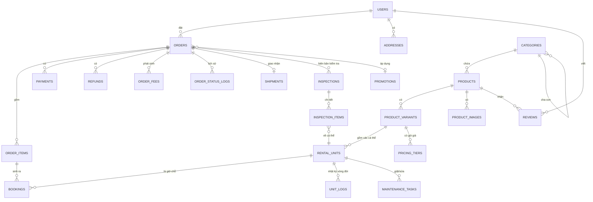

# ĐẶC TẢ HỆ THỐNG CHO THUÊ TRANG PHỤC

**Tên hệ thống:** Costume Rental System (CRS)
**Mô hình:** 1 cửa hàng duy nhất (single-tenant)
**Stack:** Next.js (App Router) + Laravel REST API + MySQL + Redis
**Phiên bản tài liệu:** 1.0 — 09/09/2026

---

## MỤC LỤC

1. [Tổng quan & phạm vi](#1-tổng-quan--phạm-vi)
2. [Actor & phân quyền](#2-actor--phân-quyền)
3. [Nghiệp vụ cốt lõi](#3-nghiệp-vụ-cốt-lõi)
4. [State machine](#4-state-machine)
5. [Business rules](#5-business-rules)
6. [Mô hình dữ liệu (ERD)](#6-mô-hình-dữ-liệu-erd)
7. [Danh sách API](#7-danh-sách-api)
8. [Danh sách màn hình & wireframe](#8-danh-sách-màn-hình--wireframe)
9. [Kiến trúc thư mục](#9-kiến-trúc-thư-mục)
10. [Lộ trình triển khai](#10-lộ-trình-triển-khai)

---

## 1. TỔNG QUAN & PHẠM VI

### 1.1. Bài toán

Cửa hàng cho thuê trang phục (áo dài, vest, váy cưới, đồ cosplay, đồ biểu diễn, đồ hoá trang...). Khác với bán hàng thương mại điện tử thông thường ở **4 điểm cốt tử** — đây cũng là phần "ăn điểm" khi bảo vệ đồ án:

| Điểm khác biệt | Hệ quả kỹ thuật |
|---|---|
| Món đồ **quay vòng**, cho thuê xong lại cho thuê tiếp | Tồn kho là **lịch bận theo thời gian**, không phải con số `quantity` |
| Mỗi món có **cá thể vật lý riêng** (2 cái áo dài size M đỏ là 2 cá thể khác nhau, tình trạng khác nhau) | Phải quản lý tới cấp `rental_unit`, có mã QR/barcode riêng |
| Giữa 2 lượt thuê phải có **thời gian đệm** để giặt ủi, kiểm tra | Availability phải cộng thêm `buffer` trước và sau |
| Có **tiền cọc**, **phí phạt trễ**, **bồi thường hư hỏng** | Dòng tiền 2 chiều: thu → giữ cọc → quyết toán → hoàn trả |

### 1.2. Phạm vi (In scope)

- Catalog trang phục theo danh mục / biến thể size–màu / cá thể
- Kiểm tra tình trạng rảnh theo khoảng ngày thuê (availability engine)
- Giỏ thuê, đặt đơn, giữ chỗ tạm (hold)
- Đặt cọc + thanh toán online (VNPay/MoMo sandbox), thanh toán tại quầy
- Giao nhận: nhận tại cửa hàng hoặc ship 2 chiều
- Trả đồ, kiểm tra tình trạng, tính phí phát sinh, hoàn cọc
- Vòng đời hậu thuê: giặt ủi → sửa chữa → sẵn sàng / thanh lý
- Khuyến mãi, đánh giá, thông báo, báo cáo doanh thu

### 1.3. Ngoài phạm vi (Out of scope)

- Nhiều cửa hàng / marketplace nhiều chủ shop
- Tích hợp API hãng vận chuyển thật (GHN/GHTK) — chỉ mô phỏng trạng thái
- Kế toán thuế, hoá đơn điện tử
- App mobile native

### 1.4. Kiến trúc tổng thể

```
┌────────────────────┐        ┌─────────────────────┐
│   Next.js (App)    │        │   Next.js Admin     │
│   - SSR/ISR catalog│        │   - CSR dashboard   │
│   - Client cart    │        │                     │
└─────────┬──────────┘        └──────────┬──────────┘
          │  REST /api/v1  (JSON)        │
          └──────────────┬───────────────┘
                         ▼
            ┌────────────────────────┐
            │   Laravel 11 API       │
            │  Controller → Service  │
            │  → Repository → Model  │
            │  Sanctum / Policies    │
            │  Queue (Jobs) + Events │
            └───┬───────────┬────────┘
                │           │
         ┌──────▼───┐   ┌───▼──────────┐
         │  MySQL 8 │   │ Redis        │
         │          │   │ cache + lock │
         └──────────┘   │ + queue      │
                        └──────────────┘
                │
        ┌───────▼────────┬──────────────┬─────────────┐
        │ VNPay sandbox  │ Mail/SMTP    │ S3/local FS │
        └────────────────┴──────────────┴─────────────┘
```

**Vì sao tách rời (headless):** Next.js lo SEO trang catalog (SSR/ISR) + trải nghiệm chọn ngày mượt; Laravel lo nghiệp vụ, transaction, khoá tồn kho. Ranh giới rõ ràng cũng dễ trình bày khi bảo vệ.

---

## 2. ACTOR & PHÂN QUYỀN

### 2.1. Danh sách actor

| Actor | Mô tả | Kênh sử dụng |
|---|---|---|
| **Khách vãng lai** (Guest) | Xem catalog, tra cứu lịch trống, không đặt được đơn | Web public |
| **Khách hàng** (Customer) | Đặt thuê, thanh toán, theo dõi đơn, đánh giá | Web public (đã đăng nhập) |
| **Nhân viên bán hàng** (Staff) | Xử lý đơn, tạo đơn tại quầy, giao/nhận đồ, kiểm tra khi trả | Admin panel |
| **Nhân viên kho/giặt ủi** (Warehouse) | Soạn đồ, cập nhật vòng đời cá thể: giặt → sửa → sẵn sàng | Admin panel |
| **Quản lý** (Manager) | Duyệt hoàn cọc/miễn phạt, cấu hình giá, xem báo cáo | Admin panel |
| **Admin hệ thống** | Quản lý user, phân quyền, cấu hình hệ thống | Admin panel |
| **Hệ thống** (System/Cron) | Job tự động: huỷ đơn quá hạn thanh toán, nhắc trả đồ, tính phí trễ | Nền |

### 2.2. Ma trận phân quyền (RBAC)

Dùng `spatie/laravel-permission`. Quyền đặt tên `<module>.<action>`.

| Nhóm quyền | Customer | Staff | Warehouse | Manager | Admin |
|---|:-:|:-:|:-:|:-:|:-:|
| `catalog.view` | ✓ | ✓ | ✓ | ✓ | ✓ |
| `catalog.manage` (CRUD sản phẩm, giá) | | | | ✓ | ✓ |
| `unit.manage` (cá thể, QR, tình trạng) | | ✓ | ✓ | ✓ | ✓ |
| `unit.lifecycle` (giặt/sửa/thanh lý) | | | ✓ | ✓ | ✓ |
| `order.create` | ✓ | ✓ | | ✓ | ✓ |
| `order.view.own` | ✓ | | | | |
| `order.view.all` | | ✓ | ✓ | ✓ | ✓ |
| `order.confirm` / `order.cancel` | | ✓ | | ✓ | ✓ |
| `order.handover` (giao đồ) | | ✓ | ✓ | ✓ | ✓ |
| `order.return_inspect` (kiểm khi trả) | | ✓ | ✓ | ✓ | ✓ |
| `fee.apply` (áp phí phạt) | | ✓ | | ✓ | ✓ |
| `fee.waive` (miễn/giảm phí phạt) | | | | ✓ | ✓ |
| `refund.approve` (duyệt hoàn cọc) | | | | ✓ | ✓ |
| `payment.record` (ghi nhận thu tiền mặt) | | ✓ | | ✓ | ✓ |
| `promotion.manage` | | | | ✓ | ✓ |
| `report.view` | | | | ✓ | ✓ |
| `user.manage` / `role.manage` | | | | | ✓ |

> **Nguyên tắc tách quyền quan trọng:** người **áp phí** và người **miễn phí** phải khác nhau (Staff áp — Manager miễn). Đây là điểm kiểm soát nội bộ, hội đồng rất hay hỏi.

---

## 3. NGHIỆP VỤ CỐT LÕI

### 3.1. Bản đồ chức năng

```
CRS
├── A. Catalog & Kho
│   ├── A1. Quản lý danh mục, dịp sử dụng (cưới, tết, cosplay, biểu diễn)
│   ├── A2. Quản lý sản phẩm (thông tin, ảnh, chất liệu, bảng size)
│   ├── A3. Quản lý biến thể (size × màu) + giá thuê + tiền cọc
│   ├── A4. Quản lý cá thể (rental unit) — mã QR, tình trạng, số lượt thuê
│   └── A5. Bảng giá & gói thuê (theo ngày / gói 2–3 ngày / thuê dài ngày)
│
├── B. Tìm kiếm & Đặt thuê
│   ├── B1. Duyệt/lọc catalog (danh mục, size, màu, giá, dịp)
│   ├── B2. Chọn khoảng ngày thuê → kiểm tra lịch trống (availability)
│   ├── B3. Giỏ thuê (nhiều món, cùng/khác khoảng ngày)
│   ├── B4. Giữ chỗ tạm (soft hold 15 phút)
│   └── B5. Đặt đơn (checkout): thông tin nhận đồ, số đo, ghi chú
│
├── C. Thanh toán & Cọc
│   ├── C1. Tính tiền: tiền thuê + cọc + phí ship − khuyến mãi
│   ├── C2. Thanh toán online (VNPay/MoMo) — cọc giữ chỗ hoặc trả đủ
│   ├── C3. Thanh toán tại quầy (tiền mặt / chuyển khoản)
│   ├── C4. Quyết toán cuối kỳ: cọc − phí phát sinh
│   └── C5. Hoàn cọc (tự động hoặc chờ duyệt)
│
├── D. Vận hành đơn
│   ├── D1. Xác nhận đơn / huỷ đơn
│   ├── D2. Soạn đồ — gán cá thể cụ thể (picking)
│   ├── D3. Giao đồ: nhận tại shop (quét QR) hoặc ship
│   ├── D4. Đang thuê — nhắc hạn trả
│   ├── D5. Gia hạn thuê
│   ├── D6. Nhận lại đồ + biên bản kiểm tra tình trạng
│   └── D7. Tính phí phát sinh (trễ / hư / mất / vệ sinh nặng)
│
├── E. Hậu thuê (vòng đời cá thể)
│   ├── E1. Kiểm tra sau trả
│   ├── E2. Giặt ủi
│   ├── E3. Sửa chữa
│   ├── E4. Trả lại kho (sẵn sàng)
│   └── E5. Thanh lý / báo mất
│
└── F. Hỗ trợ
    ├── F1. Khuyến mãi, mã giảm giá
    ├── F2. Đánh giá & hình ảnh khách gửi
    ├── F3. Thông báo (email / in-app)
    ├── F4. Báo cáo: doanh thu, top sản phẩm, tỷ lệ khai thác, tồn ế
    └── F5. Nhật ký hệ thống (audit log)
```

### 3.2. Use case chính

| Mã | Use case | Actor | Mức ưu tiên |
|---|---|---|---|
| UC-01 | Tìm & lọc trang phục theo ngày rảnh | Guest, Customer | Bắt buộc |
| UC-02 | Xem chi tiết sản phẩm + lịch bận | Guest, Customer | Bắt buộc |
| UC-03 | Thêm vào giỏ thuê với khoảng ngày | Customer | Bắt buộc |
| UC-04 | Đặt đơn & thanh toán cọc online | Customer | Bắt buộc |
| UC-05 | Theo dõi đơn / lịch sử thuê | Customer | Bắt buộc |
| UC-06 | Yêu cầu gia hạn | Customer | Nên có |
| UC-07 | Huỷ đơn & hoàn tiền | Customer, Staff | Bắt buộc |
| UC-08 | Đánh giá sau khi trả đồ | Customer | Nên có |
| UC-09 | Tạo đơn tại quầy (walk-in) | Staff | Bắt buộc |
| UC-10 | Soạn đồ & gán cá thể | Staff, Warehouse | Bắt buộc |
| UC-11 | Bàn giao đồ (quét QR) | Staff | Bắt buộc |
| UC-12 | Nhận lại & lập biên bản kiểm tra | Staff | Bắt buộc |
| UC-13 | Áp phí phát sinh & quyết toán cọc | Staff, Manager | Bắt buộc |
| UC-14 | Cập nhật vòng đời cá thể (giặt/sửa) | Warehouse | Bắt buộc |
| UC-15 | Quản lý sản phẩm & bảng giá | Manager | Bắt buộc |
| UC-16 | Xem báo cáo doanh thu / khai thác | Manager | Nên có |
| UC-17 | Tự động huỷ đơn quá hạn thanh toán | System | Bắt buộc |
| UC-18 | Tự động nhắc trả đồ & tính phí trễ | System | Bắt buộc |

### 3.3. Luồng nghiệp vụ chính (happy path)

```
KHÁCH                        HỆ THỐNG                      CỬA HÀNG
  │
  ├─ Chọn ngày thuê ────────► Kiểm tra availability
  │                            (loại trừ booking chồng lấn
  │                             + buffer giặt ủi)
  │◄── Hiển thị món còn rảnh ─┘
  │
  ├─ Thêm giỏ ──────────────► Tạo soft hold (TTL 15')
  ├─ Checkout ──────────────► Tạo Order (pending_payment)
  │                            + khoá cá thể tạm thời
  ├─ Thanh toán cọc ────────► VNPay IPN → xác nhận
  │                            Order → confirmed
  │                            Booking → confirmed (khoá cứng)
  │                                                   │
  │                            Thông báo cho shop ───►├─ Soạn đồ, gán cá thể
  │                                                   │  Order → preparing
  │                                                   │
  ├─ Đến nhận / nhận ship ◄──────────────────────────┤─ Quét QR bàn giao
  │                            Order → in_use          │  Unit → rented
  │                            Bắt đầu đếm hạn trả
  │
  │  ... đang thuê ...
  │  (T-1 ngày) ◄───────────  Job nhắc trả đồ
  │
  ├─ Trả đồ ─────────────────────────────────────────►├─ Quét QR nhận lại
  │                                                   │  Lập biên bản kiểm tra
  │                            Order → inspecting     │
  │                            Tính phí trễ/hư ◄──────┤─ Nhập tình trạng
  │                            Quyết toán cọc         │
  │◄── Thông báo số tiền hoàn ─┤                      │
  │                            Order → completed      │
  │                            Unit → cleaning ──────►├─ Giặt ủi → sẵn sàng
  ├─ Đánh giá ───────────────► Lưu review
```

### 3.4. Đặc tả chi tiết một số use case then chốt

#### UC-04: Đặt đơn & thanh toán cọc

| Mục | Nội dung |
|---|---|
| **Tiền điều kiện** | Khách đã đăng nhập; giỏ thuê có ≥1 dòng; mọi dòng còn hold hợp lệ |
| **Luồng chính** | 1. Khách vào trang checkout<br>2. Hệ thống **kiểm tra lại availability** (chống race condition)<br>3. Khách chọn hình thức nhận: tại shop / giao tận nơi<br>4. Khách nhập địa chỉ, số điện thoại, số đo (nếu cần sửa vừa người)<br>5. Khách nhập mã giảm giá (tuỳ chọn)<br>6. Hệ thống tính: `tổng thuê + tổng cọc + phí ship − giảm giá`<br>7. Khách chọn: **trả cọc trước** (mặc định) hoặc **trả đủ**<br>8. Khách xác nhận điều khoản → tạo `Order` trạng thái `pending_payment`, tạo `Booking` cho từng dòng ở trạng thái `held`<br>9. Redirect sang cổng thanh toán<br>10. Cổng trả kết quả qua **IPN/webhook** → tạo `Payment` thành công<br>11. `Order → confirmed`, `Booking → confirmed`, gửi email xác nhận |
| **Luồng phụ 4a** | Địa chỉ ngoài vùng giao → chỉ cho phép nhận tại shop |
| **Luồng phụ 6a** | Mã giảm giá hết hạn/không đủ điều kiện → báo lỗi, giữ nguyên giỏ |
| **Ngoại lệ 2a** | Món vừa bị người khác đặt mất → thông báo tên món, gợi ý biến thể/ngày khác, loại khỏi giỏ |
| **Ngoại lệ 10a** | Thanh toán thất bại / khách bỏ giữa chừng → đơn giữ `pending_payment` trong 30 phút, sau đó job `ExpireUnpaidOrders` huỷ đơn và nhả booking |
| **Hậu điều kiện** | Đơn `confirmed`, các cá thể bị khoá lịch, đã ghi nhận `Payment` cọc |

#### UC-12 + UC-13: Nhận lại đồ, kiểm tra và quyết toán

| Mục | Nội dung |
|---|---|
| **Tiền điều kiện** | Đơn ở trạng thái `in_use` hoặc `overdue` |
| **Luồng chính** | 1. Staff quét QR từng cá thể khách trả<br>2. Hệ thống đối chiếu cá thể ↔ đơn; cảnh báo nếu trả nhầm/thiếu<br>3. Staff chọn tình trạng mỗi cá thể: `nguyên vẹn` / `bẩn nặng` / `hư hỏng nhẹ` / `hư hỏng nặng` / `mất`<br>4. Staff chụp ảnh minh chứng (bắt buộc nếu không phải "nguyên vẹn")<br>5. Hệ thống tự tính phí trễ theo số ngày quá hạn<br>6. Hệ thống gợi ý phí hư hỏng theo bảng cấu hình; Staff có thể chỉnh trong biên độ cho phép<br>7. Hệ thống quyết toán: `hoàn = cọc − tổng phí phát sinh`<br>8. Nếu `hoàn ≥ 0` → tạo `Refund`; nếu `hoàn < 0` → tạo công nợ khách phải trả thêm<br>9. `Order → completed` (hoặc `disputed` nếu khách không đồng ý)<br>10. Cá thể chuyển `cleaning` (hoặc `repairing` / `lost`) |
| **Luồng phụ 6a** | Phí vượt biên độ Staff → đơn chuyển `pending_approval`, chờ Manager duyệt |
| **Ngoại lệ 2a** | Khách trả thiếu 1 món → phần đã trả xử lý bình thường, món thiếu giữ `in_use` và tiếp tục tính phí trễ |
| **Hậu điều kiện** | Cọc được quyết toán, cá thể vào vòng đời hậu thuê |

---

## 4. STATE MACHINE

### 4.1. Trạng thái đơn thuê (`orders.status`)

```
                    ┌──────────┐
                    │  draft   │ (giỏ hàng / đơn nháp tại quầy)
                    └────┬─────┘
                         │ checkout
                    ┌────▼──────────────┐
        huỷ ◄───────│  pending_payment  │──── quá 30' ──► expired
                    └────┬──────────────┘
                         │ thanh toán cọc thành công
                    ┌────▼──────┐
        huỷ ◄───────│ confirmed │
                    └────┬──────┘
                         │ staff soạn đồ & gán cá thể
                    ┌────▼──────┐
                    │ preparing │
                    └────┬──────┘
                         │ đóng gói xong
                    ┌────▼──────┐
                    │  ready    │ (chờ khách nhận / chờ shipper lấy)
                    └────┬──────┘
                         │ bàn giao (quét QR) / shipper giao thành công
                    ┌────▼──────┐         quá hạn trả      ┌─────────┐
                    │  in_use   │────────────────────────► │ overdue │
                    └────┬──────┘                          └────┬────┘
                         │  khách trả đồ                        │
                    ┌────▼──────────────────────────────────────▼──┐
                    │              inspecting                      │
                    └────┬────────────────────────────┬────────────┘
       phí vượt quyền ───┤                            │ khách không đồng ý
                    ┌────▼───────────────────┐   ┌────▼──────┐
                    │ pending_approval       │   │ disputed  │
                    └────┬───────────────────┘   └────┬──────┘
                         │ manager duyệt              │ giải quyết xong
                    ┌────▼────────────────────────────▼──┐
                    │            completed               │
                    └────────────────────────────────────┘

Trạng thái kết thúc: completed | cancelled | expired
```

**Bảng chuyển trạng thái hợp lệ:**

| Từ | Sang | Điều kiện / người thực hiện |
|---|---|---|
| `draft` | `pending_payment` | Khách checkout, availability còn hợp lệ |
| `pending_payment` | `confirmed` | Payment cọc `succeeded` (qua IPN) |
| `pending_payment` | `expired` | Job cron sau 30 phút |
| `pending_payment` | `cancelled` | Khách/Staff huỷ |
| `confirmed` | `preparing` | Staff bắt đầu soạn đồ |
| `confirmed` | `cancelled` | Khách huỷ (áp chính sách phí huỷ) hoặc Staff huỷ (hoàn 100%) |
| `preparing` | `ready` | Đã gán đủ cá thể & đóng gói |
| `ready` | `in_use` | Bàn giao thành công |
| `in_use` | `overdue` | Job cron khi `now > return_due_at` |
| `in_use` / `overdue` | `inspecting` | Staff nhận lại đồ |
| `inspecting` | `completed` | Quyết toán trong quyền hạn Staff |
| `inspecting` | `pending_approval` | Phí phát sinh vượt ngưỡng |
| `inspecting` | `disputed` | Khách khiếu nại |
| `pending_approval` / `disputed` | `completed` | Manager duyệt / giải quyết |

> **Chốt kỹ thuật:** đưa toàn bộ bảng này vào một class `OrderStateMachine` phía Laravel; mọi chuyển trạng thái đi qua method `transitionTo()` và ghi `order_status_logs`. Không cho controller `$order->status = 'x'` tuỳ tiện.

### 4.2. Trạng thái cá thể trang phục (`rental_units.status`)

```
      ┌───────────┐   nhập kho mới
      │ available │◄──────────────────────┐
      └─────┬─────┘                       │
            │ được gán vào đơn            │ QC đạt
      ┌─────▼─────┐                 ┌─────┴──────┐
      │ reserved  │                 │  cleaning  │
      └─────┬─────┘                 └─────▲──────┘
            │ bàn giao                    │ khách trả, cần giặt
      ┌─────▼─────┐                       │
      │  rented   │───────────────────────┤
      └───────────┘                       │
                                    ┌─────┴──────┐  QC không đạt
                                    │ repairing  │◄──────────────
                                    └─────┬──────┘
                                          │ không sửa được
                                    ┌─────▼──────┐
                                    │  retired   │ (thanh lý)
                                    └────────────┘

                                    ┌────────────┐
                                    │    lost    │ (khách làm mất)
                                    └────────────┘
```

| Trạng thái | Ý nghĩa | Có cho thuê được? |
|---|---|---|
| `available` | Sẵn sàng trong kho | ✓ |
| `reserved` | Đã gán cho đơn, chưa bàn giao | ✗ |
| `rented` | Đang ở chỗ khách | ✗ |
| `cleaning` | Đang giặt ủi | ✗ |
| `repairing` | Đang sửa chữa | ✗ |
| `retired` | Thanh lý, ngừng khai thác | ✗ |
| `lost` | Mất, đã bồi thường | ✗ |

### 4.3. Trạng thái booking (`bookings.status`)

`held` (giữ tạm, có TTL) → `confirmed` (khoá cứng) → `fulfilled` (đã trả xong)
Nhánh phụ: `held` → `released` (hết TTL / bỏ giỏ); `confirmed` → `cancelled`.

### 4.4. Trạng thái thanh toán (`payments.status`)

`pending` → `succeeded` | `failed` | `expired`; `succeeded` → `refunded` | `partially_refunded`.

---

## 5. BUSINESS RULES

### 5.1. Tồn kho & lịch bận — phần lõi nhất

**BR-01 — Định nghĩa "rảnh".** Một cá thể `U` rảnh trong khoảng `[D1, D2]` khi:
- `U.status ∈ {available}`, **và**
- không tồn tại booking `B` của `U` với `B.status ∈ {held, confirmed}` mà khoảng bận của `B` chồng lấn `[D1 − prep_buffer, D2 + clean_buffer]`.

**BR-02 — Khoảng bận thực tế của booking.**
```
busy_from = pickup_date  − prep_buffer_days   (mặc định 0–1 ngày)
busy_to   = return_date  + clean_buffer_days  (mặc định 1 ngày)
```
`clean_buffer_days` cấu hình theo **danh mục** (váy cưới 2 ngày, áo dài 1 ngày, phụ kiện 0 ngày).

**BR-03 — Điều kiện chồng lấn.** Hai khoảng `[a1,a2]` và `[b1,b2]` chồng lấn khi `a1 <= b2 AND b1 <= a2`. Đây là điều kiện `WHERE` chuẩn cho câu truy vấn availability.

```sql
-- Đếm số cá thể rảnh của 1 biến thể trong khoảng ngày
SELECT COUNT(*) FROM rental_units u
WHERE u.variant_id = :variant_id
  AND u.status = 'available'
  AND NOT EXISTS (
      SELECT 1 FROM bookings b
      WHERE b.rental_unit_id = u.id
        AND b.status IN ('held','confirmed')
        AND b.busy_from <= :busy_to
        AND b.busy_to   >= :busy_from
  );
```

**BR-04 — Chống đặt trùng (race condition).** Khi checkout, bọc trong transaction và khoá bi quan:
```php
DB::transaction(function () use ($unitIds) {
    RentalUnit::whereIn('id', $unitIds)->lockForUpdate()->get();
    // kiểm tra lại availability
    // tạo bookings
});
```
Kết hợp **unique index** `(rental_unit_id, busy_from)` và một Redis lock theo `variant_id` để giảm tranh chấp. Nếu kiểm tra lại thất bại → rollback, báo lỗi 409 kèm danh sách món đã mất.

**BR-05 — Soft hold.** Khi thêm vào giỏ, tạo booking `held` với `expires_at = now + 15 phút`. Job `ReleaseExpiredHolds` chạy mỗi phút để nhả. Khách checkout thì gia hạn hold lên 30 phút.

**BR-06 — Gán cá thể trễ (late binding).** Lúc đặt đơn chỉ cần **giữ số lượng** ở cấp biến thể (chọn bất kỳ cá thể rảnh nào). Cá thể **cụ thể** chỉ chốt khi Staff soạn đồ (`preparing`), ưu tiên cá thể có `rental_count` thấp nhất để mòn đều. Cách này giảm rất nhiều xung đột so với gán cứng từ đầu.

**BR-07 — Giới hạn đặt trước.** Chỉ cho đặt trong `[hôm nay + min_lead_days, hôm nay + max_advance_days]` (mặc định 0 và 180 ngày). Thời gian thuê tối thiểu 1 ngày, tối đa 30 ngày (vượt phải liên hệ shop).

### 5.2. Giá thuê & tiền cọc

**BR-10 — Công thức tính giá một dòng:**
```
số_ngày        = ceil(return_date − pickup_date) hoặc 1 nếu cùng ngày
tiền_thuê_dòng = giá_gói_phù_hợp + (số_ngày_vượt_gói × giá_ngày_thêm)
tiền_cọc_dòng  = deposit_amount của biến thể   (không nhân theo số ngày)
```

**BR-11 — Gói thuê.** Mỗi biến thể có thể có nhiều `pricing_tier`: ví dụ gói 1 ngày 300k, gói 3 ngày 700k, ngày thứ 4 trở đi +150k/ngày. Hệ thống luôn chọn tổ hợp **rẻ nhất cho khách**.

**BR-12 — Tổng đơn:**
```
tổng_thuê   = Σ tiền_thuê_dòng
tổng_cọc    = Σ tiền_cọc_dòng
giảm_giá    = theo promotion (chỉ áp lên tổng_thuê, KHÔNG áp lên cọc)
phí_ship    = theo bảng phí × 2 chiều (nếu chọn giao tận nơi)
phải_trả    = tổng_thuê − giảm_giá + phí_ship + tổng_cọc
```

**BR-13 — Hai phương án thu tiền:**
- **Cọc giữ chỗ (mặc định):** trả online `tổng_cọc` + 30% `tổng_thuê`; phần còn lại thu khi nhận đồ.
- **Trả đủ:** trả online toàn bộ `phải_trả`, được giảm thêm 2% (khuyến khích, cấu hình được).

**BR-14 — Cọc không sinh doanh thu.** Tiền cọc hạch toán vào tài khoản "phải trả người thuê", **không tính vào doanh thu** trong báo cáo. Chỉ phần cọc bị trừ do phí phát sinh mới ghi nhận doanh thu.

### 5.3. Huỷ đơn & hoàn tiền

**BR-20 — Chính sách phí huỷ (theo thời điểm huỷ trước ngày nhận):**

| Huỷ trước ngày nhận | Hoàn tiền thuê đã trả | Hoàn cọc |
|---|---|---|
| ≥ 7 ngày | 100% | 100% |
| 3–6 ngày | 70% | 100% |
| 1–2 ngày | 50% | 100% |
| < 24 giờ hoặc không đến nhận | 0% | 100% |

**BR-21.** Shop huỷ đơn (hết đồ, đồ hỏng đột xuất) → hoàn **100%** mọi khoản + tặng voucher xin lỗi.
**BR-22.** Hoàn tiền online về đúng kênh đã thanh toán, trong 3–7 ngày làm việc; hoàn tiền mặt thì Staff ghi nhận phiếu chi có xác nhận.
**BR-23.** Mọi khoản hoàn > `refund_auto_limit` (mặc định 2.000.000đ) phải qua Manager duyệt.

### 5.4. Phí phát sinh

**BR-30 — Phí trễ hạn:** `phí_trễ = số_ngày_trễ × late_fee_rate × tiền_thuê_ngày_của_dòng`, mặc định `late_fee_rate = 1.5`. Có trần: không vượt quá `tiền_cọc_dòng × 2`. Ân hạn 3 giờ sau giờ hẹn trả.

**BR-31 — Phí tình trạng khi trả:**

| Tình trạng | Phí | Xử lý cá thể |
|---|---|---|
| Nguyên vẹn | 0 | → `cleaning` |
| Bẩn nặng (dính màu, mùi, vết khó tẩy) | phí giặt đặc biệt (cấu hình theo danh mục) | → `cleaning` |
| Hư hỏng nhẹ (bung chỉ, rách nhỏ, mất hạt) | 10–30% giá trị đồ | → `repairing` |
| Hư hỏng nặng (không sửa được) | 100% giá trị đồ | → `retired` |
| Mất | 100% giá trị đồ + 20% phí cơ hội | → `lost` |

**BR-32 — Quyết toán cọc:**
```
tổng_phí_phát_sinh = phí_trễ + phí_tình_trạng + phí_khác
nếu tổng_phí ≤ tổng_cọc  → hoàn khách (tổng_cọc − tổng_phí)
nếu tổng_phí >  tổng_cọc → khách nợ thêm (tổng_phí − tổng_cọc), tạo công nợ
```

**BR-33 — Biên độ quyền hạn.** Staff tự quyết phí ≤ 500.000đ và chỉ được giảm tối đa 20% so với mức hệ thống gợi ý. Ngoài biên độ → chuyển Manager.

**BR-34 — Minh chứng bắt buộc.** Mọi phí ≠ 0 phải có ≥ 1 ảnh đính kèm trong biên bản kiểm tra. Đây là căn cứ khi khách khiếu nại.

### 5.5. Gia hạn

**BR-40.** Khách gửi yêu cầu gia hạn trước hạn trả ít nhất 12 giờ.
**BR-41.** Hệ thống tự duyệt nếu cá thể đó **không có booking kế tiếp** trong khoảng gia hạn (+ buffer); ngược lại từ chối và gợi ý trả đúng hạn.
**BR-42.** Tiền gia hạn tính theo giá ngày thêm, thu ngay khi duyệt. Gia hạn không làm mất phí trễ đã phát sinh trước đó.

### 5.6. Khuyến mãi

**BR-50.** Mã giảm giá có: loại (`percent`/`fixed`), giá trị, giảm tối đa, đơn tối thiểu, khoảng hiệu lực, giới hạn tổng lượt, giới hạn lượt/khách, phạm vi (toàn shop / danh mục / sản phẩm).
**BR-51.** Không cộng dồn nhiều mã trên một đơn (trừ mã freeship, cho phép cộng 1 mã freeship + 1 mã giảm giá).
**BR-52.** Huỷ đơn → trả lại lượt dùng mã cho khách.

### 5.7. Đánh giá & dữ liệu

**BR-60.** Chỉ khách có đơn `completed` chứa sản phẩm đó mới được đánh giá, mỗi đơn/sản phẩm 1 lần, trong 30 ngày sau khi hoàn tất.
**BR-61.** Đánh giá qua kiểm duyệt trước khi hiển thị (chống ảnh/nội dung không phù hợp).
**BR-62 — Audit log.** Mọi thao tác đổi trạng thái đơn, áp/miễn phí, hoàn tiền, sửa giá đều ghi log: ai, lúc nào, giá trị cũ → mới, lý do.

---

## 6. MÔ HÌNH DỮ LIỆU (ERD)

### 6.1. Sơ đồ quan hệ



### 6.2. Đặc tả bảng chính

#### `users`
| Cột | Kiểu | Ghi chú |
|---|---|---|
| id | bigint PK | |
| name, email, phone | string | email unique, phone unique |
| password | string | |
| id_card_note | string null | ghi chú giấy tờ thế chân (KHÔNG lưu số CCCD) |
| measurements | json null | số đo: cao, nặng, vòng 1/2/3, dài tay... |
| status | enum | active / blocked |
| blacklist_reason | text null | khách từng làm mất/hư đồ nặng |

#### `categories`
`id, parent_id, name, slug, description, clean_buffer_days (int, default 1), sort_order, is_active`

#### `products`
| Cột | Kiểu | Ghi chú |
|---|---|---|
| id | bigint PK | |
| category_id | FK | |
| name, slug, sku | string | slug unique |
| description | text | |
| material, care_instruction | text | chất liệu, hướng dẫn bảo quản |
| occasion | json | ["cưới","tết","biểu diễn"] |
| size_chart | json null | bảng size riêng của sản phẩm |
| base_price, base_deposit | decimal(12,2) | giá mặc định, biến thể có thể override |
| replacement_value | decimal(12,2) | **giá trị đền bù nếu mất** |
| is_active, is_featured | bool | |

#### `product_variants`
| Cột | Kiểu | Ghi chú |
|---|---|---|
| id | bigint PK | |
| product_id | FK | |
| size, color | string | unique (product_id, size, color) |
| color_hex | string null | để render swatch màu |
| price_per_day, deposit_amount | decimal(12,2) | |
| extra_day_price | decimal(12,2) | giá ngày thứ n+1 |
| barcode | string null | |

#### `rental_units` ⭐ *bảng quan trọng nhất*
| Cột | Kiểu | Ghi chú |
|---|---|---|
| id | bigint PK | |
| variant_id | FK | |
| unit_code | string unique | mã in QR, vd `AD-M-DO-003` |
| status | enum | available / reserved / rented / cleaning / repairing / retired / lost |
| condition_grade | enum | new / good / fair / worn |
| purchase_date, purchase_cost | date, decimal | phục vụ tính ROI từng cá thể |
| rental_count | int | số lượt đã cho thuê (dùng để mòn đều) |
| last_cleaned_at | timestamp null | |
| location | string null | vị trí trên giá kệ |
| note | text null | |

#### `bookings` ⭐ *bảng khoá lịch*
| Cột | Kiểu | Ghi chú |
|---|---|---|
| id | bigint PK | |
| order_item_id | FK null | null khi mới chỉ là hold ở giỏ |
| variant_id | FK | luôn có (giữ chỗ cấp biến thể) |
| rental_unit_id | FK null | null cho tới khi Staff gán cá thể (BR-06) |
| pickup_date, return_date | date | ngày khách nhận / trả |
| busy_from, busy_to | date | đã cộng buffer (BR-02) |
| status | enum | held / confirmed / fulfilled / released / cancelled |
| expires_at | timestamp null | TTL của soft hold |
| **Index** | | `(rental_unit_id, busy_from, busy_to)`, `(variant_id, busy_from, busy_to)`, `(status, expires_at)` |

#### `orders`
| Cột | Kiểu | Ghi chú |
|---|---|---|
| id | bigint PK | |
| code | string unique | `CR20260909-0001` |
| user_id | FK null | null cho đơn tại quầy của khách vãng lai |
| channel | enum | online / walk_in |
| status | enum | xem §4.1 |
| pickup_method | enum | at_store / delivery |
| pickup_date, return_date, return_due_at | date/datetime | |
| receiver_name, receiver_phone, address | string/text | |
| subtotal_rental, discount, shipping_fee, total_deposit | decimal | |
| extra_fees_total, grand_total, paid_amount, refunded_amount | decimal | |
| promotion_id | FK null | |
| note, internal_note | text null | |
| confirmed_at, handed_over_at, returned_at, completed_at | timestamp null | |
| created_by | FK null | staff tạo đơn tại quầy |

#### `order_items`
`id, order_id, variant_id, product_name_snapshot, variant_snapshot (json), quantity, days, unit_rental_price, unit_deposit, line_rental_total, line_deposit_total`

> Luôn **snapshot** tên/giá tại thời điểm đặt. Sau này shop đổi giá thì đơn cũ không bị lệch.

#### `payments`
`id, order_id, code, type (deposit|rental|extra_fee|extension), method (vnpay|momo|cash|bank_transfer), amount, status, gateway_txn_id, gateway_response (json), paid_at, created_by`

#### `refunds`
`id, order_id, payment_id, amount, reason, status (pending|approved|processing|done|rejected), approved_by, approved_at, processed_at, note`

#### `order_fees`
`id, order_id, rental_unit_id (null), type (late|dirty|damage_minor|damage_major|lost|other), suggested_amount, final_amount, reason, evidence (json ảnh), created_by, waived_by (null), waive_reason`

#### `inspections` / `inspection_items`
- `inspections`: `id, order_id, type (handover|return), inspector_id, inspected_at, summary, customer_signature (path null)`
- `inspection_items`: `id, inspection_id, rental_unit_id, condition (intact|dirty|damage_minor|damage_major|lost), photos (json), note`

> Có cả biên bản **lúc giao** lẫn **lúc nhận** — so 2 biên bản là căn cứ khách quan khi tranh chấp. Điểm cộng lớn cho đồ án.

#### `maintenance_tasks`
`id, rental_unit_id, type (cleaning|repair|alteration), status (todo|doing|done|failed), assigned_to, cost, started_at, finished_at, note`

#### `shipments`
`id, order_id, direction (outbound|inbound), carrier, tracking_code, fee, status (pending|picked|in_transit|delivered|failed|returned), shipped_at, delivered_at`

#### Bảng phụ trợ
- `product_images`: `id, product_id, variant_id (null), path, alt, sort_order, is_primary`
- `pricing_tiers`: `id, variant_id, days, price, label` (gói 1/3/7 ngày)
- `promotions`: `id, code, type, value, max_discount, min_order, scope, scope_ids (json), starts_at, ends_at, usage_limit, used_count, per_user_limit, is_active`
- `reviews`: `id, product_id, order_id, user_id, rating, content, images (json), status (pending|approved|rejected), replied_content, replied_at`
- `notifications`: chuẩn Laravel notifications table
- `order_status_logs`: `id, order_id, from_status, to_status, actor_id, reason, created_at`
- `unit_logs`: `id, rental_unit_id, from_status, to_status, order_id (null), actor_id, note, created_at`
- `settings`: `key, value (json)` — chứa `late_fee_rate`, `hold_ttl_minutes`, `refund_auto_limit`, `staff_fee_limit`, `max_advance_days`...

### 6.3. Ghi chú thiết kế đáng lưu ý

1. **Không có cột `stock_quantity`.** Tồn kho = số cá thể `available` trừ đi số bị chồng lịch. Đây là điểm phân biệt hệ thống cho thuê với hệ thống bán hàng.
2. **Denormalize `busy_from`/`busy_to`** vào `bookings` thay vì tính runtime — cho phép đánh index và query availability cực nhanh.
3. **Snapshot** tên/giá vào `order_items`, `order_fees` để đơn cũ bất biến.
4. Dùng **soft delete** cho `products`, `product_variants`, `rental_units` (đơn cũ vẫn phải tham chiếu được).
5. Tiền để `decimal(12,2)` hoặc `bigint` đơn vị đồng — **không dùng float**.

---

## 7. DANH SÁCH API

Prefix `/api/v1`. Auth: Laravel Sanctum (SPA cookie hoặc Bearer token). Định dạng lỗi thống nhất:

```json
{ "message": "Món đồ đã được người khác đặt", "errors": { "items": ["variant_id 12 không còn rảnh"] }, "code": "AVAILABILITY_CONFLICT" }
```

### 7.1. Public / Customer

| Method | Endpoint | Mô tả |
|---|---|---|
| GET | `/categories` | Cây danh mục |
| GET | `/products` | Danh sách + lọc `?category=&size=&color=&price_min=&price_max=&occasion=&from=&to=&sort=` |
| GET | `/products/{slug}` | Chi tiết + biến thể + ảnh + đánh giá |
| GET | `/products/{slug}/availability?from=&to=` | Trả về từng biến thể còn bao nhiêu cá thể rảnh |
| GET | `/products/{slug}/calendar?month=` | Lịch bận theo ngày (để tô màu date picker) |
| POST | `/availability/check` | Kiểm tra hàng loạt cho cả giỏ |
| GET | `/reviews?product_id=` | Đánh giá đã duyệt |
| POST | `/auth/register` · `/auth/login` · `/auth/logout` · `/auth/forgot-password` | Xác thực |
| GET/PUT | `/me` | Hồ sơ, số đo |
| GET/POST/PUT/DELETE | `/me/addresses` | Sổ địa chỉ |
| GET | `/cart` | Lấy giỏ thuê hiện tại |
| POST | `/cart/items` | Thêm dòng `{variant_id, quantity, pickup_date, return_date}` → tạo soft hold |
| PUT | `/cart/items/{id}` · DELETE | Sửa / xoá dòng |
| POST | `/cart/apply-promotion` | Thử mã giảm giá |
| POST | `/cart/quote` | Tính tiền chi tiết, không tạo đơn |
| POST | `/orders` | Checkout → tạo đơn `pending_payment` |
| GET | `/orders` · `/orders/{code}` | Đơn của tôi |
| POST | `/orders/{code}/cancel` | Huỷ (áp BR-20) |
| POST | `/orders/{code}/extend` | Yêu cầu gia hạn |
| POST | `/orders/{code}/pay` | Khởi tạo phiên thanh toán → trả `payment_url` |
| POST | `/orders/{code}/reviews` | Đánh giá sau khi hoàn tất |
| GET | `/notifications` · POST `/notifications/{id}/read` | Thông báo |

### 7.2. Webhook (không auth, verify chữ ký)

| Method | Endpoint | Mô tả |
|---|---|---|
| GET | `/payments/vnpay/return` | Trình duyệt quay về (chỉ hiển thị, KHÔNG tin để cập nhật đơn) |
| POST | `/payments/vnpay/ipn` | **Nguồn sự thật** — verify `vnp_SecureHash`, idempotent theo `gateway_txn_id` |
| POST | `/payments/momo/ipn` | Tương tự |

> **Nguyên tắc vàng:** chỉ IPN mới được đổi trạng thái đơn. Return URL chỉ dùng để điều hướng UI. Xử lý IPN phải **idempotent** vì cổng có thể gọi lại nhiều lần.

### 7.3. Admin

**Catalog**
| Method | Endpoint |
|---|---|
| GET/POST/PUT/DELETE | `/admin/categories`, `/admin/products`, `/admin/products/{id}/variants` |
| POST | `/admin/products/{id}/images` (upload nhiều ảnh) |
| GET/POST/PUT | `/admin/variants/{id}/pricing-tiers` |

**Kho & cá thể**
| Method | Endpoint | Mô tả |
|---|---|---|
| GET | `/admin/units` | Lọc theo variant, status, vị trí |
| POST | `/admin/units/bulk` | Tạo nhiều cá thể một lần cho 1 biến thể |
| PUT | `/admin/units/{id}/status` | Đổi trạng thái + ghi `unit_logs` |
| GET | `/admin/units/{code}/qr` | Sinh mã QR |
| GET | `/admin/units/{id}/schedule?from=&to=` | Lịch bận của một cá thể |
| GET | `/admin/calendar?from=&to=` | **Lịch tổng** — timeline mọi booking |

**Đơn hàng**
| Method | Endpoint | Mô tả |
|---|---|---|
| GET | `/admin/orders` | Lọc trạng thái/ngày/khách/kênh |
| POST | `/admin/orders` | Tạo đơn tại quầy |
| GET | `/admin/orders/{code}` | Chi tiết đầy đủ |
| POST | `/admin/orders/{code}/confirm` · `/cancel` | Xác nhận / huỷ |
| POST | `/admin/orders/{code}/assign-units` | Gán cá thể cụ thể (BR-06) |
| POST | `/admin/orders/{code}/handover` | Bàn giao — body chứa danh sách `unit_code` quét được |
| POST | `/admin/orders/{code}/return` | Nhận lại + biên bản kiểm tra |
| POST | `/admin/orders/{code}/fees` | Thêm phí phát sinh |
| POST | `/admin/orders/{code}/fees/{id}/waive` | Miễn phí (chỉ Manager) |
| POST | `/admin/orders/{code}/settle` | Quyết toán cọc → sinh refund/công nợ |
| POST | `/admin/orders/{code}/payments` | Ghi nhận thu tiền mặt |
| POST | `/admin/refunds/{id}/approve` · `/reject` | Duyệt hoàn tiền |

**Vận hành khác**
| Method | Endpoint |
|---|---|
| GET/PUT | `/admin/maintenance-tasks`, `/admin/maintenance-tasks/{id}` |
| GET/POST/PUT | `/admin/promotions` |
| GET/PUT | `/admin/reviews` (duyệt / trả lời) |
| GET | `/admin/reports/revenue?from=&to=&group_by=day|month` |
| GET | `/admin/reports/utilization` (tỷ lệ khai thác từng cá thể) |
| GET | `/admin/reports/top-products`, `/admin/reports/idle-stock` |
| GET/POST | `/admin/users`, `/admin/roles` |
| GET/PUT | `/admin/settings` |

### 7.4. Job nền (Laravel Scheduler / Queue)

| Job | Tần suất | Việc |
|---|---|---|
| `ReleaseExpiredHolds` | mỗi phút | Nhả booking `held` hết `expires_at` |
| `ExpireUnpaidOrders` | mỗi 5 phút | Huỷ đơn `pending_payment` quá 30 phút |
| `MarkOverdueOrders` | mỗi giờ | `in_use` → `overdue`, bắt đầu tính phí trễ |
| `SendReturnReminder` | 9h hằng ngày | Nhắc khách trước hạn trả 1 ngày |
| `SendPickupReminder` | 9h hằng ngày | Nhắc khách ngày mai đến nhận đồ |
| `AutoCompleteInspection` | hằng ngày | Đơn `inspecting` quá 7 ngày không xử lý → cảnh báo Manager |
| `RebuildAvailabilityCache` | mỗi 10 phút | Làm mới cache lịch cho trang catalog |

---

## 8. DANH SÁCH MÀN HÌNH & WIREFRAME

### 8.1. Bản đồ route (Next.js App Router)

```
app/
├── (shop)/                          # Giao diện khách
│   ├── page.tsx                     # S01 Trang chủ
│   ├── danh-muc/[slug]/page.tsx     # S02 Danh sách sản phẩm
│   ├── san-pham/[slug]/page.tsx     # S03 Chi tiết sản phẩm
│   ├── gio-thue/page.tsx            # S04 Giỏ thuê
│   ├── thanh-toan/page.tsx          # S05 Checkout
│   ├── thanh-toan/ket-qua/page.tsx  # S06 Kết quả thanh toán
│   ├── tai-khoan/
│   │   ├── page.tsx                 # S07 Hồ sơ & số đo
│   │   ├── don-thue/page.tsx        # S08 Danh sách đơn
│   │   ├── don-thue/[code]/page.tsx # S09 Chi tiết đơn
│   │   └── dia-chi/page.tsx         # S10 Sổ địa chỉ
│   ├── dang-nhap | dang-ky          # S11 Auth
│   └── huong-dan | chinh-sach       # S12 Trang tĩnh
│
└── admin/                           # Giao diện quản trị
    ├── page.tsx                     # A01 Dashboard
    ├── don-hang/page.tsx            # A02 Danh sách đơn
    ├── don-hang/[code]/page.tsx     # A03 Chi tiết & xử lý đơn
    ├── don-hang/tao-moi/page.tsx    # A04 Tạo đơn tại quầy (POS)
    ├── lich/page.tsx                # A05 Lịch thuê tổng
    ├── san-pham/page.tsx            # A06 Quản lý sản phẩm
    ├── san-pham/[id]/page.tsx       # A07 Sửa sản phẩm & biến thể
    ├── kho/page.tsx                 # A08 Quản lý cá thể
    ├── tra-do/page.tsx              # A09 Quầy nhận trả (quét QR)
    ├── giat-ui/page.tsx             # A10 Hàng đợi giặt/sửa
    ├── khuyen-mai/page.tsx          # A11 Khuyến mãi
    ├── danh-gia/page.tsx            # A12 Duyệt đánh giá
    ├── khach-hang/page.tsx          # A13 Khách hàng
    ├── bao-cao/page.tsx             # A14 Báo cáo
    └── cai-dat/page.tsx             # A15 Cấu hình & phân quyền
```

**Ưu tiên làm trước (MVP bảo vệ được):** S01, S02, S03, S04, S05, S06, S08, S09, A01, A02, A03, A05, A06, A08, A09.

---

### 8.2. Wireframe các màn hình quan trọng

#### S03 — Chi tiết sản phẩm ⭐ *màn hình linh hồn của hệ thống*

```
┌──────────────────────────────────────────────────────────────────────┐
│  [Logo]   Danh mục ▾   Tìm kiếm...           [Giỏ thuê 2]  [Tài khoản]│
├──────────────────────────────────────────────────────────────────────┤
│  Trang chủ / Áo dài / Áo dài cách tân đỏ thêu sen                     │
│                                                                       │
│ ┌──────────────────────┐  ┌────────────────────────────────────────┐ │
│ │                      │  │ ÁO DÀI CÁCH TÂN ĐỎ THÊU SEN            │ │
│ │      Ảnh chính       │  │ ★★★★☆ 4.6 (32 đánh giá) · Đã thuê 118 │ │
│ │       (zoom)         │  │                                        │ │
│ │                      │  │ 350.000đ /ngày                         │ │
│ └──────────────────────┘  │ Cọc: 500.000đ (hoàn khi trả nguyên vẹn)│ │
│ [▪][▪][▪][▪] thumbnails   │                                        │ │
│                           │ ┌────────────────────────────────────┐ │ │
│                           │ │ 📅 CHỌN NGÀY THUÊ                  │ │ │
│                           │ │ Nhận: [12/10/2026] Trả:[15/10/2026]│ │ │
│                           │ │ → 3 ngày · Gói 3 ngày: 900.000đ    │ │ │
│                           │ │   (tiết kiệm 150.000đ)             │ │ │
│                           │ └────────────────────────────────────┘ │ │
│                           │                                        │ │
│                           │ Màu:  [🔴 Đỏ] [🟡 Vàng] [⚪ Trắng✗]   │ │
│                           │ Size: [ S ] [ M ] [ L ] [XL✗]         │ │
│                           │       ✗ = hết đồ trong khoảng ngày này │ │
│                           │                                        │ │
│                           │ ✅ Còn 2/3 bộ rảnh cho ngày bạn chọn   │ │
│                           │                                        │ │
│                           │ Số lượng: [− 1 +]                      │ │
│                           │ ┌──────────────────┐ ┌───────────────┐│ │
│                           │ │ THÊM VÀO GIỎ THUÊ│ │ THUÊ NGAY     ││ │
│                           │ └──────────────────┘ └───────────────┘│ │
│                           │ ⏱ Giữ chỗ 15 phút sau khi thêm giỏ    │ │
│                           └────────────────────────────────────────┘ │
│                                                                       │
│  ┌─ LỊCH TRỐNG THÁNG 10/2026 ────────────────────────────────────┐   │
│  │  T2  T3  T4  T5  T6  T7  CN                                   │   │
│  │   1   2   3   4   5   6   7    🟩 Còn nhiều  🟨 Sắp hết       │   │
│  │  🟩  🟩  🟨  🟥  🟥  🟩  🟩    🟥 Hết đồ    ⬜ Không nhận    │   │
│  │   8   9  10  11  12  13  14                                   │   │
│  │  🟩  🟩  🟩  🟨  🟩  🟩  🟩                                   │   │
│  └───────────────────────────────────────────────────────────────┘   │
│                                                                       │
│  [Mô tả] [Chất liệu & bảo quản] [Bảng size] [Chính sách] [Đánh giá]  │
│  ─────────────────────────────────────────────────────────────────   │
│  Chất liệu: lụa tơ tằm, thêu tay hoạ tiết sen...                     │
│                                                                       │
│  SẢN PHẨM TƯƠNG TỰ    [▪][▪][▪][▪]                                   │
└──────────────────────────────────────────────────────────────────────┘
```

**Điểm cần chú ý khi code:**
- Date picker phải gọi `/products/{slug}/calendar` để tô màu ngày và **chặn chọn ngày hết đồ**.
- Đổi ngày → gọi lại `/availability` → cập nhật lại trạng thái ✗ của từng size/màu. Debounce 300ms.
- Hiển thị rõ **cọc tách khỏi tiền thuê** — khách rất hay hiểu nhầm chỗ này.

---

#### S04 — Giỏ thuê

```
┌──────────────────────────────────────────────────────────────────────┐
│  GIỎ THUÊ CỦA BẠN                          ⏱ Giữ chỗ còn 12:45      │
├──────────────────────────────────────────────────────────────────────┤
│ ┌──────────────────────────────────────────────────────────────────┐ │
│ │ [ảnh] Áo dài cách tân đỏ · Size M                        [Xoá]   │ │
│ │       Nhận 12/10 → Trả 15/10 (3 ngày)      [Đổi ngày]            │ │
│ │       SL: [− 1 +]        Thuê: 900.000đ   Cọc: 500.000đ          │ │
│ │       ✅ Còn rảnh                                                 │ │
│ ├──────────────────────────────────────────────────────────────────┤ │
│ │ [ảnh] Vest nam đen · Size L                              [Xoá]   │ │
│ │       Nhận 12/10 → Trả 15/10 (3 ngày)      [Đổi ngày]            │ │
│ │       SL: [− 1 +]        Thuê: 750.000đ   Cọc: 800.000đ          │ │
│ │       ⚠️ Chỉ còn 1 bộ — đặt sớm kẻo hết                          │ │
│ └──────────────────────────────────────────────────────────────────┘ │
│                                                                       │
│  Mã giảm giá: [____________] [Áp dụng]                               │
│                                                                       │
│                        ┌──────────────────────────────────────┐      │
│                        │ Tiền thuê          1.650.000đ        │      │
│                        │ Giảm giá (SEN10)    −165.000đ        │      │
│                        │ Tiền cọc           1.300.000đ        │      │
│                        │ ──────────────────────────────       │      │
│                        │ Tạm tính           2.785.000đ        │      │
│                        │ ⓘ Cọc hoàn lại khi trả nguyên vẹn    │      │
│                        │  ┌────────────────────────────────┐  │      │
│                        │  │      TIẾN HÀNH THUÊ            │  │      │
│                        │  └────────────────────────────────┘  │      │
│                        └──────────────────────────────────────┘      │
└──────────────────────────────────────────────────────────────────────┘
```

---

#### S05 — Checkout

```
┌──────────────────────────────────────────────────────────────────────┐
│  ① Thông tin  ──  ② Thanh toán  ──  ③ Hoàn tất                       │
├───────────────────────────────────────┬──────────────────────────────┤
│ NHẬN ĐỒ                               │ ĐƠN THUÊ CỦA BẠN             │
│ ( ) Nhận tại cửa hàng — miễn phí      │ ┌──────────────────────────┐ │
│     123 Nguyễn Văn Cừ, Q5             │ │ Áo dài đỏ M × 1          │ │
│ (•) Giao tận nơi (2 chiều) +60.000đ   │ │ 12/10 → 15/10   900.000đ │ │
│                                       │ │ Vest đen L × 1           │ │
│ Người nhận: [Lê Võ Nhật Pin        ]  │ │ 12/10 → 15/10   750.000đ │ │
│ Điện thoại: [09xx xxx xxx          ]  │ ├──────────────────────────┤ │
│ Địa chỉ:    [Chọn từ sổ ▾ / nhập mới] │ │ Tiền thuê    1.650.000đ  │ │
│                                       │ │ Giảm giá      −165.000đ  │ │
│ SỐ ĐO (giúp shop chọn đồ vừa vặn)     │ │ Phí giao        60.000đ  │ │
│ Cao [   ]cm  Nặng [   ]kg             │ │ Tiền cọc     1.300.000đ  │ │
│ V1 [  ] V2 [  ] V3 [  ]  [Lưu vào HS] │ │ ────────────────────────  │ │
│                                       │ │ TỔNG        2.845.000đ   │ │
│ HÌNH THỨC THANH TOÁN                  │ │                          │ │
│ (•) Cọc giữ chỗ — trả ngay 1.795.000đ │ │ Trả ngay:   1.795.000đ   │ │
│     (cọc + 30% tiền thuê)             │ │ Trả khi nhận: 1.050.000đ │ │
│     Còn lại trả khi nhận đồ           │ └──────────────────────────┘ │
│ ( ) Trả đủ ngay — giảm thêm 2%        │                              │
│                                       │  [ ] Tôi đồng ý với          │
│ CỔNG THANH TOÁN                       │      Điều khoản thuê đồ      │
│ (•) VNPay  ( ) MoMo  ( ) Chuyển khoản │  ┌────────────────────────┐  │
│                                       │  │   ĐẶT THUÊ & THANH TOÁN│  │
│ Ghi chú: [__________________________] │  └────────────────────────┘  │
└───────────────────────────────────────┴──────────────────────────────┘
```

---

#### S09 — Chi tiết đơn thuê (phía khách)

```
┌──────────────────────────────────────────────────────────────────────┐
│  ĐƠN #CR20260909-0001                            [Trạng thái: ĐANG THUÊ]│
├──────────────────────────────────────────────────────────────────────┤
│  ●━━━━━●━━━━━●━━━━━●━━━━━○━━━━━○                                     │
│  Đặt   Xác   Soạn  Nhận  Trả   Hoàn                                  │
│        nhận  đồ    đồ    đồ    tất                                    │
│                                                                       │
│  ⏰ Hạn trả: 15/10/2026 18:00  —  còn 2 ngày                          │
│     [Yêu cầu gia hạn]                                                 │
│                                                                       │
│  SẢN PHẨM ĐANG THUÊ                                                   │
│  ┌──────────────────────────────────────────────────────────────────┐ │
│  │ [ảnh] Áo dài đỏ · M · Mã đồ AD-M-DO-003                          │ │
│  │ [ảnh] Vest đen · L · Mã đồ VS-L-DEN-001                          │ │
│  └──────────────────────────────────────────────────────────────────┘ │
│                                                                       │
│  BIÊN BẢN LÚC GIAO (ảnh tình trạng)  [▪][▪][▪]                        │
│                                                                       │
│  THANH TOÁN                                                           │
│  Tiền thuê 1.650.000đ · Giảm −165.000đ · Ship 60.000đ                │
│  Cọc 1.300.000đ                                                       │
│  Đã trả: 2.845.000đ (VNPay 09/09 · Tiền mặt 12/10)                   │
│                                                                       │
│  [Liên hệ shop]  [Xem chính sách trả đồ]                              │
└──────────────────────────────────────────────────────────────────────┘
```

Khi đơn đã `completed`, khối thanh toán đổi thành **bảng quyết toán**:
`Cọc 1.300.000đ − Phí trễ 0đ − Phí giặt đặc biệt 100.000đ = Hoàn lại 1.200.000đ (đã hoàn ngày 17/10)`.

---

#### A01 — Dashboard quản trị

```
┌──────────────────────────────────────────────────────────────────────┐
│ ☰  CRS Admin                                    🔔 5   Nhật Pin ▾    │
├────────────┬─────────────────────────────────────────────────────────┤
│ Dashboard  │  HÔM NAY — 09/09/2026                                   │
│ Đơn hàng   │  ┌──────────┐┌──────────┐┌──────────┐┌──────────┐      │
│ Lịch thuê  │  │Đơn mới   ││Cần giao  ││Cần nhận  ││Quá hạn   │      │
│ Sản phẩm   │  │   12     ││    8     ││    5     ││    2 ⚠️  │      │
│ Kho đồ     │  └──────────┘└──────────┘└──────────┘└──────────┘      │
│ Trả đồ     │  ┌──────────┐┌──────────┐┌──────────┐┌──────────┐      │
│ Giặt ủi    │  │Doanh thu ││Cọc đang  ││Đang giặt ││Tỷ lệ khai│      │
│ Khuyến mãi │  │ 18.5tr   ││giữ 42tr  ││   14     ││thác 68%  │      │
│ Đánh giá   │  └──────────┘└──────────┘└──────────┘└──────────┘      │
│ Khách hàng │                                                          │
│ Báo cáo    │  ⚠️ CẦN XỬ LÝ NGAY                                      │
│ Cài đặt    │  • CR20260901-0007 quá hạn 3 ngày — Nguyễn A — [Gọi]   │
│            │  • CR20260905-0012 chờ Manager duyệt phí 1.2tr [Xem]   │
│            │  • Váy cưới VC-M-TR-002 hỏng nặng — chờ quyết định     │
│            │                                                          │
│            │  ┌─ ĐƠN CẦN GIAO HÔM NAY ────────────────────────────┐ │
│            │  │ Mã       Khách      Món  Hình thức   Thao tác     │ │
│            │  │ ...0021  Trần B     2    Tại shop   [Bàn giao]    │ │
│            │  │ ...0022  Lê C       1    Ship       [In phiếu]    │ │
│            │  └───────────────────────────────────────────────────┘ │
│            │                                                          │
│            │  [Biểu đồ doanh thu 30 ngày]   [Top 5 đồ thuê nhiều]   │
└────────────┴─────────────────────────────────────────────────────────┘
```

---

#### A03 — Chi tiết & xử lý đơn (màn hình làm việc chính của Staff)

```
┌──────────────────────────────────────────────────────────────────────┐
│ ← Đơn CR20260909-0001        [CONFIRMED]     [Huỷ đơn] [In phiếu]   │
├──────────────────────────────────────┬───────────────────────────────┤
│ KHÁCH HÀNG                           │ HÀNH ĐỘNG TIẾP THEO           │
│ Lê Võ Nhật Pin · 09xx xxx xxx        │ ┌───────────────────────────┐ │
│ pinbeauta@gmail.com                  │ │  ► SOẠN ĐỒ & GÁN CÁ THỂ   │ │
│ Đã thuê 4 lần · 0 lần vi phạm ✅     │ └───────────────────────────┘ │
│                                      │                               │
│ THỜI GIAN                            │ TIẾN TRÌNH                    │
│ Nhận 12/10  ·  Trả 15/10 18:00       │ ✓ 09/09 10:12 Tạo đơn         │
│ Giao tận nơi — Q5, TP.HCM            │ ✓ 09/09 10:15 Thanh toán cọc  │
│                                      │ ✓ 09/09 10:15 Xác nhận (auto) │
│ SẢN PHẨM                             │ ○ Soạn đồ                     │
│ ┌──────────────────────────────────┐ │ ○ Bàn giao                    │
│ │ Áo dài đỏ · M                    │ │ ○ Nhận lại                    │
│ │ Cá thể: [Chọn ▾] AD-M-DO-003     │ │                               │
│ │         (đã thuê 12 lần, tốt)    │ │ THANH TOÁN                    │
│ │ Thuê 900.000đ · Cọc 500.000đ     │ │ Phải thu  2.845.000đ          │
│ ├──────────────────────────────────┤ │ Đã thu    1.795.000đ (VNPay)  │
│ │ Vest đen · L                     │ │ Còn lại   1.050.000đ          │
│ │ Cá thể: [Chọn ▾] VS-L-DEN-001    │ │ [Ghi nhận thu tiền mặt]       │
│ │ Thuê 750.000đ · Cọc 800.000đ     │ │                               │
│ └──────────────────────────────────┘ │ GHI CHÚ NỘI BỘ                │
│                                      │ [_______________________]     │
│ Ghi chú khách: "Cần sửa lai áo dài"  │ [Lưu]                         │
└──────────────────────────────────────┴───────────────────────────────┘
```

Dropdown **"Chọn cá thể"** chỉ liệt kê cá thể `available` và không chồng lịch (BR-01), sắp xếp theo `rental_count` tăng dần, hiển thị kèm tình trạng và vị trí kệ.

---

#### A05 — Lịch thuê tổng ⭐ *màn hình gây ấn tượng nhất khi demo*

```
┌──────────────────────────────────────────────────────────────────────┐
│ LỊCH THUÊ   [◄ Tháng 10/2026 ►]   Lọc: [Danh mục ▾][Trạng thái ▾]   │
│                                    Xem: (•)Timeline ( )Lưới tháng    │
├────────────────┬─────────────────────────────────────────────────────┤
│ CÁ THỂ         │ 10  11  12  13  14  15  16  17  18  19  20  21     │
├────────────────┼─────────────────────────────────────────────────────┤
│ AD-M-DO-001    │     ▓▓▓▓▓▓▓▓▓▓▓▓ CR-0018 ░░                        │
│ AD-M-DO-002    │ ░░░░░░ ▓▓▓▓▓▓▓▓ CR-0021 ░░                        │
│ AD-M-DO-003    │         ▓▓▓▓▓▓▓▓▓▓▓ CR-0001 ░░                    │
│ AD-L-DO-001    │                     ▓▓▓▓▓▓▓ CR-0025 ░░            │
│ VS-L-DEN-001   │         ▓▓▓▓▓▓▓▓▓▓▓ CR-0001 ░░                    │
│ VS-L-DEN-002   │ ▒▒▒▒▒▒▒▒▒▒ đang sửa                                │
│ VC-M-TR-001    │             ▓▓▓▓▓▓▓▓▓▓▓▓▓▓▓ CR-0030 ░░░░          │
├────────────────┴─────────────────────────────────────────────────────┤
│ ▓ Đang thuê/đã đặt   ░ Buffer giặt ủi   ▒ Bảo trì   (trống) = rảnh   │
│ Click vào thanh → mở nhanh đơn.  Kéo thả → đổi cá thể (Manager).     │
└──────────────────────────────────────────────────────────────────────┘
```

> Màn này thể hiện trực quan **toàn bộ điểm khác biệt** của bài toán cho thuê. Thư viện gợi ý: `vis-timeline`, `@fullcalendar/resource-timeline`, hoặc tự vẽ bằng CSS Grid (nhẹ, dễ giải thích).

---

#### A09 — Quầy nhận trả đồ ⭐ *nơi hội tụ nhiều nghiệp vụ nhất*

```
┌──────────────────────────────────────────────────────────────────────┐
│ NHẬN TRẢ ĐỒ                                                          │
│ Quét mã: [ ▮ AD-M-DO-003________ ]  hoặc  [Tìm đơn theo SĐT/mã đơn]  │
├──────────────────────────────────────────────────────────────────────┤
│ ĐƠN CR20260909-0001 · Lê Võ Nhật Pin · Hạn trả 15/10 18:00           │
│ 🔴 TRỄ 2 NGÀY 3 GIỜ                                                  │
│                                                                       │
│ ┌── AD-M-DO-003 — Áo dài đỏ M ─────────────────────── ✅ Đã quét ──┐ │
│ │ Tình trạng:                                                       │ │
│ │  (•) Nguyên vẹn   ( ) Bẩn nặng   ( ) Hư nhẹ  ( ) Hư nặng ( ) Mất │ │
│ │ Ảnh minh chứng: [📷 Chụp/Tải lên]  [▪][▪]                        │ │
│ │ Ghi chú: [________________________________]                      │ │
│ │ → Sau khi nhận: chuyển sang [Giặt ủi ▾]                          │ │
│ └───────────────────────────────────────────────────────────────────┘ │
│ ┌── VS-L-DEN-001 — Vest đen L ─────────────────────── ⬜ Chưa quét ─┐ │
│ │ ⚠️ Khách chưa trả món này                                         │ │
│ └───────────────────────────────────────────────────────────────────┘ │
│                                                                       │
│ ┌── QUYẾT TOÁN ────────────────────────────────────────────────────┐ │
│ │ Tiền cọc đang giữ (cả đơn)                     1.300.000đ        │ │
│ │ Tạm giữ cho VS-L-DEN-001 (chưa trả)              800.000đ        │ │
│ │ Cọc quyết toán đợt này (AD-M-DO-003)             500.000đ        │ │
│ │ Phí trễ (2 ngày × 1.5 × 300.000)      [gợi ý]   −900.000đ  [Sửa] │ │
│ │ Phí giặt đặc biệt                     [gợi ý]         −0đ  [Sửa] │ │
│ │ Phí hư hỏng                                           −0đ        │ │
│ │ ──────────────────────────────────────────────────────────       │ │
│ │ KHÁCH CÒN NỢ                                     400.000đ        │ │
│ │ (phí vượt phần cọc quyết toán → ghi công nợ, trừ tiếp vào        │ │
│ │  800.000đ còn giữ khi khách trả nốt vest)                        │ │
│ │ ⚠️ Phí 900.000đ vượt hạn mức Staff (500.000đ) → cần Manager duyệt│ │
│ │                                                                   │ │
│ │ [Lưu nháp]              [GỬI DUYỆT & HOÀN TẤT]                   │ │
│ └───────────────────────────────────────────────────────────────────┘ │
└──────────────────────────────────────────────────────────────────────┘
```

---

#### A08 — Quản lý kho cá thể

```
┌──────────────────────────────────────────────────────────────────────┐
│ KHO ĐỒ    [+ Thêm cá thể]  [In mã QR hàng loạt]  [Xuất Excel]        │
│ Lọc: [Sản phẩm ▾][Size ▾][Màu ▾][Trạng thái ▾][Vị trí ▾]  🔍 [____]  │
├──────────────────────────────────────────────────────────────────────┤
│ ☐ Mã đồ         Sản phẩm        Size Màu  Trạng thái  Lượt  Vị trí   │
│ ☐ AD-M-DO-001   Áo dài đỏ sen   M   Đỏ   🟢 Rảnh      24   A1-03    │
│ ☐ AD-M-DO-002   Áo dài đỏ sen   M   Đỏ   🔵 Đang thuê 18   —        │
│ ☐ AD-M-DO-003   Áo dài đỏ sen   M   Đỏ   🟡 Đang giặt 12   Giặt     │
│ ☐ VS-L-DEN-002  Vest nam đen    L   Đen  🟠 Đang sửa   31   Xưởng    │
│ ☐ VC-M-TR-004   Váy cưới trắng  M   Trắng ⚫ Thanh lý   47   —       │
├──────────────────────────────────────────────────────────────────────┤
│ Đã chọn 0  ·  [Đổi trạng thái hàng loạt ▾]  ·  Tổng 248 cá thể       │
└──────────────────────────────────────────────────────────────────────┘
```

Click một dòng → panel bên phải: ảnh, lịch sử thuê, nhật ký vòng đời, chi phí bảo trì luỹ kế, **ROI cá thể** (`tổng doanh thu ÷ giá mua`) — chỉ số này rất "ăn tiền" khi bảo vệ.

---

#### A10 — Hàng đợi giặt ủi / bảo trì (dạng Kanban)

```
┌──────────────────────────────────────────────────────────────────────┐
│ GIẶT ỦI & BẢO TRÌ                            [+ Tạo việc thủ công]   │
├──────────────┬──────────────┬──────────────┬─────────────────────────┤
│ CHỜ XỬ LÝ 8  │ ĐANG GIẶT 5  │ ĐANG SỬA 3   │ HOÀN TẤT (hôm nay) 11   │
├──────────────┼──────────────┼──────────────┼─────────────────────────┤
│┌────────────┐│┌────────────┐│┌────────────┐│┌───────────────────────┐│
││AD-M-DO-003 │││AD-L-VA-001 │││VS-L-DEN-002│││VC-M-TR-001            ││
││Áo dài đỏ M │││Áo dài vàng │││Vest đen L  │││Váy cưới M             ││
││Bẩn nặng    │││Giặt thường │││Bung chỉ tay│││✓ Đã QC — về kho       ││
││⏰ Cần xong  │││Từ 10:20    │││Chi phí 80k │││                       ││
││   trước 11/10│││           │││            │││                       ││
│└────────────┘│└────────────┘│└────────────┘│└───────────────────────┘│
│              │              │              │                         │
│ Kéo thả thẻ giữa các cột để đổi trạng thái cá thể                    │
└──────────────┴──────────────┴──────────────┴─────────────────────────┘
```

> Cột "Chờ xử lý" phải **sắp theo deadline**: cá thể nào đã có booking kế tiếp gần nhất thì ưu tiên giặt trước. Đây là một tính năng nhỏ nhưng cho thấy hiểu nghiệp vụ rất rõ.

---

#### A04 — Tạo đơn tại quầy (POS)

```
┌──────────────────────────────────────────────────────────────────────┐
│ TẠO ĐƠN TẠI QUẦY                                                     │
├───────────────────────────────────────┬──────────────────────────────┤
│ Khách: [🔍 SĐT/tên...] hoặc [+ Khách mới]│ GIỎ ĐƠN                    │
│ → Trần Văn B · 0909xxx · Thuê 6 lần    │ Áo dài đỏ M  900.000đ  [x] │
│                                        │ Vest đen L   750.000đ  [x] │
│ Ngày thuê: [12/10] → [15/10]  (3 ngày) │ ───────────────────────    │
│                                        │ Thuê      1.650.000đ       │
│ Tìm đồ: [🔍 tên/mã/quét QR________]    │ Cọc       1.300.000đ       │
│ ┌────────────────────────────────────┐ │ Giảm giá  [____] đ         │
│ │ [ảnh] Áo dài đỏ M  🟢 còn 2  [Thêm]│ │ TỔNG      2.950.000đ       │
│ │ [ảnh] Áo dài đỏ L  🔴 hết         │ │                            │
│ │ [ảnh] Vest đen L   🟢 còn 1  [Thêm]│ │ Thu: (•)Tiền mặt ( )CK    │
│ └────────────────────────────────────┘ │ Nhận: [_________] đ        │
│                                        │ Thối:      0đ              │
│ Giấy tờ thế chân: [CCCD ▾] đã nhận ☑   │ [TẠO ĐƠN & BÀN GIAO NGAY]  │
└───────────────────────────────────────┴──────────────────────────────┘
```

---

### 8.3. Component dùng chung (Next.js)

| Component | Dùng ở | Ghi chú |
|---|---|---|
| `<RentalDatePicker>` | S02, S03, S04, A04 | Range picker + tô màu ngày bận, chặn ngày hết |
| `<AvailabilityBadge>` | S02, S03, A04 | "Còn 2/3 bộ" / "Hết đồ" |
| `<VariantSelector>` | S03 | Swatch màu + size, disable theo availability |
| `<PriceBreakdown>` | S03, S04, S05, S09 | Tách rõ thuê / cọc / phí |
| `<HoldTimer>` | S04, S05 | Đếm ngược TTL giữ chỗ, hết giờ thì refresh giỏ |
| `<OrderTimeline>` | S09, A03 | Thanh tiến trình trạng thái |
| `<QrScanner>` | A03, A09, A04 | Dùng camera (`html5-qrcode`) hoặc đầu đọc barcode |
| `<UnitStatusChip>` | A03, A08, A10 | Chip màu theo trạng thái cá thể |
| `<ConditionForm>` | A09 | Chọn tình trạng + upload ảnh minh chứng |
| `<RentalTimeline>` | A05 | Timeline lịch bận |

---

## 9. KIẾN TRÚC THƯ MỤC

### 9.1. Backend — Laravel

```
app/
├── Http/
│   ├── Controllers/Api/V1/
│   │   ├── Public/     ProductController, AvailabilityController, ReviewController
│   │   ├── Customer/   CartController, OrderController, PaymentController, ProfileController
│   │   ├── Admin/      ProductController, UnitController, OrderController,
│   │   │               InspectionController, FeeController, RefundController,
│   │   │               MaintenanceController, ReportController, SettingController
│   │   └── Webhook/    VnpayController, MomoController
│   ├── Requests/       CreateOrderRequest, AddCartItemRequest, ReturnOrderRequest...
│   ├── Resources/      ProductResource, OrderResource, UnitResource...
│   └── Middleware/     EnsureOrderOwner, LogAdminAction
│
├── Services/                        ← nơi chứa nghiệp vụ, KHÔNG để trong controller
│   ├── AvailabilityService.php      # BR-01 → BR-07
│   ├── PricingService.php           # BR-10 → BR-13
│   ├── CartService.php              # soft hold
│   ├── OrderService.php             # tạo đơn, transaction, lock
│   ├── OrderStateMachine.php        # §4.1
│   ├── InspectionService.php        # biên bản kiểm tra
│   ├── FeeCalculator.php            # BR-30 → BR-33
│   ├── SettlementService.php        # BR-32 quyết toán cọc
│   ├── RefundService.php
│   ├── MaintenanceService.php
│   └── Payment/
│       ├── PaymentGateway.php (interface)
│       ├── VnpayGateway.php
│       └── MomoGateway.php
│
├── Models/         User, Category, Product, ProductVariant, RentalUnit, Booking,
│                   Order, OrderItem, Payment, Refund, OrderFee, Inspection,
│                   InspectionItem, MaintenanceTask, Shipment, Promotion, Review
│
├── Jobs/           ReleaseExpiredHolds, ExpireUnpaidOrders, MarkOverdueOrders,
│                   SendReturnReminder, SendPickupReminder
├── Events/         OrderConfirmed, OrderHandedOver, OrderReturned, UnitStatusChanged
├── Listeners/      NotifyCustomer, UpdateUnitStatus, WriteAuditLog
├── Notifications/  OrderConfirmedNotification, ReturnReminderNotification...
├── Policies/       OrderPolicy, ProductPolicy, FeePolicy
└── Enums/          OrderStatus, UnitStatus, BookingStatus, FeeType, PaymentStatus

database/
├── migrations/     (theo thứ tự: categories → products → variants → units →
│                    orders → order_items → bookings → payments → ...)
├── seeders/        RoleSeeder, CategorySeeder, DemoProductSeeder, DemoOrderSeeder
└── factories/

tests/
├── Unit/    AvailabilityServiceTest, PricingServiceTest, FeeCalculatorTest
└── Feature/ CheckoutTest, DoubleBookingTest, ReturnAndSettleTest, VnpayIpnTest
```

> **Test nên viết trước tiên:** `DoubleBookingTest` — bắn 2 request checkout đồng thời cùng 1 cá thể, khẳng định chỉ 1 đơn thành công. Đây là bằng chứng thuyết phục nhất cho phần "xử lý tranh chấp tồn kho".

### 9.2. Frontend — Next.js

```
src/
├── app/                    (đã liệt kê ở §8.1)
├── components/
│   ├── ui/                 button, input, dialog, calendar (shadcn/ui)
│   ├── product/            ProductCard, VariantSelector, AvailabilityBadge, ImageGallery
│   ├── rental/             RentalDatePicker, PriceBreakdown, HoldTimer, OrderTimeline
│   └── admin/              DataTable, UnitStatusChip, QrScanner, ConditionForm,
│                           RentalTimeline, KanbanBoard
├── features/               (theo domain, mỗi feature gồm api + hooks + types)
│   ├── catalog/  cart/  orders/  units/  inspections/  reports/
├── lib/
│   ├── api-client.ts       axios/fetch wrapper, interceptor refresh token
│   ├── date.ts             tính số ngày thuê, format, timezone Asia/Ho_Chi_Minh
│   ├── money.ts            format VNĐ, tránh sai số làm tròn
│   └── validators.ts       zod schema dùng chung với form
├── store/                  Zustand: cart, auth, ui
└── types/                  types sinh từ API (khuyến nghị dùng openapi-typescript)
```

**Gợi ý kỹ thuật frontend:**
- **TanStack Query** cho mọi call API — cache availability theo key `[variantId, from, to]`, tự invalidate khi đổi ngày.
- Trang catalog & chi tiết dùng **SSR/ISR** (`revalidate: 300`) cho SEO; phần availability gọi client-side để luôn tươi.
- `HoldTimer` hết giờ → invalidate query giỏ, hiện dialog "Giỏ hàng đã hết hạn giữ chỗ".
- Chuẩn hoá múi giờ: backend lưu UTC, frontend hiển thị `Asia/Ho_Chi_Minh`. Ngày thuê lưu dạng `date` (không giờ) để tránh lệch ngày.

---

## 10. LỘ TRÌNH TRIỂN KHAI

| Giai đoạn | Nội dung | Ước lượng |
|---|---|---|
| **0. Chuẩn bị** | Khởi tạo repo, Docker (nginx + php-fpm + mysql + redis), CI cơ bản, thiết kế DB, seed dữ liệu mẫu | 1 tuần |
| **1. Catalog** | Danh mục, sản phẩm, biến thể, cá thể, upload ảnh; trang chủ + danh sách + chi tiết | 2 tuần |
| **2. Availability ⭐** | `AvailabilityService`, bảng `bookings`, API lịch, date picker, test double-booking | 1.5 tuần |
| **3. Giỏ & Đặt đơn** | Soft hold, `PricingService`, checkout, tạo đơn, quản lý đơn phía khách | 2 tuần |
| **4. Thanh toán** | VNPay sandbox, IPN idempotent, ghi nhận tiền mặt, huỷ & hoàn tiền | 1.5 tuần |
| **5. Vận hành ⭐** | Admin: dashboard, xử lý đơn, gán cá thể, bàn giao QR, lịch tổng | 2 tuần |
| **6. Trả đồ & quyết toán ⭐** | Quầy nhận trả, biên bản kiểm tra, `FeeCalculator`, quyết toán cọc, duyệt Manager | 2 tuần |
| **7. Hậu thuê** | Kanban giặt ủi/sửa, vòng đời cá thể, nhật ký | 1 tuần |
| **8. Bổ trợ** | Khuyến mãi, đánh giá, thông báo, báo cáo | 1.5 tuần |
| **9. Hoàn thiện** | Test, tối ưu, tài liệu, deploy, chuẩn bị demo | 1.5 tuần |

**Tổng ≈ 16 tuần cho một mình.** Nếu thời gian eo hẹp, cắt giai đoạn 7 và 8 (giữ lại đánh giá đơn giản) — vẫn còn nguyên phần lõi để bảo vệ.

### 10.1. Ba điểm quyết định chất lượng đồ án

1. **Availability engine + chống đặt trùng.** Đây là phần "khó thật" của bài toán. Chuẩn bị sẵn một test tự động chạy trước hội đồng: 2 request song song, 1 thành công, 1 nhận lỗi 409.
2. **Vòng đời cá thể + buffer giặt ủi.** Nhiều đồ án cho thuê chỉ làm `quantity` giống bán hàng — làm tới cấp cá thể là điểm phân biệt rõ nhất.
3. **Quyết toán cọc có kiểm soát nội bộ.** Có biên bản 2 chiều, ảnh minh chứng, biên độ quyền hạn Staff/Manager, audit log. Cho thấy hiểu nghiệp vụ chứ không chỉ biết code CRUD.

### 10.2. Câu hỏi hội đồng hay hỏi — chuẩn bị trước

| Câu hỏi | Trả lời ngắn gọn |
|---|---|
| "Hai người cùng đặt một bộ đồ thì sao?" | Transaction + `lockForUpdate` trên `rental_units`, kiểm tra lại availability trong transaction, người sau nhận lỗi 409 (§BR-04) |
| "Sao không dùng cột số lượng tồn?" | Vì đồ quay vòng — tồn kho là lịch bận theo thời gian, không phải con số. Cùng một bộ đồ vừa "hết" ngày 12/10 vừa "còn" ngày 20/10 (§BR-01) |
| "Đồ vừa trả có cho thuê ngay ngày hôm sau được không?" | Không — có `clean_buffer_days` theo danh mục, cộng vào `busy_to` (§BR-02) |
| "Khách làm hỏng đồ thì xử lý ra sao?" | Biên bản kiểm tra 2 chiều có ảnh, bảng phí cấu hình, quyết toán trên tiền cọc, vượt hạn mức thì Manager duyệt (§BR-31→33) |
| "Vì sao tách Next.js và Laravel?" | Next.js lo SEO + trải nghiệm chọn ngày; Laravel lo nghiệp vụ và transaction. Tách ra thì mỗi bên scale và test độc lập |
| "Bảo mật thanh toán thế nào?" | Chỉ tin IPN đã verify chữ ký, xử lý idempotent theo `gateway_txn_id`, không bao giờ cập nhật đơn từ return URL |

---

## PHỤ LỤC A — Giá trị cấu hình mặc định (bảng `settings`)

| Key | Mặc định | Ý nghĩa |
|---|---|---|
| `hold_ttl_minutes` | 15 | TTL giữ chỗ ở giỏ |
| `checkout_ttl_minutes` | 30 | Thời gian giữ đơn chờ thanh toán |
| `default_clean_buffer_days` | 1 | Buffer giặt ủi mặc định |
| `prep_buffer_days` | 0 | Buffer chuẩn bị trước ngày nhận |
| `min_lead_days` / `max_advance_days` | 0 / 180 | Cửa sổ đặt trước |
| `min_rental_days` / `max_rental_days` | 1 / 30 | Giới hạn thời gian thuê |
| `deposit_rate_default` | 0.6 | Cọc mặc định = 60% giá trị đồ |
| `prepay_rental_rate` | 0.3 | % tiền thuê trả trước cùng cọc |
| `full_payment_discount` | 0.02 | Giảm khi trả đủ |
| `late_fee_rate` | 1.5 | Hệ số phí trễ / ngày |
| `late_fee_grace_hours` | 3 | Ân hạn |
| `late_fee_cap_multiplier` | 2 | Trần phí trễ = 2× cọc |
| `staff_fee_limit` | 500.000 | Hạn mức Staff tự quyết phí |
| `staff_discount_limit_rate` | 0.2 | Staff giảm tối đa 20% phí gợi ý |
| `refund_auto_limit` | 2.000.000 | Trên mức này cần Manager duyệt |

## PHỤ LỤC B — Bảng thuật ngữ

| Thuật ngữ | Giải thích |
|---|---|
| **Variant** (biến thể) | Tổ hợp size × màu của một sản phẩm |
| **Rental unit** (cá thể) | Một món đồ vật lý cụ thể, có mã QR riêng |
| **Booking** | Bản ghi khoá lịch một cá thể/biến thể trong khoảng ngày |
| **Buffer** | Khoảng đệm trước/sau lượt thuê để giặt ủi, kiểm tra |
| **Soft hold** | Giữ chỗ tạm có thời hạn khi khách bỏ vào giỏ |
| **Late binding** | Chỉ gán cá thể cụ thể khi soạn đồ, không gán lúc đặt |
| **Settlement** (quyết toán) | Đối trừ cọc với phí phát sinh khi kết thúc đơn |
| **Utilization** (tỷ lệ khai thác) | Số ngày cho thuê được / tổng số ngày trong kỳ |
| **IPN** | Instant Payment Notification — webhook từ cổng thanh toán |

---

*Tài liệu đặc tả — Dự án "Cho thuê đồ (trang phục)" · Lê Võ Nhật Pin · 09/2026*
